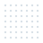

<h1>boitatá</h1>

my python tooling for day-to-day geostatistics.

boitatá holds the tools i use for resource work, from drill hole checks and statistics to variograms, kriging, simulation and model checks.

[get started](#start-here){ .md-button .md-button--primary }
[examples](examples/01-first-steps/index.md){ .md-button }
[api reference](api/containers/index.md){ .md-button }

## start here

<ol class="bt-path" markdown>
<li markdown="block">**[install](install.md)**

one command: `pip install "boitata[all]"`.
</li>
<li markdown="block">**[learning track](learn/01-samples-and-support/learn_01.md)**

what a sample stands for, before any code.
</li>
<li markdown="block">**[quick tour](examples/01-first-steps/01-quick-tour/example_01_01.md)**

from samples to a checked estimate in one page of code.
</li>
<li markdown="block">**[workflows](examples/14-workflows/index.md)**

whole problems, from the question to the decision.
</li>
</ol>

## modules

-   :material-school-outline: **[learn](learn/index.md)**

    ---

    six chapters of geostatistics from the ground up, each with diagrams and runnable code.

-   :material-sitemap-outline: **[guide](guide/organization.md)**

    ---

    how the library is organized, so you can guess your way around it, and [which page answers your question](guide/finder.md).

-   :material-rocket-launch-outline: **[first steps](examples/01-first-steps/index.md)**

    ---

    a quick tour from samples to a checked estimate, plus short pages such as saving to parquet.

-   :material-database-outline: **[data and geometry](examples/02-data-and-geometry/index.md)**

    ---

    drill holes, composites, block models, solids, meshes and GIS files.

-   :material-chart-bell-curve: **[exploratory analysis](examples/03-exploratory-analysis/index.md)**

    ---

    declustering, top cuts, contacts, swaths and data spacing before any model.

-   :material-swap-horizontal: **[transforms](examples/04-transforms/index.md)**

    ---

    normal scores, log-ratios, multivariate factors and imputation.

-   :material-vector-curve: **[spatial continuity](examples/05-spatial-continuity/index.md)**

    ---

    experimental variograms, model fitting and coregionalization.

-   :material-grid: **[kriging](examples/06-kriging/index.md)**

    ---

    point and block kriging, cokriging, indicators and search tuning.

-   :material-shape-outline: **[categories and domains](examples/07-categories-and-domains/index.md)**

    ---

    rock types as proportions, probabilities and simulated layouts.

-   :material-dice-multiple-outline: **[stochastic simulation](examples/08-stochastic-simulation/index.md)**

    ---

    SGS, turning bands and cosimulation, reproducible from one seed.

-   :material-pickaxe: **[recoverable resources](examples/09-recoverable-resources/index.md)**

    ---

    tonnes and grade above cutoff at the size of a mining block.

-   :material-check-decagram-outline: **[checking models](examples/10-checking-models/index.md)**

    ---

    cross-validation, swaths, realization checks and classification.

-   :material-layers-triple-outline: **[geological modeling](examples/11-geological-modeling/index.md)**

    ---

    grade shells, contact surfaces and layered horizons.

-   :material-book-open-page-variant-outline: **[case studies](examples/12-case-studies/index.md)**

    ---

    four deposits, each from raw tables to a result.

-   :material-texture-box: **[multiple-point statistics](examples/13-multiple-point-statistics/index.md)**

    ---

    SNESIM on categories and on continuous values, with multigrid and hard data.

