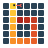

<div class="boitata-hero" markdown>


<div markdown>
<h1>Boitatá</h1>

My Python tooling for day-to-day geostatistics.

Boitatá holds the tools I use for resource work: drill hole checks, statistics, transforms, variograms, kriging, simulation and model checks. It runs from Python; the numerical core is Rust.

[Get started](#install){ .md-button .md-button--primary }
[Examples](examples/01-first-steps/index.md){ .md-button }
[API reference](api/containers/index.md){ .md-button }
</div>
</div>

<div class="grid cards" markdown>

-   :material-rocket-launch-outline: **[First steps](examples/01-first-steps/index.md)**

    ---

    A quick tour from samples to a checked estimate, and short pages to get going, such as saving to Parquet.

-   :material-database-outline: **[Data and geometry](examples/02-data-and-geometry/index.md)**

    ---

    Drill holes, composites, block models, solids, meshes and GIS files.

-   :material-chart-bell-curve: **[Exploratory analysis](examples/03-exploratory-analysis/index.md)**

    ---

    Declustering, top cuts, contacts, swaths and data spacing before any model.

-   :material-swap-horizontal: **[Transforms](examples/04-transforms/index.md)**

    ---

    Normal scores, log-ratios, multivariate factors and imputation.

-   :material-vector-curve: **[Spatial continuity](examples/05-spatial-continuity/index.md)**

    ---

    Experimental variograms, model fitting and coregionalization.

-   :material-grid: **[Kriging](examples/06-kriging/index.md)**

    ---

    Point and block kriging, cokriging, indicators and search tuning.

-   :material-shape-outline: **[Categories and domains](examples/07-categories-and-domains/index.md)**

    ---

    Rock types as proportions, probabilities and simulated layouts.

-   :material-dice-multiple-outline: **[Stochastic simulation](examples/08-stochastic-simulation/index.md)**

    ---

    SGS, turning bands and cosimulation, reproducible from one seed.

-   :material-pickaxe: **[Recoverable resources](examples/09-recoverable-resources/index.md)**

    ---

    Tonnes and grade above cutoff at the size of a mining block.

-   :material-check-decagram-outline: **[Checking models](examples/10-checking-models/index.md)**

    ---

    Cross-validation, swaths, realization checks and classification.

-   :material-layers-triple-outline: **[Geological modeling](examples/11-geological-modeling/index.md)**

    ---

    Grade shells, contact surfaces and layered horizons.

-   :material-book-open-page-variant-outline: **[Case studies](examples/12-case-studies/index.md)**

    ---

    Four deposits, each from raw tables to a result.

-   :material-texture-box: **[Multiple-point statistics](examples/13-multiple-point-statistics/index.md)**

    ---

    SNESIM on categories and on continuous values, with its multigrid and hard data.

</div>

## Install

Boitatá is not on PyPI yet. Install it from git (this builds the Rust core, so it needs Rust and a C compiler):

```bash
pip install "boitata[all] @ git+https://github.com/gstvschlz/boitata"
```

The [install page](install.md) covers uv, poetry, conda and pixi, wheels, extras and offline installs.
