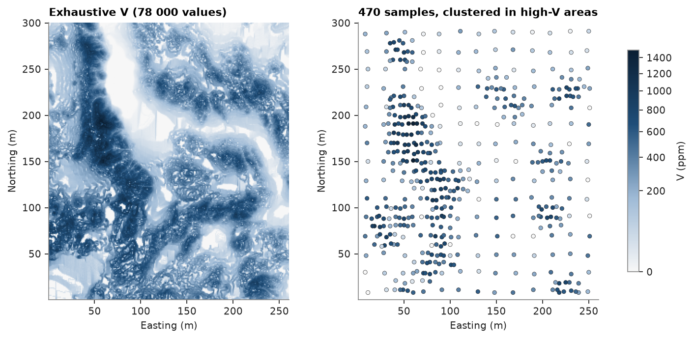
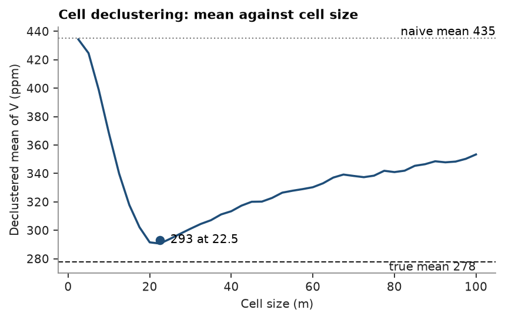
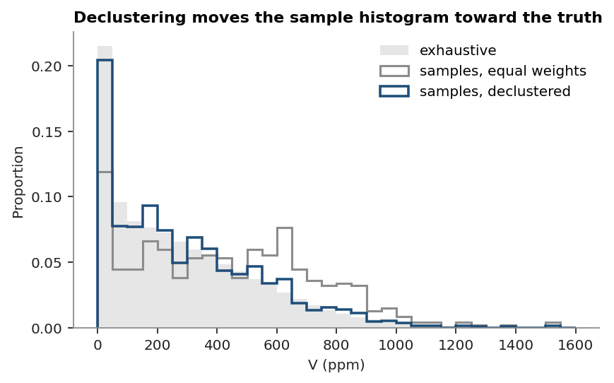

# 1. Data and declustering

Walker Lake: 470 samples of `V` (ppm) over a 260 × 300 m area whose exhaustive values are known.
`fetch` downloads a file from the datasets repository once; `save` writes a figure next to this page;
colours and fonts come from [`common.py`](../common.py).

<details><summary>Python</summary>

```python
import ceres as cs
import matplotlib.pyplot as plt
import numpy as np
from common import ACCENT, GREY, HIGHLIGHT, INK, fetch, map_axes, save
from matplotlib.colors import PowerNorm

samples = cs.PointSet.from_table(cs.read_csv(fetch("walker-lake/sample.csv")))
exhaustive = cs.read_csv(fetch("walker-lake/exhaustive.csv"))
v = samples["V"]
truth = exhaustive["V"].reshape(300, 260)
print(samples)
print(f"sample mean {v.mean():.1f} ppm, true mean {truth.mean():.1f} ppm")
```

</details>

```text
PointSet(470 points, crs: none)
  ID: Float64
  V: Float64
  U: Float64
  T: Float64
sample mean 435.3 ppm, true mean 278.0 ppm
```

Samples are denser where `V` is high, so their plain mean overstates the true mean.

<details><summary>Python</summary>

```python
norm = PowerNorm(0.5, vmin=0, vmax=1500)
fig, (a, b) = plt.subplots(1, 2, figsize=(9, 4.2), layout="constrained")
image = a.imshow(truth, origin="lower", extent=(0.5, 260.5, 0.5, 300.5), norm=norm)
map_axes(a, "Exhaustive V (78 000 values)")
x, y = samples.coords[:, 0], samples.coords[:, 1]
b.scatter(x, y, c=v, s=14, norm=norm, edgecolors=INK, linewidths=0.3)
b.set_xlim(a.get_xlim())
b.set_ylim(a.get_ylim())
map_axes(b, "470 samples, clustered in high-V areas")
fig.colorbar(image, ax=(a, b), shrink=0.8, label="V (ppm)")
save(fig, "maps")
```

</details>



Cell declustering weights each sample by the inverse of the number of samples in its cell.
Scanning cell sizes, each averaged over 25 grid offsets, and keeping the size with the lowest mean
corrects for sampling that favours high values.

<details><summary>Python</summary>

```python
d = cs.cell_declustering(samples.coords, v, sizes=np.arange(2.5, 102.5, 2.5))
print(d)

fig, ax = plt.subplots(figsize=(6, 3.4))
ax.plot(d.sizes, d.means, color=ACCENT, lw=1.6)
ax.axhline(v.mean(), color=GREY, ls=":", lw=1)
ax.axhline(truth.mean(), color=INK, ls="--", lw=1)
ax.plot(d.cell_size, d.mean, "o", color=HIGHLIGHT, ms=6)
ax.annotate(
    f"minimum: {d.mean:.0f} ppm at {d.cell_size:.1f} m cells",
    (d.cell_size, d.mean),
    xytext=(10, 0),
    textcoords="offset points",
    va="center",
    color=HIGHLIGHT,
)
ax.text(d.sizes[-1], v.mean(), f"naive mean {v.mean():.0f}", va="bottom", ha="right", color=GREY)
ax.text(d.sizes[-1], truth.mean(), f"true mean {truth.mean():.0f}", va="top", ha="right", color=INK)
ax.set_title("Cell declustering: mean against cell size")
ax.set_xlabel("Cell size (m)")
ax.set_ylabel("Declustered mean of V (ppm)")
save(fig, "declustering")
```

</details>

```text
Declustering(mean=293.173966, cell_size=22.5, n=470)
```



With the weights, the sample histogram moves toward the exhaustive one.

<details><summary>Python</summary>

```python
fig, ax = plt.subplots(figsize=(6, 3.4))
bins = np.linspace(0, 1600, 33)
flat = truth.ravel()
ax.hist(flat, bins, weights=np.full(flat.size, 1 / flat.size), color="#e6e6e6", label="exhaustive")
ax.hist(
    v,
    bins,
    weights=np.full(v.size, 1 / v.size),
    histtype="step",
    color=GREY,
    lw=1.4,
    label="samples, equal weights",
)
ax.hist(
    v,
    bins,
    weights=d.weights / d.weights.sum(),
    histtype="step",
    color=ACCENT,
    lw=1.6,
    label="samples, declustered",
)
ax.set_title("Declustering moves the sample histogram toward the truth")
ax.set_xlabel("V (ppm)")
ax.set_ylabel("Proportion")
ax.legend()
save(fig, "histograms")
```

</details>



Full script: [`example.py`](example.py)
