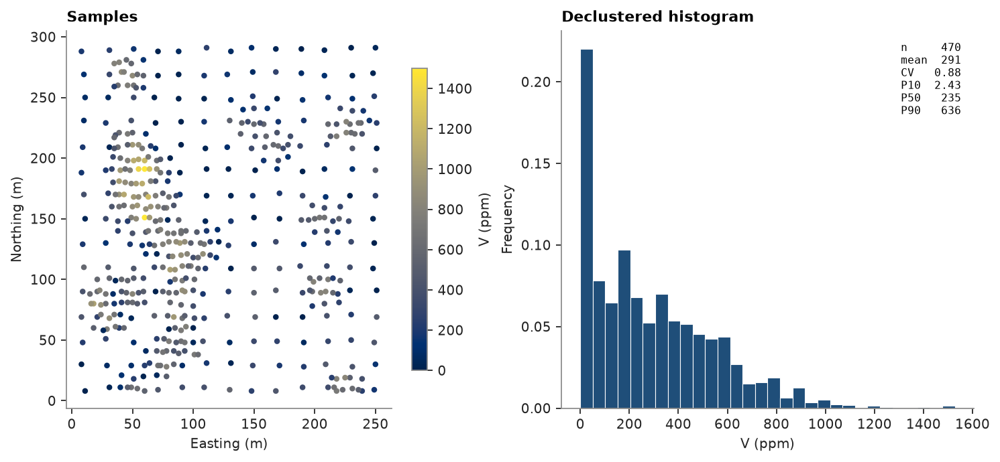
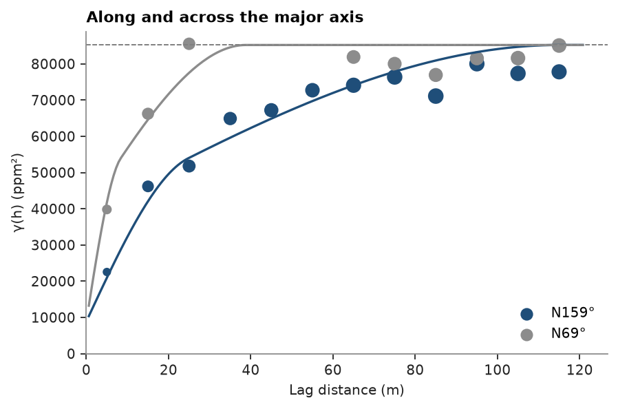
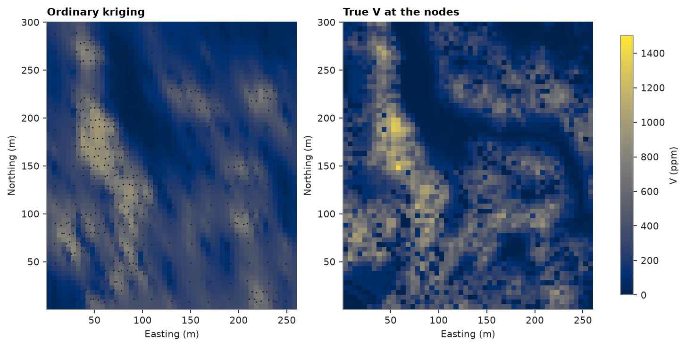
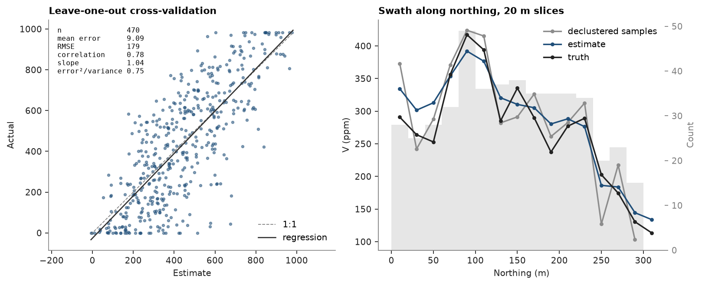

# quick tour

one pass from samples to a checked estimate. walker lake has 470 samples of `V` (ppm) over a 260 × 300 m area, and
an exhaustive grid of 78 000 values over the same area to check the estimate against. each step fits in one cell and
links to the page that covers it in full.

<details><summary>Python</summary>

```python
import boitata as bt
import matplotlib.pyplot as plt
import numpy as np
from common import ACCENT, GRAY, INK, map_axes, save

samples = bt.datasets.walker_lake()
truth = bt.datasets.walker_lake_exhaustive()["V"].reshape(300, 260)
print(samples)
```

</details>

```text
PointSet(470 points, crs: none)
  ID: Float64
  V: Float64
  U: Float64
  T: Float64
```

`bt.datasets` downloads a dataset once and caches it. the samples load as a `PointSet`: coordinates, plus one column
per variable. the exhaustive values wait for the checks at the end.

## statistics

a first campaign sampled a 20 m grid and later ones infilled the rich zones, so the plain mean of the samples
overstates the area. cell declustering weights each sample by the inverse of the sample count in its cell and keeps
the cell size with the lowest mean ([declustering](../../03-exploratory-analysis/03-declustering/README.md)).

<details><summary>Python</summary>

```python
declustering = bt.cell_declustering(samples, "V", sizes=np.arange(2.5, 102.5, 2.5))
weights = declustering.weights
naive, declustered = bt.describe(samples["V"]), bt.describe(samples["V"], weights=weights)
print(f"declustering cell {declustering.cell_size:.1f} m")
print(f"{'':12}{'mean':>6}{'CV':>6}{'P50':>6}{'P90':>6}{'max':>6}")
for name, stats in (
    ("naive", naive),
    ("declustered", declustered),
    ("exhaustive", bt.describe(truth.ravel())),
):
    print(
        f"{name:<12}{stats['mean']:>6.0f}{stats['cv']:>6.2f}{stats['P50']:>6.0f}{stats['P90']:>6.0f}"
        f"{stats['max']:>6.0f}"
    )

fig, (a, b) = plt.subplots(1, 2, figsize=(9.5, 4.2), layout="constrained")
points = a.scatter(*samples.coords[:, :2].T, c=samples["V"], s=8, vmin=0, vmax=1500)
map_axes(a, "Samples")
fig.colorbar(points, ax=a, shrink=0.8, label="V (ppm)")
bt.plot.histogram(samples["V"], weights=weights, bins=30, stats=True, ax=b, color=ACCENT)
b.set(title="Declustered histogram", xlabel="V (ppm)")
save(fig, "samples")
```

</details>

```text
declustering cell 22.5 m
              mean    CV   P50   P90   max
naive          435  0.69   424   819  1528
declustered    291  0.88   235   636  1528
exhaustive     278  0.90   221   634  1631
```



declustering takes the mean from 435 to 291 ppm, 13 ppm above the exhaustive mean, and brings the median and P90
close to the true ones. the histogram is skewed to the right, with a peak of near-zero values and a thin tail up to
1528 ppm.

## top cut

`Capping` clips the grades at a cap chosen from the data, here the declustered P99 ([top cuts](../../03-exploratory-analysis/05-top-cuts/README.md) chooses a cap, and
[capping transform](../../04-transforms/03-capping-transform/README.md) compares the rules).

<details><summary>Python</summary>

```python
capping = bt.Capping(quantile=0.99).fit(samples["V"], weights=weights)
samples = samples.with_column("V_cut", capping.transform(samples["V"]))
print(
    f"cap {capping.caps_:.0f} ppm: {(samples['V'] > capping.caps_).sum()} samples cut, "
    f"{capping.metal_removed_:.1%} of the metal removed"
)
```

</details>

```text
cap 982 ppm: 14 samples cut, 0.7% of the metal removed
```

the cap trims less than 1 % of the metal, since V has no erratic tail. the later steps use the capped column `V_cut`.

## variogram

`experimental_variogram` computes γ(h) along one azimuth. `Variogram.fit_directional` fits one model (two
spherical structures with a nugget) to eight directions at once and finds the direction of greatest continuity
([experimental variograms](../../05-spatial-continuity/01-experimental-variograms/README.md), [variogram fitting](../../05-spatial-continuity/02-variogram-fitting/README.md)).

<details><summary>Python</summary>

```python
azimuths = np.arange(0, 180, 22.5)
directional = [bt.experimental_variogram(samples, "V_cut", 10.0, 120.0, azimuth=a) for a in azimuths]
model = bt.Variogram.fit_directional(
    directional, [(a, 0) for a in azimuths], ["spherical", "spherical"], weighting="count/gamma"
)
print(model)

major = model.rotation[0]
fig, ax = plt.subplots(figsize=(5.5, 3.6), layout="constrained")
for azimuth, color in ((major, ACCENT), (major + 90, GRAY)):
    experimental = bt.experimental_variogram(samples, "V_cut", 10.0, 120.0, azimuth=azimuth)
    bt.plot.variogram(
        experimental,
        variogram=model,
        direction=(azimuth, 0),
        ax=ax,
        color=color,
        label=f"N{azimuth % 180:.0f}°",
    )
ax.set(title="Along and across the major axis", xlabel="Lag distance (m)", ylabel="γ(h) (ppm²)")
ax.legend(loc="lower right")
save(fig, "variogram")
```

</details>

```text
Variogram(nugget=8867.786210090486, structures=[Structure("spherical", sill=30452.04768457904, range=24.786734362667683), Structure("spherical", sill=45879.78702049813, range=115)], rotation=(159.196766259666, 0.0, 0.0), ratios=(0.3373516036246563, 1.0))
```



V is most continuous along N159°, with a range of 115 m. across it the range drops to about 40 m (a ratio of
0.34). the nugget holds a tenth of the sill.

## kriging

ordinary kriging estimates V on a 5 m grid from up to 24 samples in an ellipse aligned with the variogram. `fit`
takes the samples and the column, `predict` a `BlockModel`, and `with_columns` stores the results on the model
([ordinary kriging](../../06-kriging/01-ordinary-kriging/README.md), [search](../../06-kriging/06-search/README.md)). the grid nodes fall on points of the exhaustive grid, so
the true value at each node joins the model as a second column.

<details><summary>Python</summary>

```python
grid = bt.BlockModel(origin=(3, 3), size=(5, 5), count=(52, 60))
search = bt.Search(radius=80, max_samples=24, min_samples=4, rotation=model.rotation, ratios=(0.5, 1.0))
kriging = bt.OrdinaryKriging(model, search).fit(samples, "V_cut")
nodes = grid.coords.astype(int)
grid = grid.with_columns(
    {"estimate": kriging.predict(grid), "truth": truth[nodes[:, 1] - 1, nodes[:, 0] - 1]}
)
print(grid)

extent = (0.5, 260.5, 0.5, 300.5)
fig, axes = plt.subplots(1, 2, figsize=(9, 4.6), layout="constrained")
for ax, name, title in ((axes[0], "estimate", "Ordinary kriging"), (axes[1], "truth", "True V at the nodes")):
    image = ax.imshow(grid.grid(name)[0], origin="lower", extent=extent, vmin=0, vmax=1500)
    map_axes(ax, title)
axes[0].scatter(*samples.coords[:, :2].T, s=2, color=INK, linewidths=0)
fig.colorbar(image, ax=axes, shrink=0.8, label="V (ppm)")
save(fig, "estimate")
```

</details>

```text
BlockModel(regular, 3120 of 3120 cells, count [52, 60, 1], size [5.0, 5.0, 1.0], rotation [0.0, 0.0, 0.0])
  estimate: Float64
  truth: Float64
```



the estimate draws the NNW-trending rich zones of the truth, smoothed. kriging averages samples, so it misses the
short-scale highs and lows.

## checks

leave-one-out cross-validation re-estimates each sample from the others ([cross-validation](../../10-checking-models/02-cross-validation/README.md)). a swath compares
mean grades slice by slice for the declustered samples, the estimate and the truth ([model checks](../../10-checking-models/01-model-checks/README.md),
[swaths](../../03-exploratory-analysis/09-swaths/README.md)).

<details><summary>Python</summary>

```python
cv = kriging.cross_validate()
print(f"cross-validation: RMSE {cv.rmse:.0f} ppm, correlation {cv.correlation:.2f}, slope {cv.slope:.2f}")
check = bt.compare("estimate", "truth", data=grid)
print(f"against the truth: RMSE {check['rmse']:.0f} ppm, correlation {check['correlation']:.2f}")
print(
    f"mean: estimate {grid['estimate'].mean():.0f}, declustered samples {declustered['mean']:.0f}, "
    f"truth {grid['truth'].mean():.0f} ppm"
)

fig, (a, b) = plt.subplots(1, 2, figsize=(10, 4), layout="constrained")
bt.plot.cross_validation(cv, ax=a)
a.set_title("Leave-one-out cross-validation")
series = [
    bt.swath(samples, "V_cut", 20.0, axis="y", weights=weights),
    bt.swath(grid, "estimate", 20.0, axis="y"),
    bt.swath(grid, "truth", 20.0, axis="y"),
]
bt.plot.swath(series, labels=["declustered samples", "estimate", "truth"], ax=b)
for line, color in zip(b.lines, (GRAY, ACCENT, INK), strict=True):
    line.set_color(color)
b.legend()
b.set(title="Swath along northing, 20 m slices", xlabel="Northing (m)", ylabel="V (ppm)")
save(fig, "checks")
```

</details>

```text
cross-validation: RMSE 179 ppm, correlation 0.78, slope 1.04
against the truth: RMSE 154 ppm, correlation 0.79
mean: estimate 288, declustered samples 291, truth 277 ppm
```



the slope of 1.04 shows no conditional bias. cross-validation (RMSE 179 ppm) and the truth (RMSE 154 ppm) give
errors of the same size. the estimate follows the swath of the truth and flattens its peaks. its mean matches the
declustered samples and sits 4 % above the truth, a bias that no check against the samples can detect.
[storing containers in parquet](../../01-first-steps/04-parquet/README.md) saves a grid like this one to a file.

Full script: [`example_01_01.py`](example_01_01.py)
