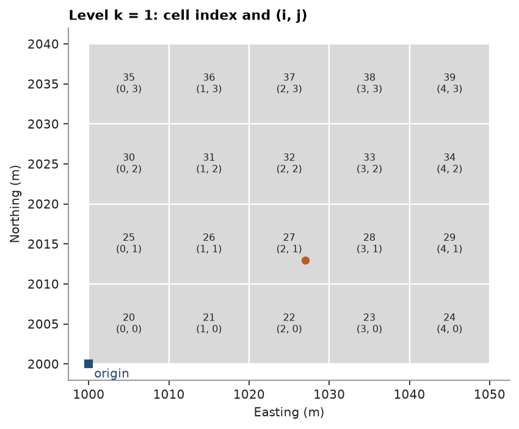
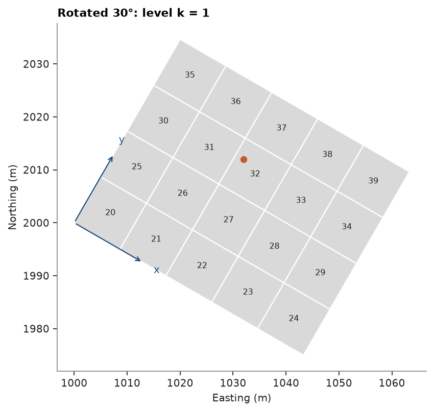
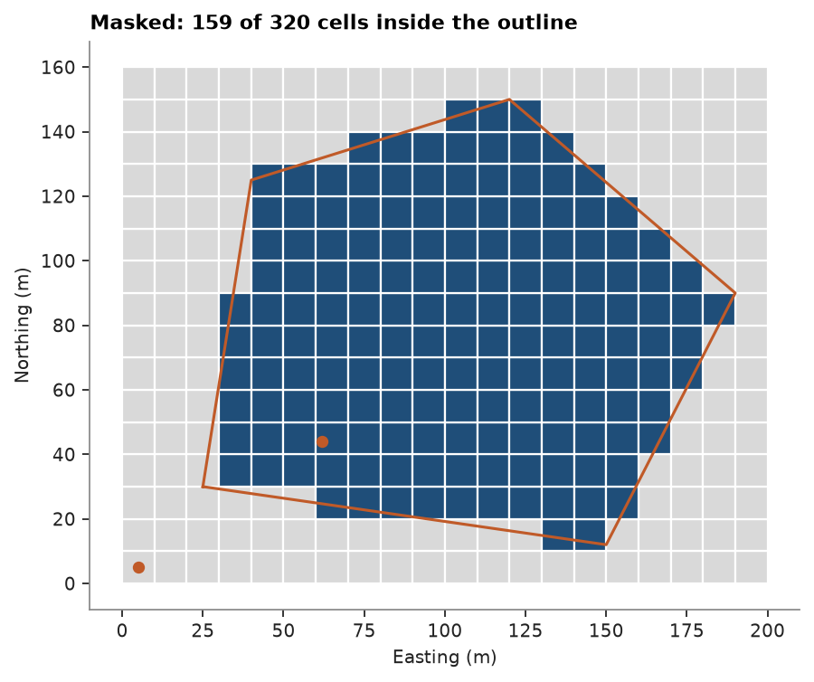
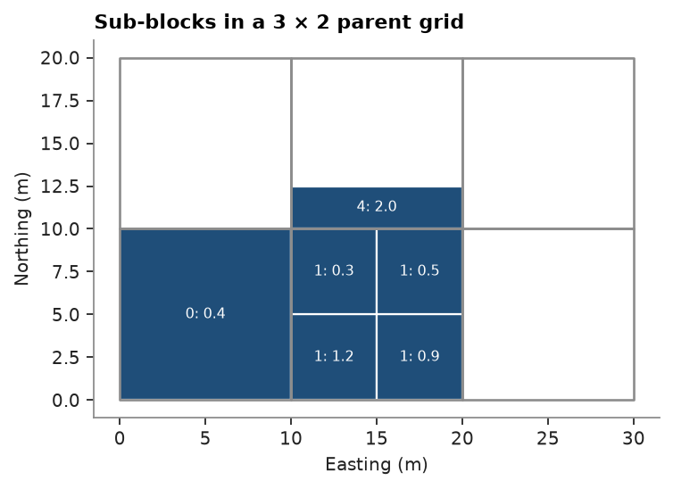

# Block models

A `BlockModel` is a grid of boxes, the blocks, with one attribute row per block. Three numbers per axis define
the grid: origin, block size and block count, plus three angles when it is rotated. The blocks come in
three layouts. A regular model holds every cell of the grid, a masked model a subset of them, and a
sub-blocked model splits some cells into smaller boxes. This page builds each one on small grids you can count
by eye, then reads a model back from centroids and from a file.

<details><summary>Python</summary>

```python
import tempfile

import ceres as cs
import matplotlib.pyplot as plt
import numpy as np
from common import ACCENT, GRAY, HIGHLIGHT, INK, LIGHT, map_axes, save
from matplotlib.collections import PolyCollection


def draw(ax, model, color=LIGHT, edge="white", **style):
    outlines = model.corners[:, [0, 1, 3, 2], :2]
    ax.add_collection(PolyCollection(outlines, facecolors=color, edgecolors=edge, **style))
    ax.autoscale_view()
```

</details>

## A regular grid

The grid below has 5 × 4 × 3 blocks of 10 × 10 × 5 m. Its origin is the outer corner of the first block, the
one with the smallest x, y and z, and not that block's center. The first centroid sits half a block
from the origin along each axis.

<details><summary>Python</summary>

```python
model = cs.BlockModel(origin=(1000, 2000, 300), size=(10, 10, 5), count=(5, 4, 3))
print(model)
print("first corner:  ", model.corners[0, 0])
print("first centroid:", model.centroids[0])
```

</details>

```text
BlockModel(regular, 60 of 60 cells, count [5, 4, 3], size [10.0, 10.0, 5.0], rotation [0.0, 0.0, 0.0])
first corner:   [1000. 2000.  300.]
first centroid: [1005.  2005.   302.5]
```

## Cell index, (i, j, k) and centroid

Each cell has a linear index that runs along x first, then y, then z: n = i + nx (j + ny k). A regular model
stores its rows in that order and stores no coordinates, so row n is cell n. Integer division takes an index
back to (i, j, k), and the centroid is the origin plus (i + ½, j + ½, k + ½) blocks.

<details><summary>Python</summary>

```python
nx, ny, nz = model.count
n = np.arange(len(model))
i, j, k = n % nx, n // nx % ny, n // (nx * ny)
centroids = np.array(model.origin) + (np.column_stack([i, j, k]) + 0.5) * model.size
print("index 27 is (i, j, k) =", (int(i[27]), int(j[27]), int(k[27])), "at", centroids[27])
print("same centroids as the model:", np.allclose(centroids, model.centroids))
print("back to the index:", np.array_equal(i + nx * (j + ny * k), n))
```

</details>

```text
index 27 is (i, j, k) = (2, 1, 1) at [1025.  2015.   307.5]
same centroids as the model: True
back to the index: True
```

Going from a point to its cell reverses the last step: subtract the origin, divide by the block size and round
down. `row_at` does this for you and returns -1 for a point outside the grid.

<details><summary>Python</summary>

```python
points = np.array([[1027.0, 2013.0, 308.0], [1049.9, 2039.9, 314.9], [1055.0, 2010.0, 305.0]])
ijk = np.floor((points - model.origin) / model.size).astype(int)
print("(i, j, k):", ijk.tolist())
print("index:    ", (ijk[:, 0] + nx * (ijk[:, 1] + ny * ijk[:, 2])).tolist())
print("row_at:   ", model.row_at(points).tolist())
```

</details>

```text
(i, j, k): [[2, 1, 1], [4, 3, 2], [5, 1, 1]]
index:     [27, 59, 30]
row_at:    [27, 59, -1]
```

The third point lies east of the last column, so its i of 5 is out of range and `row_at` gives -1. The middle
level (k = 1) in plan, each cell labeled with its index and (i, j), and the first point:

<details><summary>Python</summary>

```python
level = model.mask(k == 1)
fig, ax = plt.subplots(figsize=(5.2, 4.4), layout="constrained")
draw(ax, level)
for c, index in zip(level.centroids, level.index):
    ax.text(
        *c[:2],
        f"{index}\n({index % nx}, {index // nx % ny})",
        ha="center",
        va="center",
        fontsize=7,
        color=INK,
    )
ax.plot(*model.origin[:2], "s", color=ACCENT, ms=5)
ax.annotate("origin", model.origin[:2], xytext=(4, -10), textcoords="offset points", color=ACCENT)
ax.plot(*points[0, :2], "o", color=HIGHLIGHT, ms=5)
map_axes(ax, "Level k = 1: cell index and (i, j)")
save(fig, "indices")
```

</details>



## A rotated grid

`rotation` takes azimuth, dip and rake in degrees, and the grid turns about its origin. With an azimuth of 30°
the y axis of the grid points N30°E and the x axis N120°E. The rows of `corners` give those axes: vertex 1, 2
and 4 of a block sit one block length from vertex 0 along x, y and z. Written as the columns of a matrix, the axes
carry a position in the grid (i + ½, j + ½, k + ½ blocks) to the world, and the transposed matrix carries a world
point back into the grid.

<details><summary>Python</summary>

```python
rotated = cs.BlockModel(origin=(1000, 2000, 300), size=(10, 10, 5), count=(5, 4, 3), rotation=(30, 0, 0))
corner = rotated.corners[0]
axes = ((corner[[1, 2, 4]] - corner[0]) / np.array(rotated.size)[:, None]).T
print("x axis", axes[:, 0].round(3), " y axis", axes[:, 1].round(3))
local = (np.column_stack([i, j, k]) + 0.5) * rotated.size
print("same centroids:", np.allclose(np.array(rotated.origin) + local @ axes.T, rotated.centroids))

point = np.array([1032.0, 2012.0, 308.0])
ijk = np.floor((point - rotated.origin) @ axes / rotated.size).astype(int)
print(
    "point in cell",
    ijk.tolist(),
    "index",
    ijk[0] + nx * (ijk[1] + ny * ijk[2]),
    "row_at",
    rotated.row_at([point]),
)
```

</details>

```text
x axis [ 0.866 -0.5    0.   ]  y axis [0.5   0.866 0.   ]
same centroids: True
point in cell [2, 2, 1] index 32 row_at [32]
```

The same level of the rotated grid, with the grid axes drawn from the origin. Indices keep their order in the
grid frame, so cell 20 stays at the origin corner whatever the rotation:

<details><summary>Python</summary>

```python
level = rotated.mask(k == 1)
fig, ax = plt.subplots(figsize=(5.2, 5.2), layout="constrained")
draw(ax, level)
for c, index in zip(level.centroids, level.index):
    ax.text(*c[:2], index, ha="center", va="center", fontsize=7, color=INK)
for axis, name in zip(axes.T[:2], "xy"):
    ax.annotate(
        "",
        rotated.origin[:2] + 15 * axis[:2],
        rotated.origin[:2],
        arrowprops={"arrowstyle": "->", "color": ACCENT},
    )
    ax.text(*(rotated.origin[:2] + 18 * axis[:2]), name, color=ACCENT, ha="center", va="center")
ax.plot(*point[:2], "o", color=HIGHLIGHT, ms=5)
map_axes(ax, "Rotated 30°: level k = 1")
save(fig, "rotated")
```

</details>



To size a rotated grid on data rather than choose its origin and count by hand, see
[block model from extents](../../02-data-and-geometry/12-block-model-from-extents/README.md).

## Masked layout

A masked model keeps some cells of the grid and drops the rest. It stores the geometry once and the sorted
indices of the cells present, so row and cell index part ways: `index[row]` is the cell. Here a 2D grid of
20 × 16 blocks of 10 m keeps the cells whose centroid falls inside a domain outline. A 2D grid has one level,
`nz = 1`, and its blocks take a unit height.

<details><summary>Python</summary>

```python
grid = cs.BlockModel(origin=(0, 0), size=(10, 10), count=(20, 16))
outline = cs.Polylines([[[25, 30], [150, 12], [190, 90], [120, 150], [40, 125]]], closed=True)
domain = grid.mask(outline.contains(grid))
print(domain)
print("first rows hold cells", domain.index[:5].tolist())

points = np.array([[62.0, 44.0], [5.0, 5.0]])
row = domain.row_at(points)
print(
    "rows", row.tolist(), "-> cell", domain.index[row[0]], "| in the full grid:", grid.row_at(points).tolist()
)
```

</details>

```text
BlockModel(masked, 159 of 320 cells, count [20, 16, 1], size [10.0, 10.0, 1.0], rotation [0.0, 0.0, 0.0])
first rows hold cells [33, 34, 46, 47, 48]
rows [28, -1] -> cell 86 | in the full grid: [86, 0]
```

The second point falls in cell 0, which the mask dropped, so the masked model returns -1 where the full grid
returns row 0. `to_regular` puts every cell back and leaves the dropped ones null.

<details><summary>Python</summary>

```python
domain = domain.with_column("cu", np.random.default_rng(7).gamma(4, 0.25, len(domain)))
full = domain.to_regular()
print(full, "| null cells:", np.isnan(full["cu"]).sum())

fig, ax = plt.subplots(figsize=(5.6, 4.6), layout="constrained")
draw(ax, grid)
draw(ax, domain, color=ACCENT)
ring = np.vstack([outline.parts[0], outline.parts[0][:1]])
ax.plot(ring[:, 0], ring[:, 1], color=HIGHLIGHT, lw=1.4)
ax.plot(*points.T, "o", color=HIGHLIGHT, ms=5)
map_axes(ax, f"Masked: {len(domain)} of {len(grid)} cells inside the outline")
save(fig, "masked")
```

</details>

```text
BlockModel(regular, 320 of 320 cells, count [20, 16, 1], size [10.0, 10.0, 1.0], rotation [0.0, 0.0, 0.0])
  cu: Float64 | null cells: 161
```



Masking suits models that fill a fraction of their grid, such as one domain in a large box; the
[models larger than memory](../../02-data-and-geometry/10-large-models/README.md) page builds one level by level.

## Sub-blocked layout

A sub-blocked model keeps a parent grid and gives each row a parent cell and an extent inside it, as fractions of
the parent from 0 to 1: minimum u, v, w, then maximum u, v, w. A parent can hold one row, whole or partial, or
several smaller boxes. With `subgrid=(4, 4, 1)` every fraction must fall on quarters of a parent. Below, cell 0
stays whole, cell 1 splits into four quarters and cell 4 keeps only its southern quarter.

<details><summary>Python</summary>

```python
parents = np.array([0, 1, 1, 1, 1, 4], dtype=np.uint64)
extents = [
    [0, 0, 0, 1, 1, 1],
    [0, 0, 0, 0.5, 0.5, 1],
    [0.5, 0, 0, 1, 0.5, 1],
    [0, 0.5, 0, 0.5, 1, 1],
    [0.5, 0.5, 0, 1, 1, 1],
    [0, 0, 0, 1, 0.25, 1],
]
cu = [0.4, 1.2, 0.9, 0.3, 0.5, 2.0]
blocks = cs.BlockModel.subblocked(
    (0, 0), (10, 10), (3, 2), parents, extents, subgrid=(4, 4, 1), attributes={"cu": cu}
)
print(blocks)
print("areas:", blocks.volumes.tolist())
merged = blocks.to_regular()
print("per parent:", merged["cu"].round(2).tolist())

fig, ax = plt.subplots(figsize=(4.6, 3.4), layout="constrained")
draw(ax, blocks, color=ACCENT)
draw(ax, cs.BlockModel(origin=(0, 0), size=(10, 10), count=(3, 2)), color="none", edge=GRAY, lw=1.2)
for c, parent, value in zip(blocks.centroids, blocks.index, cu):
    ax.text(*c[:2], f"{parent}: {value}", ha="center", va="center", fontsize=7, color="white")
map_axes(ax, "Sub-blocks in a 3 × 2 parent grid")
save(fig, "subblocks")
```

</details>

```text
BlockModel(sub-blocked, 6 sub-blocks in 6 cells, count [3, 2, 1], size [10.0, 10.0, 1.0], rotation [0.0, 0.0, 0.0])
  cu: Float64
areas: [100.0, 25.0, 25.0, 25.0, 25.0, 25.0]
per parent: [0.4, 0.72, nan, nan, 2.0, nan]
```



`to_regular` merged each parent back into one row: floats become area-weighted means (1.2, 0.9, 0.3 and 0.5
average to 0.72 in cell 1), and cell 4 keeps the 2.0 of its only sub-block. Cells 2, 3 and 5 hold no sub-block
and stay null. Sub-blocks usually come from solids and surfaces, not from a hand-written list; the
[sub-blocks](../../02-data-and-geometry/06-sub-blocks/README.md) page builds them from meshes and regularizes them.

## A model from centroids

Block models often arrive as a table of centroids and attributes, one row per block, with the block size known
from elsewhere. `from_extents` with a buffer of half a block recovers the grid, since the outer centroids lie half a
block inside it, and `row_at` gives each centroid its cell. The table here comes from the masked domain above,
written as CSV.

<details><summary>Python</summary>

```python
folder = Path(tempfile.mkdtemp())
cs.write_csv(folder / "domain.csv", domain, progress=False)
table = cs.read_csv(folder / "domain.csv", progress=False)
xyz = np.column_stack([table["x"], table["y"], table["z"]])
size = (10.0, 10.0, 1.0)
box = cs.BlockModel.from_extents(xyz, size=size, buffer=np.array(size) / 2)
cells = box.row_at(xyz).astype(np.uint64)
order = np.argsort(cells)
rebuilt = cs.BlockModel(
    box.origin, size, box.count, index=cells[order], attributes={"cu": table["cu"][order]}
)
print(rebuilt)
print("origin", rebuilt.origin, "count", rebuilt.count)
```

</details>

```text
BlockModel(masked, 159 of 224 cells, count [16, 14, 1], size [10.0, 10.0, 1.0], rotation [0.0, 0.0, 0.0])
  cu: Float64
origin [30.0, 10.0, 0.0] count [16, 14, 1]
```

The domain spans fewer cells than the grid it came from, so the rebuilt grid is smaller and starts elsewhere
(origin 30, 10 instead of 0, 0), and its indices differ. The blocks coincide: same centroids, same values.

<details><summary>Python</summary>

```python
print("same centroids:", np.allclose(rebuilt.centroids, domain.centroids))
print("same values:   ", np.allclose(rebuilt["cu"], domain["cu"]))
```

</details>

```text
same centroids: True
same values:    True
```

Without the known block size, the smallest gap between distinct centroid coordinates along each axis gives it,
provided at least two neighboring blocks share a row.

## Round trip to a file

CSV kept only centroids and attributes. Parquet keeps the whole model: geometry, rotation, layout, index and
CRS travel in the file metadata. The rotated grid, masked to its middle level, goes out and comes back unchanged.

<details><summary>Python</summary>

```python
middle = rotated.with_column("cu", np.linspace(0.1, 3.0, len(rotated))).mask(k == 1)
cs.write_parquet(folder / "middle.parquet", middle, progress=False)
back = cs.read_parquet(folder / "middle.parquet", progress=False)
print(back)
print("origin", back.origin, "rotation", back.rotation)
print(
    "same cells:",
    np.array_equal(back.index, middle.index),
    "| same cu:",
    np.array_equal(back["cu"], middle["cu"]),
)
```

</details>

```text
BlockModel(masked, 20 of 60 cells, count [5, 4, 3], size [10.0, 10.0, 5.0], rotation [30.0, 0.0, 0.0])
  cu: Float64
origin [1000.0, 2000.0, 300.0] rotation [30.0, 0.0, 0.0]
same cells: True | same cu: True
```

[Storing containers in Parquet](../../01-first-steps/04-parquet/README.md) covers the file format, reading a model
with polars, and models of other layouts.

Full script: [`example_01_02.py`](example_01_02.py)
