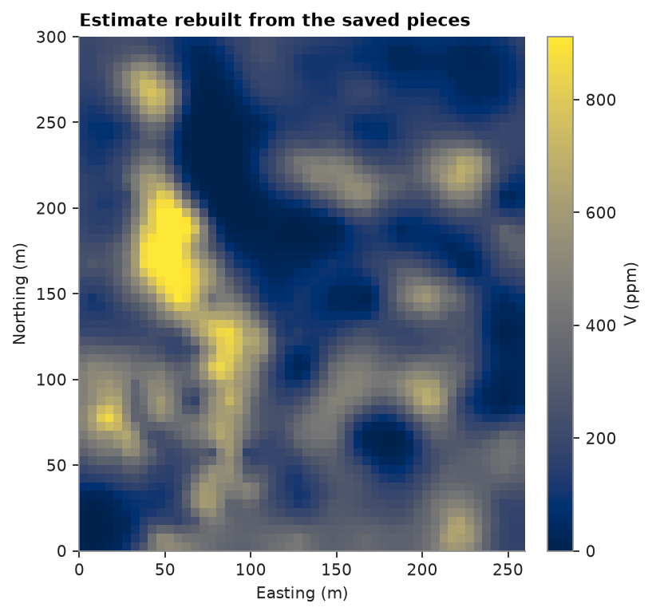

# saving and loading

models, transforms and searches save to JSON: `to_json` returns a string and the class's `from_json` builds the
object back from it. a fitted transform keeps what it learned, so the loaded copy transforms new values the same
way. containers and fitted estimators hold columns and go to parquet instead
([storing containers in parquet](../../01-first-steps/04-parquet/README.md)).

<details><summary>Python</summary>

```python
import tempfile

import boitata as bt
import matplotlib.pyplot as plt
import numpy as np
from common import map_axes, save
```

</details>

## a small workflow

walker lake `V` goes through five fitted pieces: cell declustering weights, a cap at the declustered P99, a
normal-score transform, a variogram of the scores and a search. simple kriging of the scores, back-transformed,
gives the estimate on a 5 m grid.

<details><summary>Python</summary>

```python
samples = bt.datasets.walker_lake()
declustering = bt.cell_declustering(samples, "V", sizes=np.arange(2.5, 102.5, 2.5))
capping = bt.Capping(quantile=0.99).fit("V", weights=declustering.weights, data=samples)
capped = capping.transform("V", data=samples)
normal_score = bt.NormalScore().fit(capped, weights=declustering.weights)
scores = normal_score.transform(capped)
variogram = bt.Variogram.fit(
    bt.experimental_variogram(samples, scores, 10.0, 120.0), ["spherical", "spherical"]
)
search = bt.Search(radius=60, max_samples=24, min_samples=4)

grid = bt.BlockModel(origin=(2.5, 2.5), size=(5, 5), count=(52, 60))
kriged = bt.SimpleKriging(variogram, search).fit(samples, scores).predict(grid)
estimate = normal_score.inverse_transform(kriged)
print(f"cap: {capping.caps_:.0f} ppm | declustered mean: {declustering.mean:.1f} ppm")
print(variogram)
```

</details>

```text
cap: 982 ppm | declustered mean: 290.7 ppm
Variogram(nugget=0.3052597668357192, structures=[Structure("spherical", sill=0.501613916596432, range=39.9400880709822), Structure("spherical", sill=0.32454526508977327, range=63.403682315084254)], rotation=(0.0, 0.0, 0.0), ratios=(1.0, 1.0))
```

## saving

each piece goes to its own file. the declustering file stores one weight per sample in the order of `samples`,
and the normal-score file stores the fitted transform table. both grow with the data; the cap, the variogram and
the search take a few hundred bytes.

<details><summary>Python</summary>

```python
folder = Path(tempfile.mkdtemp())
pieces = {
    "declustering": declustering,
    "capping": capping,
    "normal_score": normal_score,
    "variogram": variogram,
    "search": search,
}
for name, piece in pieces.items():
    (folder / f"{name}.json").write_text(piece.to_json())
    print(f"{name + '.json':>18}: {(folder / f'{name}.json').stat().st_size:>6} bytes")
print((folder / "search.json").read_text())
```

</details>

```text
 declustering.json:   9959 bytes
      capping.json:    174 bytes
 normal_score.json:  21183 bytes
    variogram.json:    240 bytes
       search.json:    146 bytes
{"type":"Search","format":1,"min_samples":4,"max_samples":24,"radius":60.0,"max_per_hole":null,"octant":false,"anisotropy":null,"high_grade":null}
```

the files are plain JSON with a `type` and a `format` number. a reader of another type or a newer format raises
`InvalidInput` instead of loading the wrong object.

## loading and rerunning

`rerun` sees only the folder and the samples. it reads the cap, the normal-score table, the variogram and the
search, applies them in the same order and returns the estimate. it skips the weights, since the fitted cap and
table already carry them. you load the weights separately for declustered statistics in a report.

<details><summary>Python</summary>

```python
def rerun(folder, samples):
    capping = bt.Capping.from_json((folder / "capping.json").read_text())
    normal_score = bt.NormalScore.from_json((folder / "normal_score.json").read_text())
    variogram = bt.Variogram.from_json((folder / "variogram.json").read_text())
    search = bt.Search.from_json((folder / "search.json").read_text())
    scores = normal_score.transform(capping.transform("V", data=samples))
    grid = bt.BlockModel(origin=(2.5, 2.5), size=(5, 5), count=(52, 60))
    kriged = bt.SimpleKriging(variogram, search).fit(samples, scores).predict(grid)
    return normal_score.inverse_transform(kriged)


again = rerun(folder, bt.datasets.walker_lake())
assert np.array_equal(again, estimate)
print("identical estimate:", np.array_equal(again, estimate))
weights = bt.Declustering.from_json((folder / "declustering.json").read_text()).weights
print(f"declustered mean from the saved weights: {np.average(capped, weights=weights):.1f} ppm (capped)")

fig, ax = plt.subplots(figsize=(5, 5.2), layout="constrained")
image = ax.imshow(
    grid.grid(again)[0], origin="lower", extent=(0, 260, 0, 300), vmin=0, vmax=np.quantile(again, 0.99)
)
fig.colorbar(image, ax=ax, shrink=0.8, label="V (ppm)")
map_axes(ax, "Estimate rebuilt from the saved pieces")
save(fig, "estimate")
```

</details>

```text
identical estimate: True
declustered mean from the saved weights: 288.8 ppm (capped)
```



the rerun matches bit for bit, because JSON writes each float with enough digits to read back the same number.

the same pair exists on `Structure`, `Coregionalization`, `HighGrade`, `Categories`, `Trend` and the other
transforms (`HermiteAnamorphosis`, `BoxCox`, `PPMT`, `PCA`, `MAF`, `StepwiseConditional`, `UniformConditioning`,
`GaussianImputer`, `KernelDensity`, `GaussianMixture`). these objects also pickle, through the same JSON.
a fitted estimator such as the `SimpleKriging` above carries its samples, so it saves with `to_parquet`.

Full script: [`example_01_03.py`](example_01_03.py)
