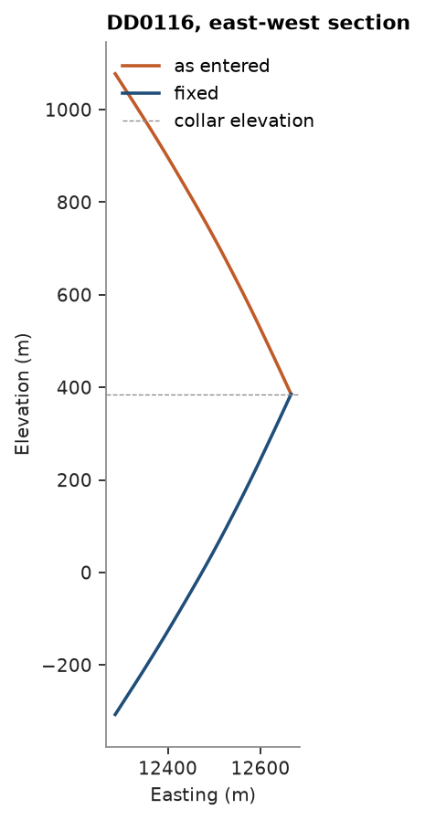

# Checking drill holes

The stacked sulphide lenses as logged: collar, survey (dip positive down, azimuth clockwise from north), assay and
lithology tables with typical data-entry errors planted in them, each listed in the dataset's `raw/README.md`. The
tables are checked, repaired and checked again before anything is desurveyed.

<details><summary>Python</summary>

```python
import ceres as cs
import matplotlib.pyplot as plt
import numpy as np
from common import ACCENT, GRAY, HIGHLIGHT, save
```

</details>

`check_drillholes` flags every record of the collar, survey and interval tables: duplicate ids, missing or sentinel
values, text in numeric columns, from ≥ to, gaps, overlaps, angles out of range, depths past the collar `LENGTH`,
ids that match a collar only once trimmed and case-folded, holes missing from a table, abrupt survey deviation and
holes dipping against the rest. Each flagged check is listed with the holes it hit.

<details><summary>Python</summary>

```python
data = cs.datasets.stacked_sulphide_lenses(raw=True)
raw = {
    "collar": data["collars"],
    "survey": data["surveys"],
    "assays": data["assays"],
    "lithology": data["lithology"],
}
for name, table in raw.items():
    print(f"{name:>9}: {table.num_rows:6} rows")


def check(t, show=True):
    flags, summary, details = cs.check_drillholes(
        t["collar"], t["survey"], {"assays": t["assays"], "lithology": t["lithology"]}, max_depth="LENGTH"
    )
    for table, name, rows, holes in zip(
        summary["table"], summary["check"], summary["rows"], summary["holes"]
    ):
        if rows and show:
            ids = np.array(t[table]["HOLE_ID"])
            hit = sorted(set(ids[np.asarray(flags[table][name])]))
            listed = ", ".join(repr(h) for h in hit) if len(hit) <= 8 else f"{hit[0]!r} ... {hit[-1]!r}"
            print(f"{table:>9} {name:<12} {rows:4.0f} rows in {holes:3.0f} holes: {listed}")
    return flags, details


flags, details = check(raw)
```

</details>

```text
   collar:    290 rows
   survey:   4326 rows
   assays:  16907 rows
lithology:   1726 rows
   collar duplicate       2 rows in   2 holes: 'DD0058', 'DD0067'
   collar no_survey       1 rows in   1 holes: 'DD0151'
   collar no_assays     112 rows in 112 holes: 'DD0001' ... 'DD0244'
   survey deviation       2 rows in   1 holes: 'DD0197'
   survey dip_sign       28 rows in   1 holes: 'DD0116'
   survey past_depth      5 rows in   1 holes: 'DD0055'
   survey id_mismatch    13 rows in   1 holes: 'DD0104'
   survey no_collar       8 rows in   1 holes: 'DD0111'
   assays inverted        1 rows in   1 holes: 'DD0100'
   assays gap            10 rows in   8 holes: 'DD0062', 'DD0080', 'DD0100', 'DD0200', 'RC0008', 'RC0014', 'RC0016', 'RC0031'
   assays overlap         5 rows in   2 holes: 'DD0162', 'DD0200'
   assays past_depth      4 rows in   1 holes: 'DD0055'
   assays sentinel        5 rows in   1 holes: 'DD0110'
   assays text_values     3 rows in   1 holes: 'DD0083'
   assays id_mismatch   109 rows in   2 holes: 'DD0104', 'dd0062'
   assays no_collar     127 rows in   1 holes: 'DD0111'
lithology gap             1 rows in   1 holes: 'DD0132'
lithology past_depth      2 rows in   1 holes: 'DD0055'
lithology id_mismatch    10 rows in   2 holes: 'DD0104', 'DD0132 '
lithology no_collar       7 rows in   1 holes: 'DD0111'
```

Every flag points at a planted error, or follows from one:

- `duplicate` collars: `DD0067` entered twice with different coordinates, `DD0058` the same row twice.
- `id_mismatch`: `'dd0062'` in the assays and `'DD0132 '` in the lithology are ids in the wrong case or with a
  trailing space; the collar `'DD0104 '` has the trailing space, so its survey, assays and lithology miss it.
- `no_collar`: `DD0111` has surveys, assays and lithology but no collar.
- `no_survey`: `DD0151` has no survey.
- `deviation`: two stations of `DD0197`, where the azimuth flips at one station and back at the next.
- `dip_sign`: `DD0116` is entered with its dips negative, pointing up, while every other hole dips down.
- `past_depth`: `DD0055` has surveys, assays and lithology below its collar `LENGTH`.
- `inverted`: an assay of `DD0100` with `FROM` > `TO`.
- `overlap`: two assays of `DD0200` start before the previous one ends, and three of `DD0162` are entered twice.
- `gap`: two missing samples in `DD0080`; the gaps in `DD0062`, `DD0100`, `DD0132` and `DD0200` are left by the
  rows above. The RC holes' gaps are unsampled core and real.
- `text_values` and `sentinel`: the grades were read as text, because some cells are not numbers; `DD0110` holds
  `-99` and `-999`.
- `no_assays`: 112 collars. Only mineralized zones are assayed, so a hole that never logs `MS`, `SMS` or `STR`
  has no assays by design; one more hides among them.

The details name the value behind each id, dip and text flag, and what it should become:

<details><summary>Python</summary>

```python
groups = {}
for table, check_, hole, column, value, suggestion in zip(
    *(details[c] for c in ("table", "check", "hole", "column", "value", "suggestion"))
):
    groups.setdefault((table, check_, hole, column), set()).add(
        f"{value!r} -> {suggestion!r}" if suggestion else repr(value)
    )
for (table, check_, hole, column), values in groups.items():
    values = sorted(values)
    listed = ", ".join(values) if len(values) <= 2 else f"{values[0]} ... {values[-1]} ({len(values)} values)"
    print(f"{table:>9} {check_:<12} {hole!r:9} {column:<7} {listed}")
```

</details>

```text
   survey dip_sign     'DD0116'  DIP     '-53.8' -> '53.8' ... '-63.81' -> '63.81' (28 values)
   assays text_values  'DD0083'  ZN_PCT  'NS'
   assays text_values  'DD0083'  PB_PCT  'NS'
   assays text_values  'DD0083'  CU_PCT  '<0.01', 'NS'
   assays text_values  'DD0083'  AG_GPT  'NS'
   assays text_values  'DD0083'  AU_GPT  '<0.01', 'NS'
   survey id_mismatch  'DD0104'  HOLE_ID 'DD0104' -> 'DD0104 '
   assays id_mismatch  'dd0062'  HOLE_ID 'dd0062' -> 'DD0062'
   assays id_mismatch  'DD0104'  HOLE_ID 'DD0104' -> 'DD0104 '
lithology id_mismatch  'DD0104'  HOLE_ID 'DD0104' -> 'DD0104 '
lithology id_mismatch  'DD0132 ' HOLE_ID 'DD0132 ' -> 'DD0132'
```

A hole missing its assays looks like one of the unassayed holes, unless its lithology says it is mineralized:

<details><summary>Python</summary>

```python
lith = raw["lithology"]
mineralized = set(np.array(lith["HOLE_ID"])[np.isin(lith["LITH"], ["MS", "SMS", "STR"])])
print("mineralized, no assays:", sorted(mineralized - set(raw["assays"]["HOLE_ID"])))
```

</details>

```text
mineralized, no assays: ['DD0043']
```

Two repairs need a person: the inverted interval's ends are swapped, and `DD0055`'s `LENGTH` is taken from its
deepest survey station, since the survey, assays and lithology agree the hole is longer. The tables are checked
again, and `fix_drillholes` resolves the rest with one named rule per check. Two rules are asked for by name:
`dip_sign="negate"` turns `DD0116` down, and `text_values="half"` reads `<0.01` as half the detection limit
(by default, as `NS` is, it becomes null). The log says what each rule changed: ids are renamed to their collar,
the later duplicate collar is dropped (for `DD0067`, the second, wrong entry), overlapping assays keep the one that
starts first (dropping the twinned re-entries), the two `DD0197` stations turned by the flip are dropped,
sentinels become null and rows of a hole without collar go.

<details><summary>Python</summary>

```python
def replace(table, **columns):
    return cs.Table({**{c: table[c] for c in table.column_names}, **columns})


tables = dict(raw)
a, s, c = raw["assays"], raw["survey"], raw["collar"]
swap = a["FROM"] > a["TO"]
tables["assays"] = replace(a, FROM=np.where(swap, a["TO"], a["FROM"]), TO=np.where(swap, a["FROM"], a["TO"]))
deepest = {}
for h, d in zip(s["HOLE_ID"], s["DEPTH"]):
    deepest[h] = max(deepest.get(h, 0.0), d)
tables["collar"] = replace(c, LENGTH=np.maximum(c["LENGTH"], [deepest.get(h, 0.0) for h in c["HOLE_ID"]]))

flags, _ = check(tables, show=False)
fixed, log = cs.fix_drillholes(flags, tables, dip_sign="negate", text_values="half")
for table, name, action, rows in zip(log["table"], log["check"], log["action"], log["rows"]):
    if rows:
        print(f"{action:>10} {rows:3.0f} {table} rows flagged {name}")
print()
flags, _ = check(fixed)
```

</details>

```text
      drop   2 collar rows flagged duplicate
      drop   2 survey rows flagged deviation
      drop   8 survey rows flagged no_collar
    negate  28 survey rows flagged dip_sign
    rename  13 survey rows flagged id_mismatch
keep_first   5 assays rows flagged overlap
      half   3 assays rows flagged text_values
      null   5 assays rows flagged sentinel
      drop 127 assays rows flagged no_collar
    rename 109 assays rows flagged id_mismatch
      drop   7 lithology rows flagged no_collar
    rename  10 lithology rows flagged id_mismatch

   collar no_survey       1 rows in   1 holes: 'DD0151'
   collar no_assays     112 rows in 112 holes: 'DD0001' ... 'DD0244'
   assays gap             8 rows in   6 holes: 'DD0080', 'DD0200', 'RC0008', 'RC0014', 'RC0016', 'RC0031'
```

What is left needs the field records, not a rule: `DD0151` has no survey and would be desurveyed as vertical,
`DD0043` needs its assays found, and the gaps are the two lost `DD0080` samples, the two `DD0200` intervals
dropped as overlaps and the unsampled RC core. `'DD0104 '` keeps its trailing space, now in every table. `DD0116`
shows why the dips matter: desurveyed as entered, it climbs out of the ground.

<details><summary>Python</summary>

```python
def dd0116(table):
    return table.filter(table["HOLE_ID"] == "DD0116")


collar = dd0116(fixed["collar"])
fig, ax = plt.subplots(figsize=(4, 5.5), layout="constrained")
for name, survey, color in (("as entered", raw["survey"], HIGHLIGHT), ("fixed", fixed["survey"], ACCENT)):
    path = cs.Drillholes(collar, dd0116(survey)).paths()
    ax.plot(path["x"], path["z"], color=color, lw=1.6, label=name)
ax.axhline(collar["Z"][0], color=GRAY, lw=0.6, ls="--", label="collar elevation")
ax.set_aspect("equal")
ax.set(title="DD0116, east-west section", xlabel="Easting (m)", ylabel="Elevation (m)")
ax.legend()
save(fig, "dip")
```

</details>



Full script: [`example_01.py`](example_01.py)
