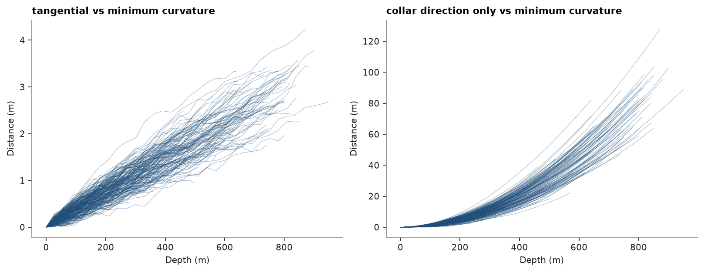
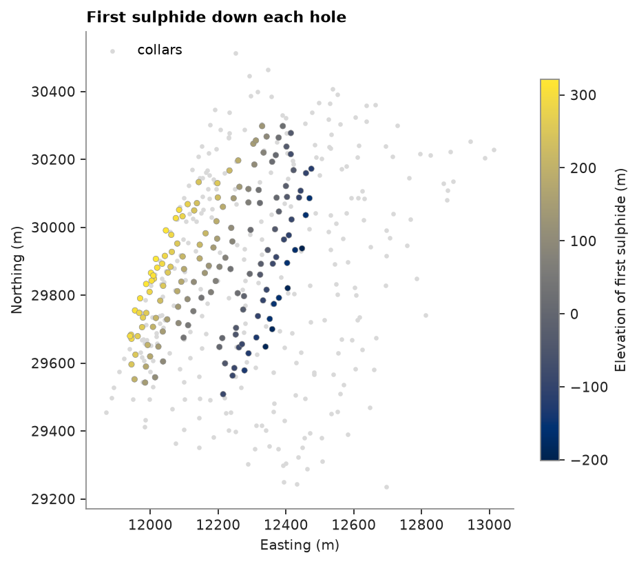

# desurveying drill holes

the stacked sulphide lenses: 244 diamond holes up to 958 m long, which flatten and swing clockwise as they deepen,
and 45 short RC holes. desurveying turns each collar and its survey stations (depth, dip positive down, azimuth
clockwise from north) into a path, so any depth down a hole has coordinates.

<details><summary>Python</summary>

```python
import boitata as bt
import matplotlib.pyplot as plt
import numpy as np
from common import ACCENT, GRAY, LIGHT, map_axes, save
```

</details>

`Drillholes` desurveys each hole from its collar and survey. `paths` gives the position of each survey station.
the deepest hole, `DD0027`, flattens from 55° to 46° and swings from azimuth 290° to 296° on its way down:

<details><summary>Python</summary>

```python
data = bt.datasets.stacked_sulphide_lenses()
collar, survey = data["collars"], data["surveys"]
dh = bt.Drillholes(collar, survey)
paths = dh.paths()
print(dh)
last = np.flatnonzero(paths["HOLE_ID"] == "DD0027")[[0, 1, -2, -1]]
station = np.flatnonzero(survey["HOLE_ID"] == "DD0027")[[0, 1, -2, -1]]
for i, j in zip(last, station):
    print(
        f"{paths['depth'][i]:6.1f} m  dip {survey['DIP'][j]:5.2f}  azimuth {survey['AZIMUTH'][j]:6.2f}"
        f"  ->  x {paths['x'][i]:8.1f}  y {paths['y'][i]:8.1f}  z {paths['z'][i]:6.1f}"
    )
```

</details>

```text
Drillholes(289 holes, 0 intervals)
   0.0 m  dip 55.18  azimuth 289.92  ->  x  12696.7  y  29235.4  z  403.5
  30.0 m  dip 54.71  azimuth 290.76  ->  x  12680.5  y  29241.4  z  378.9
 930.0 m  dip 46.08  azimuth 296.88  ->  x  12155.4  y  29473.2  z -312.6
 958.1 m  dip 45.68  azimuth 296.29  ->  x  12137.9  y  29482.0  z -332.7
```

between stations the path depends on the method. minimum curvature, the default, bends along a circular arc.
tangential holds each station's direction down to the next, and balanced tangential gives half of each segment to
each end. `at` places any depth on the path, here the end of each hole. the plot adds a hole drilled straight from
its collar direction, as if never surveyed:

<details><summary>Python</summary>

```python
holes, length = list(collar["HOLE_ID"]), collar["LENGTH"]
reference = dh.at(holes, length)
collar_station = np.cumsum(survey["DEPTH"] == 0) - 1
unsurveyed = bt.Table(
    {
        "HOLE_ID": survey["HOLE_ID"],
        "DEPTH": survey["DEPTH"],
        "DIP": survey["DIP"][survey["DEPTH"] == 0][collar_station],
        "AZIMUTH": survey["AZIMUTH"][survey["DEPTH"] == 0][collar_station],
    }
)
alternatives = {
    "tangential": bt.Drillholes(collar, survey, method="tangential"),
    "balanced_tangential": bt.Drillholes(collar, survey, method="balanced_tangential"),
    "collar direction only": bt.Drillholes(collar, unsurveyed),
}
for name, other in alternatives.items():
    shift = np.linalg.norm(other.at(holes, length) - reference, axis=1)
    print(
        f"{name:>21}: end of hole {np.median(shift):7.3f} m from minimum curvature (median), {shift.max():7.3f} m max"
    )
```

</details>

```text
           tangential: end of hole   1.345 m from minimum curvature (median),   4.211 m max
  balanced_tangential: end of hole   0.003 m from minimum curvature (median),   0.011 m max
collar direction only: end of hole  17.181 m from minimum curvature (median), 130.097 m max
```

with stations every 30 m, tangential ends at most 4.2 m from minimum curvature and balanced tangential within
about 1 cm. ignoring the survey puts a hole's end up to 130 m away. both gaps grow with depth:

<details><summary>Python</summary>

```python
long = collar["TYPE"] == "DD"
fig, axes = plt.subplots(1, 2, figsize=(10, 3.8), layout="constrained")
for ax, name in zip(axes, ("tangential", "collar direction only")):
    for h, total in zip(np.array(holes)[long], length[long]):
        depth = np.arange(0, total, 10.0)
        at = [h] * len(depth)
        shift = np.linalg.norm(alternatives[name].at(at, depth) - dh.at(at, depth), axis=1)
        ax.plot(depth, shift, color=ACCENT, lw=0.5, alpha=0.4)
    ax.set(title=f"{name} vs minimum curvature", xlabel="Depth (m)", ylabel="Distance (m)")
save(fig, "divergence")
```

</details>



`at` also places logged contacts. the top of the first sulphide (`MS`, `SMS` or `STR`) down each hole traces the
hanging wall of the upper lens, which deepens to the east-southeast:

<details><summary>Python</summary>

```python
lith = data["lithology"]
sulphide = np.isin(lith["LITH"], ["MS", "SMS", "STR"])
hole_ids = lith["HOLE_ID"][sulphide]
first = np.r_[True, hole_ids[1:] != hole_ids[:-1]]
top = dh.at(list(hole_ids[first]), lith["FROM"][sulphide][first])
print(
    f"{len(top)} holes reach sulphide, from {top[:, 2].max():.0f} m down to {top[:, 2].min():.0f} m elevation"
)

fig, ax = plt.subplots(figsize=(6, 5), layout="constrained")
ax.scatter(collar["X"], collar["Y"], s=4, color=LIGHT, label="collars")
points = ax.scatter(top[:, 0], top[:, 1], c=top[:, 2], s=14, cmap="cividis", edgecolor=GRAY, lw=0.3)
fig.colorbar(points, ax=ax, shrink=0.8, label="Elevation of first sulphide (m)")
map_axes(ax, "First sulphide down each hole")
ax.legend(loc="upper left")
save(fig, "contacts")
```

</details>

```text
150 holes reach sulphide, from 322 m down to -201 m elevation
```



Full script: [`example_02_02.py`](example_02_02.py)
