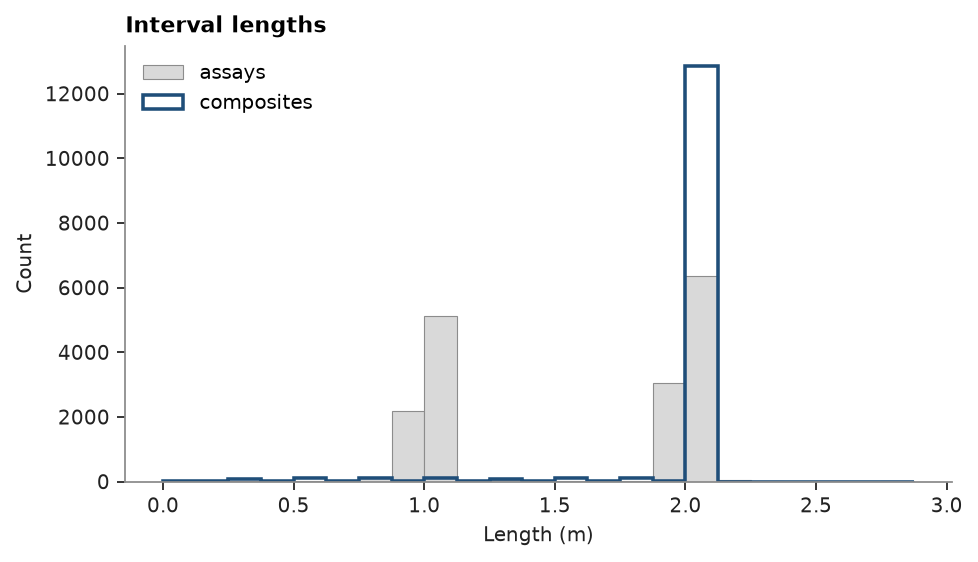

# compositing

the stacked sulphide lenses: 16 995 assays, mostly 1 m or 2 m, taken only in and around the mineralized zones, and 1726
lithology intervals. compositing brings the assays to one support. it must not average across a contact, read
unsampled core as zero, or create or lose metal.

<details><summary>Python</summary>

```python
import boitata as bt
import matplotlib.pyplot as plt
import numpy as np
from common import ACCENT, GRAY, LIGHT, save
```

</details>

assays and lithology come in separate interval tables. `merge_intervals` splits both at each boundary so each piece
carries its grades and its lithology. pieces outside the assayed zones have no grades.

<details><summary>Python</summary>

```python
data = bt.datasets.stacked_sulphide_lenses()
collar, survey, assay, lithology = data["collars"], data["surveys"], data["assays"], data["lithology"]
GRADES = ["ZN_PCT", "PB_PCT", "CU_PCT", "AG_GPT", "AU_GPT"]
intervals = bt.merge_intervals(assay, lithology)
dh = bt.Drillholes(collar, survey, intervals)
print(f"{assay.num_rows} assays + {lithology.num_rows} lithology intervals -> {intervals.num_rows} merged")
print(dh)
```

</details>

```text
16995 assays + 1726 lithology intervals -> 17848 merged
Drillholes(289 holes, 17848 intervals)
  HOLE_ID: Utf8
  FROM: Float64
  TO: Float64
  ZN_PCT: Float64
  PB_PCT: Float64
  CU_PCT: Float64
  AG_GPT: Float64
  AU_GPT: Float64
  DENSITY: Float64
  LITH: Utf8
```

compositing to 2 m by `LITH` cuts intervals at each 2 m mark and at each contact, so no composite averages across
one. a grade is the mean over the length that carries a value, which keeps unsampled core from counting as zero.
each grade returns that length as `<grade>_length`, next to `length`, which also counts unsampled ground.
composites without assays are dropped. here the assayed zones start and end at lithology contacts, so inside a
lithology Zn is sampled everywhere. the RC holes have no Au assays.

<details><summary>Python</summary>

```python
composites = dh.composite(2.0, GRADES, domain="LITH")
partial = composites["ZN_PCT_length"] < composites["length"] - 1e-9
no_au = np.isnan(composites["AU_GPT"])
print(
    f"{len(composites)} composites; {partial.sum()} partly unsampled for Zn; {no_au.sum()} without Au (RC holes)"
)
```

</details>

```text
13602 composites; 0 partly unsampled for Zn; 2247 without Au (RC holes)
```

the assays are mostly 1 m or 2 m and the composites 2 m, with shorter tails where a run of one lithology ends.

<details><summary>Python</summary>

```python
raw_len = assay["TO"] - assay["FROM"]
fig, ax = plt.subplots(figsize=(6, 3.4), layout="constrained")
bins = np.arange(0, 3.0, 0.125)
ax.hist(raw_len, bins, color=LIGHT, edgecolor=GRAY, lw=0.5, label="assays")
ax.hist(composites["length"], bins, histtype="step", color=ACCENT, lw=1.6, label="composites")
ax.set(title="Interval lengths", xlabel="Length (m)", ylabel="Count")
ax.legend(loc="upper left")
save(fig, "compositing")
```

</details>



other supports. `length=None` gives one composite per run of a lithology. `intervals=` composites to given
intervals instead, here 10 m benches: the depths where each desurveyed path crosses a bench elevation. `residual=`
decides what happens to a run's tail shorter than `min_fraction` of the length: kept, merged into the previous
composite or dropped. without `domain`, composites cross contacts and `categories=` gives the lithology covering
most of each.

<details><summary>Python</summary>

```python
BENCH = 10.0
paths = dh.paths()
hole, depth, z = paths["HOLE_ID"], paths["depth"], paths["z"]
cuts = {h: [0.0, depth[hole == h].max()] for h in np.unique(hole)}
for i in np.flatnonzero(hole[1:] == hole[:-1]):
    lo, hi = sorted((z[i], z[i + 1]))
    for level in np.arange(np.ceil(lo / BENCH) * BENCH, hi, BENCH):
        cuts[hole[i]].append(depth[i] + (level - z[i]) / (z[i + 1] - z[i]) * (depth[i + 1] - depth[i]))
benches = {"HOLE_ID": [], "FROM": [], "TO": []}
for h, c in cuts.items():
    c = np.unique(c)
    benches["HOLE_ID"] += [h] * (len(c) - 1)
    benches["FROM"] += list(c[:-1])
    benches["TO"] += list(c[1:])

modes = {
    "2 m": composites,
    "runs": dh.composite(None, GRADES, domain="LITH"),
    "10 m benches": dh.composite(None, GRADES, domain="LITH", intervals=benches),
    "2 m, merge < 1 m": dh.composite(2.0, GRADES, domain="LITH", residual="merge"),
    "2 m, drop < 1 m": dh.composite(2.0, GRADES, domain="LITH", residual="drop"),
    "2 m, majority LITH": dh.composite(2.0, GRADES, categories=["LITH"]),
}
for name, c in modes.items():
    print(f"{name:>18}: {len(c):6} composites, median length {np.median(c['length']):.1f} m")
```

</details>

```text
               2 m:  13602 composites, median length 2.0 m
              runs:    873 composites, median length 12.2 m
      10 m benches:   3176 composites, median length 10.8 m
  2 m, merge < 1 m:  13301 composites, median length 2.0 m
   2 m, drop < 1 m:  13284 composites, median length 2.0 m
2 m, majority LITH:  13390 composites, median length 2.0 m
```

metal balance: Σ grade × `<grade>_length` over the composites reproduces Σ grade × interval length over the assays,
for each grade and each mode except `drop`, which leaves its short tails out. weighting by `length` instead
counts unsampled ground at the composite grade and inflates metal, here where majority-`LITH` composites cross a
contact into unassayed rock.

<details><summary>Python</summary>

```python
def metal(grade, length):
    return np.nansum(grade * length)


assayed = {g: metal(assay[g], raw_len) for g in GRADES}
print(f"{'':>18}  {'Zn metal':>10}  {'error':>8}  {'by length':>9}")
print(f"{'assays':>18}  {assayed['ZN_PCT']:10.1f}")
for name, c in modes.items():
    zn_metal = metal(c["ZN_PCT"], c["ZN_PCT_length"])
    error, naive = zn_metal / assayed["ZN_PCT"] - 1, metal(c["ZN_PCT"], c["length"]) / assayed["ZN_PCT"] - 1
    print(f"{name:>18}  {zn_metal:10.1f}  {error:+8.1e}  {naive:+9.1%}")
    if name != "2 m, drop < 1 m":
        for g in GRADES:
            assert abs(metal(c[g], c[f"{g}_length"]) / assayed[g] - 1) < 1e-9, (name, g)
print("metal balanced to 1e-9 for", ", ".join(GRADES))
```

</details>

```text
                      Zn metal     error  by length
            assays     15710.3
               2 m     15710.3  -1.1e-16      -0.0%
              runs     15710.3  +0.0e+00      +0.0%
      10 m benches     15710.3  -2.2e-16      -0.0%
  2 m, merge < 1 m     15710.3  -1.1e-16      -0.0%
   2 m, drop < 1 m     15388.3  -2.0e-02      -2.0%
2 m, majority LITH     15710.3  -1.1e-16      +0.1%
metal balanced to 1e-9 for ZN_PCT, PB_PCT, CU_PCT, AG_GPT, AU_GPT
```

Full script: [`example_02_03.py`](example_02_03.py)
