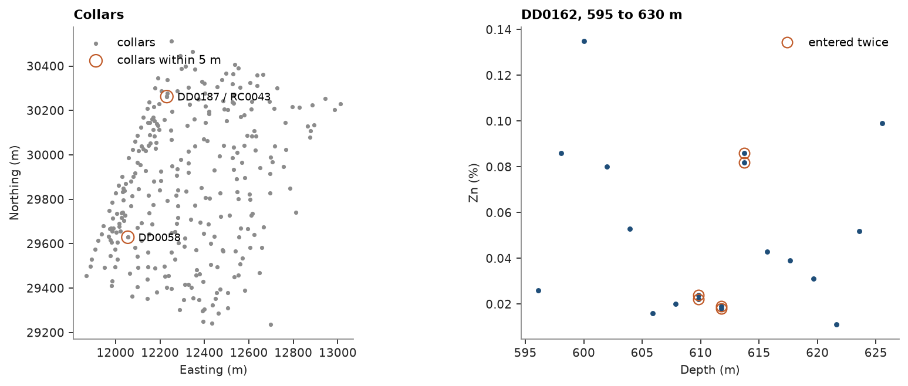

# Duplicates

Collars entered twice, holes collared next to each other and samples assayed twice put several records at one place,
and kriging cannot weight two samples at the same location. `duplicates` groups the samples closer than a tolerance
and merges each group. The raw tables of the stacked sulphide lenses carry such errors on purpose.

<details><summary>Python</summary>

```python
import boitata as bt
import matplotlib.pyplot as plt
import numpy as np
from common import ACCENT, GRAY, HIGHLIGHT, map_axes, save

raw = bt.datasets.stacked_sulphide_lenses(raw=True)
collars = raw["collars"]
names, counts = np.unique(collars["HOLE_ID"], return_counts=True)
print(f"{len(collars)} collars, {len(names)} hole ids, repeated: {', '.join(names[counts > 1])}")
```

</details>

```text
290 collars, 288 hole ids, repeated: DD0058, DD0067
```

## Collars

A repeated id is not always a repeated location. `duplicates` on the collar coordinates groups the collars within
5 m of one another, transitively, and gives each group's first collar and its spread.

<details><summary>Python</summary>

```python
xyz = np.column_stack([collars["X"], collars["Y"], collars["Z"]])
close, group_collars = bt.duplicates(xyz, tolerance=5.0)
for k, spread in zip(close["group"], close["spread"], strict=True):
    print(f"{' and '.join(collars['HOLE_ID'][group_collars == k])}: {spread:.1f} m apart")
for name in names[counts > 1]:
    first, second = xyz[collars["HOLE_ID"] == name]
    print(f"{name} twice: {np.linalg.norm(first - second):.0f} m apart")
```

</details>

```text
DD0058 and DD0058: 0.0 m apart
DD0187 and RC0043: 2.7 m apart
DD0058 twice: 0 m apart
DD0067 twice: 290 m apart
```

DD0058 is one row entered twice: drop one. DD0067 names two collars 290 m apart, an id clash rather than a
duplicate, which `check_drillholes` flags ([checking drill holes](../../02-data-and-geometry/01-check-drillholes/README.md)). DD0187 and RC0043 are two holes collared 2.7 m apart at
different dips, not a duplicate: nearby holes of two drilling types are [paired data](../../03-exploratory-analysis/01-paired-data/README.md).

## Samples

The grades of the raw assays are text, with `NS`, `<0.01` and `-999` among the numbers: anything that is not a plain
number is read as missing here. The other planted errors are fixed with the default rules of [checking drill holes](../../02-data-and-geometry/01-check-drillholes/README.md), except
overlaps, which are kept so that the samples entered twice survive.

<details><summary>Python</summary>

```python
def number(text):
    return np.array([float(v) if str(v).replace(".", "", 1).isdigit() else np.nan for v in text])


assays = raw["assays"]
assays = bt.Table({**{c: assays[c] for c in ("HOLE_ID", "FROM", "TO")}, "ZN_PCT": number(assays["ZN_PCT"])})
tables = {"collar": collars, "survey": raw["surveys"], "assays": assays}
flags, _, _ = bt.check_drillholes(collars, raw["surveys"], {"assays": assays}, max_depth="LENGTH")
fixed, _ = bt.fix_drillholes(flags, tables, overlaps="keep")
samples = bt.Drillholes(fixed["collar"], fixed["survey"], fixed["assays"]).samples()
print(f"{len(samples)} samples at their midpoints")
```

</details>

```text
16779 samples at their midpoints
```

With a tolerance of 0, only samples at exactly the same location are grouped: three intervals of DD0162 were
entered twice, with grades within 10 % of each other.

<details><summary>Python</summary>

```python
report, group = bt.duplicates(samples, tolerance=0.0)
zn, hole = samples["ZN_PCT"], samples["HOLE_ID"]
depth = (samples["FROM"] + samples["TO"]) / 2
for k in report["group"]:
    rows = np.flatnonzero(group == k)
    values = " and ".join(f"{v:.3f}" for v in zn[rows])
    print(f"{hole[rows[0]]} at {depth[rows[0]]:.1f} m: Zn {values} %")

fig, (a, b) = plt.subplots(1, 2, figsize=(10, 4), layout="constrained", width_ratios=[1.3, 1])
a.scatter(xyz[:, 0], xyz[:, 1], s=5, color=GRAY, label="collars")
a.scatter(close["x"], close["y"], s=90, facecolors="none", edgecolors=HIGHLIGHT, label="collars within 5 m")
for k, x, y in zip(close["group"], close["x"], close["y"], strict=True):
    a.annotate(
        " / ".join(dict.fromkeys(collars["HOLE_ID"][group_collars == k])),
        (x, y),
        (8, -3),
        textcoords="offset points",
        fontsize=8,
    )
map_axes(a, "Collars")
a.legend(loc="upper left")
rows = np.flatnonzero((hole == "DD0162") & (depth > 595) & (depth < 630))
b.plot(depth[rows], zn[rows], "o", ms=3, color=ACCENT)
twice = rows[group[rows] >= 0]
b.plot(depth[twice], zn[twice], "o", ms=8, mfc="none", color=HIGHLIGHT, label="entered twice")
b.set(title="DD0162, 595 to 630 m", xlabel="Depth (m)", ylabel="Zn (%)")
b.legend(loc="upper right")
save(fig, "duplicates")
```

</details>

```text
DD0162 at 609.8 m: Zn 0.024 and 0.022 %
DD0162 at 611.8 m: Zn 0.018 and 0.019 %
DD0162 at 613.8 m: Zn 0.086 and 0.082 %
```



A tolerance of a meter or two would also group neighbors along a hole, short intervals on both sides of a contact
that are not duplicates. `merge="mean"` replaces each group by one sample at its first location with the mean
grade, and the `n` column counts the samples behind each row; `"first"` keeps the first entry instead, `"max"` the
largest value.

<details><summary>Python</summary>

```python
merged = bt.duplicates(samples, merge="mean")
twins = merged["n"] > 1
means = ", ".join(f"{v:.3f}" for v in merged["ZN_PCT"][twins])
print(f"{len(merged)} samples, {int(twins.sum())} of them merged pairs, Zn {means} %")
```

</details>

```text
16776 samples, 3 of them merged pairs, Zn 0.023, 0.018, 0.084 %
```

Full script: [`example_02_04.py`](example_02_04.py)
