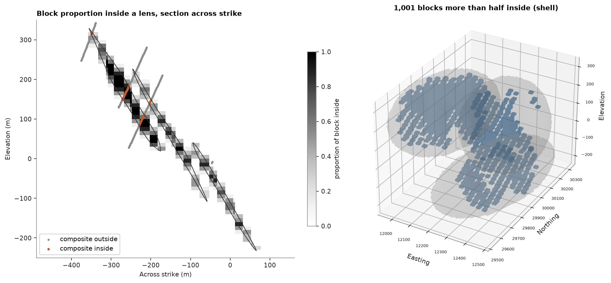

# Solids

A closed triangle mesh bounds a domain. `Mesh.contains` flags the samples inside it, `Mesh.proportion` measures
how much of each block it fills, `BlockModel.mask` keeps the blocks that count as inside and `block_shell` draws
them. Here the three stacked sulphide lenses are the solids.

<details><summary>Python</summary>

```python
import ceres as cs
import matplotlib.pyplot as plt
import numpy as np
from common import ACCENT, GRAY, HIGHLIGHT, LIGHT, save
from mpl_toolkits.mplot3d.art3d import Poly3DCollection
```

</details>

A solid needs a closed mesh: no boundary edges, every edge shared by two triangles. `Mesh.analysis` checks
that before anything relies on an inside; [mesh files](../../02-data-and-geometry/07-mesh-files/README.md) repairs meshes that fail it.

<details><summary>Python</summary>

```python
data = cs.datasets.stacked_sulphide_lenses()
lenses = [data[f"lens_{i}"] for i in (1, 2, 3)]
for i, lens in enumerate(lenses, 1):
    print(f"lens {i}: {lens}, {lens.analysis['boundary_edges']} boundary edges, {lens.volume:,.0f} m3")
```

</details>

```text
lens 1: Mesh(15766 vertices, 31528 triangles, closed), 0 boundary edges, 2,788,266 m3
lens 2: Mesh(12962 vertices, 25920 triangles, closed), 0 boundary edges, 1,901,081 m3
lens 3: Mesh(13034 vertices, 26064 triangles, closed), 0 boundary edges, 1,652,929 m3
```

`contains` tests points by generalized winding number. Of the 2 m zinc composites, those inside a lens carry
the ore:

<details><summary>Python</summary>

```python
holes = cs.Drillholes(data["collars"], data["surveys"], data["assays"])
composites = holes.composite(2.0, ["ZN_PCT"])
xyz, zn = composites.coords, composites["ZN_PCT"]
inside = np.array([lens.contains(xyz) for lens in lenses])
for i, flags in enumerate(inside, 1):
    print(f"lens {i}: {flags.sum():4} composites, mean Zn {np.nanmean(zn[flags]):.2f}%")
outside = ~inside.any(axis=0)
print(f"outside: {outside.sum()} composites, mean Zn {np.nanmean(zn[outside]):.2f}%")
```

</details>

```text
lens 1:  603 composites, mean Zn 6.19%
lens 2:  280 composites, mean Zn 5.97%
lens 3:  252 composites, mean Zn 6.02%
outside: 12177 composites, mean Zn 0.08%
```

A 20 × 20 × 10 m model around the lenses comes from `BlockModel.from_extents` ([block model from extents](../../02-data-and-geometry/12-block-model-from-extents/README.md)). `proportion` settles
blocks no triangle passes through with one centroid test and samples `discretization`³ points in the others,
here 8. Summed over the blocks, the proportions give back each lens's volume to within 1 %.

<details><summary>Python</summary>

```python
size = (20, 20, 10)
blocks = cs.BlockModel.from_extents(*lenses, size=size, buffer=10, snap=True)
proportions = [lens.proportion(blocks, discretization=2) for lens in lenses]
for i, (lens, p) in enumerate(zip(lenses, proportions), 1):
    print(f"lens {i}: mesh {lens.volume:,.0f} m3, blocks {p.sum() * np.prod(size):,.0f} m3")
blocks = blocks.with_column("proportion", np.sum(proportions, axis=0))
```

</details>

```text
lens 1: mesh 2,788,266 m3, blocks 2,788,500 m3
lens 2: mesh 1,901,081 m3, blocks 1,884,000 m3
lens 3: mesh 1,652,929 m3, blocks 1,652,500 m3
```

`mask` keeps the blocks more than half inside a lens. The lenses are thin next to the blocks, so many blocks
they cross are less than half filled, and the kept blocks hold under two thirds of the lens volume; [sub-blocks](../../02-data-and-geometry/06-sub-blocks/README.md)
sub-blocks the edges instead.

<details><summary>Python</summary>

```python
ore = blocks.mask(blocks["proportion"] > 0.5)
print(f"{len(blocks):,} blocks, {len(ore):,} more than half inside: {ore.volumes.sum():,.0f} m3")
print(f"lenses: {sum(lens.volume for lens in lenses):,.0f} m3")
```

</details>

```text
79,200 blocks, 1,001 more than half inside: 4,004,000 m3
lenses: 6,342,276 m3
```

A vertical section across strike (the lenses strike N22.5°E) shows the block proportions with the lens
outlines and the composites within 10 m of the section. `block_shell` turns the masked blocks into the mesh of
their outer faces, drawn in 3D over the lens surfaces.

<details><summary>Python</summary>

```python
center = np.mean([lens.vertices.mean(axis=0) for lens in lenses], axis=0)
plane = (center, 112.5, 90)
fig = plt.figure(figsize=(12, 5.5), layout="constrained")
a = fig.add_subplot(1, 2, 1)
cs.plot.section(blocks, "proportion", plane=plane, colorbar=False, vmin=0, vmax=1, cmap="Greys", ax=a)
cs.plot.slab(xyz[outside], plane=plane, thickness=20, s=4, color=GRAY, label="composite outside", ax=a)
cs.plot.slab(
    xyz[~outside],
    plane=plane,
    thickness=20,
    meshes=lenses,
    s=6,
    color=HIGHLIGHT,
    label="composite inside",
    ax=a,
)
a.set(title="Block proportion inside a lens, section across strike", xlabel="Across strike (m)")
a.legend(loc="lower left", frameon=True, framealpha=0.9)
fig.colorbar(a.images[0], ax=a, shrink=0.7, label="proportion of block inside")

b = fig.add_subplot(1, 2, 2, projection="3d")
shell = cs.block_shell(ore)
b.add_collection3d(
    Poly3DCollection(shell.vertices[shell.triangles], facecolor=ACCENT, edgecolor="none", alpha=0.35)
)
for lens in lenses:
    b.plot_trisurf(*lens.vertices.T, triangles=lens.triangles, color=LIGHT, linewidth=0, alpha=0.2)
lo, hi = np.array(blocks.origin), np.array(blocks.origin) + np.array(size) * blocks.count
b.set(xlim=(lo[0], hi[0]), ylim=(lo[1], hi[1]), zlim=(lo[2], hi[2]))
b.set_box_aspect(hi - lo)
b.set_title(f"{len(ore):,} blocks more than half inside (shell)")
b.set_xlabel("Easting")
b.set_ylabel("Northing")
b.set_zlabel("Elevation")
b.tick_params(labelsize=6)
save(fig, "solids")
```

</details>



Full script: [`example_02_05.py`](example_02_05.py)
