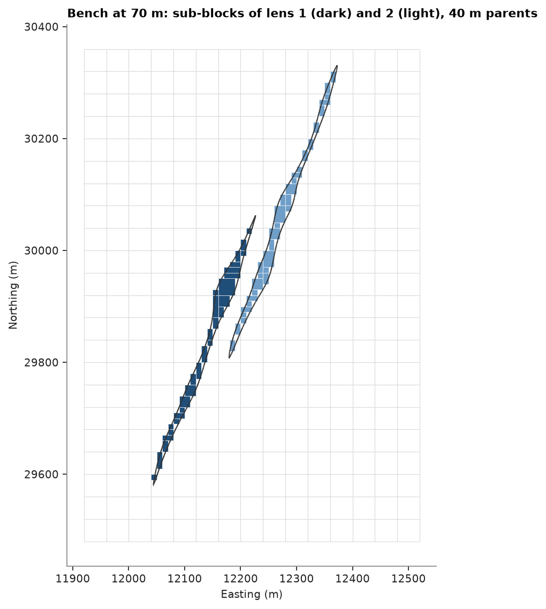
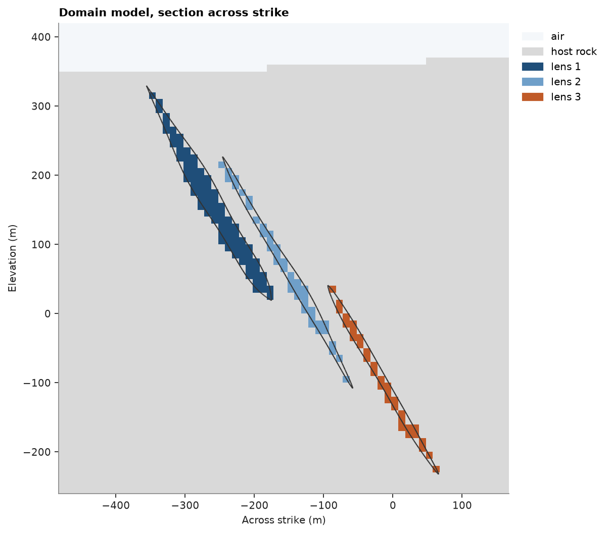

# sub-blocks

whole blocks misstate the volume of a thin solid ([solids](../../02-data-and-geometry/05-solids/README.md)). a sub-blocked model splits the blocks a mesh cuts
into smaller cells and keeps the others whole. `subblock` does this on an existing grid, `BlockModel.from_meshes`
builds the model from meshes in one call, and `regularize` moves columns from sub-blocks to any other grid of
the same rotation. here the three stacked sulphide lenses and the topography are the meshes.

<details><summary>Python</summary>

```python
import boitata as bt
import matplotlib.pyplot as plt
import numpy as np
from common import ACCENT, HIGHLIGHT, LIGHT, save
```

</details>

`BlockModel.from_extents` builds the parent grid, 40 × 40 × 20 m around the lenses ([block model from extents](../../02-data-and-geometry/12-block-model-from-extents/README.md)).

<details><summary>Python</summary>

```python
data = bt.datasets.stacked_sulphide_lenses()
lenses = [data[f"lens_{i}"] for i in (1, 2, 3)]
names = ["lens 1", "lens 2", "lens 3"]
parents = bt.BlockModel.from_extents(*lenses, size=(40, 40, 20), buffer=10, snap=True)
print(parents)
```

</details>

```text
BlockModel(regular, 10230 of 10230 cells, count [15, 22, 31], size [40.0, 40.0, 20.0], rotation [0.0, 0.0, 0.0])
```

`subblock` takes `(mesh, rule, label)` domains in priority order and a sub-grid of `n` cells per parent edge.
each sub-cell of a block a mesh cuts takes the label of the first domain holding its center, and the sub-cells
of a block merge along x, then y. blocks no mesh cuts stay whole. without `fill`, cells outside all domains are
dropped. counting centers gets each lens's volume nearly right at any sub-grid, as errors on either side cancel.
a finer sub-grid shrinks the volume in the wrong place: sub-block volume outside its lens plus lens volume
outside its sub-blocks, measured with `Mesh.proportion`.

<details><summary>Python</summary>

```python
domains = [(lens, "inside", name) for lens, name in zip(lenses, names)]


def misplaced(model):
    labels = model["domain"]
    total = 0.0
    for lens, name in zip(lenses, names):
        part = model.filter(labels == name)
        inside = lens.proportion(part, discretization=2) * part.volumes
        total += (part.volumes - inside).sum() + lens.volume - inside.sum()
    return total


print(f"lenses: {sum(lens.volume for lens in lenses):,.0f} m3")
for n in (1, 2, 4):
    model = parents.subblock(domains, n)
    print(
        f"sub-grid {n}: {len(model):>5} sub-blocks, {model.volumes.sum():,.0f} m3, {misplaced(model):,.0f} m3 misplaced"
    )
subblocked = model
print(subblocked)
print(f"whole parents: {(subblocked.extents == [0, 0, 0, 1, 1, 1]).all(axis=1).sum()}")
```

</details>

```text
lenses: 6,342,276 m3
sub-grid 1:   201 sub-blocks, 6,432,000 m3, 7,566,276 m3 misplaced
sub-grid 2:  1189 sub-blocks, 6,324,000 m3, 4,298,276 m3 misplaced
sub-grid 4:  5731 sub-blocks, 6,325,000 m3, 1,691,901 m3 misplaced
BlockModel(sub-blocked, 5731 sub-blocks in 10230 cells, count [15, 22, 31], size [40.0, 40.0, 20.0], rotation [0.0, 0.0, 0.0])
  domain: Utf8
whole parents: 0
```

each sub-block stores its parent cell and its extent as fractions of that cell (`extents`: min x, y, z, then
max x, y, z). the lenses are thinner than a 40 m parent, so the surface cuts each parent they reach and no
lens block stays whole. the plan shows one bench, the sub-blocks in the parent grid and the lens outlines at
mid-bench:

<details><summary>Python</summary>

```python
size = np.array(parents.size)
z = subblocked.z
level = parents.origin[2] + size[2] * (np.round((np.median(z) - parents.origin[2]) / size[2]) + 0.5) + 0.1
half = size[2] * (subblocked.extents[:, 5] - subblocked.extents[:, 2]) / 2
cut = (z - half < level) & (z + half > level)
labels = subblocked["domain"]
colors = dict(zip(names, (ACCENT, "#6f9fc9", HIGHLIGHT)))
fig, ax = plt.subplots(figsize=(6.4, 7), layout="constrained")
for c, e, name in zip(subblocked.coords[cut], subblocked.extents[cut], labels[cut]):
    dx, dy = (e[3] - e[0]) * size[0], (e[4] - e[1]) * size[1]
    ax.add_patch(
        plt.Rectangle(
            (c[0] - dx / 2, c[1] - dy / 2), dx, dy, facecolor=colors[name], edgecolor="white", lw=0.3
        )
    )
bt.plot.slab(np.empty((0, 3)), plane=((0, 0, level), 90, 0), thickness=1, meshes=lenses, ax=ax)
x0, y0, _ = parents.origin
nx, ny, _ = parents.count
ax.vlines(x0 + size[0] * np.arange(nx + 1), y0, y0 + ny * size[1], color=LIGHT, lw=0.5, zorder=0)
ax.hlines(y0 + size[1] * np.arange(ny + 1), x0, x0 + nx * size[0], color=LIGHT, lw=0.5, zorder=0)
ax.set(title=f"Bench at {level:.0f} m: sub-blocks of lens 1 (dark) and 2 (light), 40 m parents")
save(fig, "subblocks")
```

</details>



## a domain model from meshes

`BlockModel.from_meshes` builds the grid and sub-blocks it in one call. besides `"inside"` a solid, a domain
can be `"below"` or `"above"` a surface such as topography, and `fill` labels what no domain holds. topography
often comes as a grid of elevations, a 2D `BlockModel` with an elevation column, and `grid_surface` triangulates
it through the cell centers. the lenses come first, so they win over the host rock that also lies below the
surface. the grid is the parent grid raised to the highest point of the topography.

<details><summary>Python</summary>

```python
topography = bt.grid_surface(data["topography"], "Z")
origin, count = parents.origin, np.array(parents.count)
count[2] = np.ceil((np.nanmax(data["topography"]["Z"]) - origin[2]) / size[2])
domain_model = bt.BlockModel.from_meshes(
    origin,
    size,
    count,
    [*domains, (topography, "below", "host rock")],
    4,
    fill="air",
)
print(domain_model)
labels = domain_model["domain"]
for name in [*names, "host rock", "air"]:
    print(f"{name:>9}: {domain_model.volumes[labels == name].sum():>13,.0f} m3")
print(f"    total: {domain_model.volumes.sum():>13,.0f} m3 = grid {np.prod(size) * count.prod():,.0f} m3")
```

</details>

```text
BlockModel(sub-blocked, 26600 sub-blocks in 11220 cells, count [15, 22, 34], size [40.0, 40.0, 20.0], rotation [0.0, 0.0, 0.0])
  domain: Utf8
   lens 1:     2,788,500 m3
   lens 2:     1,884,000 m3
   lens 3:     1,652,500 m3
host rock:   322,929,000 m3
      air:    29,786,000 m3
    total:   359,040,000 m3 = grid 359,040,000 m3
```

a vertical section across strike (the lenses strike N22.5°E) through the domain model, with the lens outlines:

<details><summary>Python</summary>

```python
scheme = bt.Categories(["air", "host rock", *names], colors=["#f4f7fa", LIGHT, ACCENT, "#6f9fc9", HIGHLIGHT])
center = np.mean([lens.coords.mean(axis=0) for lens in lenses], axis=0)
plane = (center, 112.5, 90)
fig, ax = plt.subplots(figsize=(9, 6.5), layout="constrained")
bt.plot.section(domain_model, scheme.encode(domain_model["domain"]), plane=plane, scheme=scheme, ax=ax)
bt.plot.slab(np.empty((0, 3)), plane=plane, thickness=1, meshes=lenses, ax=ax)
ax.set(title="Domain model, section across strike", xlabel="Across strike (m)")
save(fig, "domains")
```

</details>



## regularizing

`regularize` moves columns between any two models of the same rotation by the volume each pair of blocks
shares: floats as volume-weighted means, labels by the value filling the most volume. here the lens sub-blocks
take an inverse-distance Zn grade from the 2 m composites inside their own lens, then go back to the 40 m
parents. `fraction` is how much of each parent the sub-blocks fill, so volume × fraction × grade keeps the
metal. `min_fraction` drops the thin edges and the metal in them.

<details><summary>Python</summary>

```python
holes = bt.Drillholes.from_tables(data)
composites = holes.composite(2.0, ["ZN_PCT"])
search = bt.Search(100, max_samples=12)
labels = subblocked["domain"]
grade = np.full(len(subblocked), np.nan)
for lens, name in zip(lenses, names):
    inside = composites.filter(lens.contains(composites)).drop_null("ZN_PCT")
    on = labels == name
    grade[on] = bt.InverseDistance(search).fit(inside, "ZN_PCT").predict(subblocked.coords[on])
subblocked = subblocked.with_column("zn", grade)
metal = (subblocked.volumes * grade).sum()
print(f"sub-blocks: {subblocked.volumes.sum():,.0f} m3 at {metal / subblocked.volumes.sum():.2f}% Zn")
for minimum in (0.0, 0.5):
    out = subblocked.regularize(parents, min_fraction=minimum)
    kept = ~np.isnan(out["zn"])
    volume = out.volumes[kept] * out["fraction"][kept]
    print(
        f"min_fraction {minimum}: {kept.sum()} parents, {volume.sum():,.0f} m3 at"
        f" {np.average(out['zn'][kept], weights=volume):.2f}% Zn, {(volume * out['zn'][kept]).sum() / metal:.1%} of the metal"
    )
```

</details>

```text
sub-blocks: 6,325,000 m3 at 6.44% Zn
min_fraction 0.0: 945 parents, 6,325,000 m3 at 6.44% Zn, 100.0% of the metal
min_fraction 0.5: 67 parents, 1,323,500 m3 at 7.02% Zn, 22.8% of the metal
```

a label keeps only the value that fills most of a block. the lenses fill few 40 m blocks by more than half,
so the regularized label keeps a fraction of their volume. an indicator column averages to a proportion per
block instead and keeps all of it.

<details><summary>Python</summary>

```python
is_ore = np.isin(domain_model["domain"], names)
domain_model = domain_model.with_column("ore", is_ore.astype(float))
coarse = domain_model.regularize(bt.BlockModel(origin=origin, size=size, count=count))
labeled = coarse.volumes[np.isin(coarse["domain"], names)].sum()
proportion = (coarse.volumes * coarse["fraction"] * coarse["ore"]).sum()
print(f"lens sub-blocks {domain_model.volumes[is_ore].sum():,.0f} m3")
print(f"40 m blocks: labeled as a lens {labeled:,.0f} m3, lens proportion {proportion:,.0f} m3")
```

</details>

```text
lens sub-blocks 6,325,000 m3
40 m blocks: labeled as a lens 1,856,000 m3, lens proportion 6,325,000 m3
```

Full script: [`example_02_06.py`](example_02_06.py)
