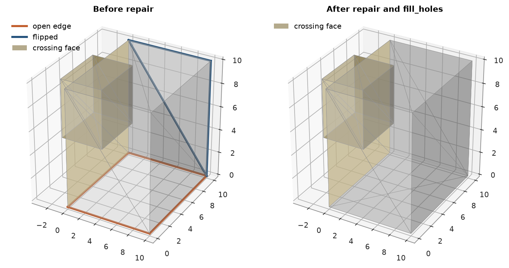

# mesh files

`read_mesh` and `write_mesh` handle OBJ, STL (binary or ASCII) and DXF, chosen by the file extension.
`Mesh.validate` reports what keeps a mesh from being a solid, and `Mesh.repair` and `Mesh.fill_holes` fix what
they can. you read the four gold veins of the grade-control dataset from their STL files, write them back in each
format, break one into loose triangles and repair it, then take a small solid apart problem by problem.

<details><summary>Python</summary>

```python
import tempfile

import boitata as bt
import matplotlib.pyplot as plt
import numpy as np
from common import ACCENT, GRAY, HIGHLIGHT, LIGHT, save
```

</details>

`bt.datasets.fetch` gives the local path of a dataset file. STL stores each triangle with its own three corners,
so reading welds the repeated corners. the veins come back closed, with a volume and an area.

<details><summary>Python</summary>

```python
veins = {}
for name in ("V1", "V2", "V3", "V4"):
    path = bt.datasets.fetch(f"mining/3d/vein-gold-grade-control/vein_{name}.stl")
    veins[name] = bt.read_mesh(path)
    mesh = veins[name]
    print(f"{name}: {path.stat().st_size / 1e6:.1f} MB, {mesh}, {mesh.volume:,.0f} m3, {mesh.area:,.0f} m2")
```

</details>

```text
V1: 2.7 MB, Mesh(26949 vertices, 53894 triangles, closed), 658,570 m3, 663,874 m2
V2: 0.7 MB, Mesh(7187 vertices, 14370 triangles, closed), 142,085 m3, 295,492 m2
V3: 0.9 MB, Mesh(8823 vertices, 17642 triangles, closed), 179,815 m3, 374,375 m2
V4: 0.3 MB, Mesh(3494 vertices, 6984 triangles, closed), 55,521 m3, 154,643 m2
```

the veins in plan at 700 m and on an east-west section at northing 15 000 m:

<details><summary>Python</summary>

```python
planes = {
    "Plan at 700 m": ((0, 0, 700), 90, 0),
    "Section at northing 15 000 m": ((0, 15000, 0), 90, 90),
}
fig, axes = plt.subplots(1, 2, figsize=(8, 6), layout="constrained")
for ax, (title, plane) in zip(axes, planes.items()):
    bt.plot.slab(np.empty((0, 3)), plane=plane, thickness=1, meshes=list(veins.values()), ax=ax)
    normal = np.array([0, 0, 1]) if plane[2] == 0 else np.array([0, 1, 0])
    along = [0, 1] if plane[2] == 0 else [0, 2]
    for name, mesh in veins.items():
        near = np.abs((mesh.vertices - plane[0]) @ normal) < 5
        if near.any():
            top = mesh.vertices[near][:, along]
            ax.annotate(name, top[top[:, 1].argmax()], xytext=(0, 3), textcoords="offset points", ha="center")
    ax.set_title(title)
save(fig, "veins")
```

</details>


each format round-trips the vein. binary STL stores single precision, so vertices can move by a fraction of a
millimeter at mine coordinates. these files were written in single precision and come back unchanged. DXF
writes one 3D face per triangle, or with `dxf_entity="polyface"` polyface meshes that share vertices. both read
back with a `layer` column per triangle.

<details><summary>Python</summary>

```python
v1 = veins["V1"]
files = {
    "v1.stl": {},
    "v1_ascii.stl": {"ascii": True},
    "v1.obj": {},
    "v1.dxf": {},
    "v1_polyface.dxf": {"dxf_entity": "polyface"},
}
with tempfile.TemporaryDirectory() as folder:
    for file, options in files.items():
        path = Path(folder) / file
        bt.write_mesh(path, v1, **options)
        back = bt.read_mesh(path)
        shift = np.abs(back.vertices[back.triangles] - v1.vertices[v1.triangles]).max()
        print(
            f"{file:>15}: {path.stat().st_size / 1e6:5.1f} MB, {len(back.triangles)} triangles,"
            f" {back.volume:,.0f} m3, largest shift {shift * 1000:.3f} mm, columns {back.face_attributes.column_names}"
        )
```

</details>

```text
         v1.stl:   2.7 MB, 53894 triangles, 658,570 m3, largest shift 0.000 mm, columns []
   v1_ascii.stl:   9.8 MB, 53894 triangles, 658,570 m3, largest shift 0.000 mm, columns []
         v1.obj:   2.4 MB, 53894 triangles, 658,570 m3, largest shift 0.000 mm, columns []
         v1.dxf:  18.5 MB, 53894 triangles, 658,570 m3, largest shift 0.000 mm, columns ['layer']
v1_polyface.dxf:  12.1 MB, 53894 triangles, 658,570 m3, largest shift 0.000 mm, columns ['layer']
```

## repair

a solid from elsewhere can arrive as loose triangles, each with its own copy of its corners, rounded
differently and wound either way. such a mesh shares no edges, so it is open and has no volume. here V1 is broken
that way, with corners moved by about 0.01 mm, so neighbors that met along an edge now cross slightly and count as
self-intersections. `repair` welds corners within `tolerance`, drops degenerate and
repeated triangles, and winds each piece consistently, outward where it is closed. the tolerance has to exceed
the rounding and stay below the shortest edge, or welding collapses triangles and opens new holes:

<details><summary>Python</summary>

```python
rng = np.random.default_rng(7)
corners = v1.vertices[v1.triangles] + rng.normal(0, 1e-5, (len(v1.triangles), 3, 3))
loose = np.arange(3 * len(v1.triangles)).reshape(-1, 3)
flip = rng.random(len(loose)) < 0.5
loose[flip] = loose[flip, ::-1]
broken = bt.Mesh(corners.reshape(-1, 3), loose)
edges = np.linalg.norm(corners - np.roll(corners, 1, axis=1), axis=2)
print(broken, broken.validate().summary)
print(f"shortest edge {edges.min() * 1000:.1f} mm")
for tolerance in (1e-6, 1e-4, 5e-3):
    attempt = broken.repair(tolerance=tolerance)
    print(f"tolerance {tolerance:g} m: {attempt}")
repaired = broken.repair(tolerance=1e-4)
print(f"repaired at 0.1 mm: {repaired.volume:,.0f} m3, original {v1.volume:,.0f} m3")
```

</details>

```text
Mesh(161682 vertices, 53894 triangles, open, 161682 boundary edges) {'degenerate_faces': 0, 'duplicate_faces': 0, 'duplicate_vertices': 0, 'boundary_edges': 161682, 'non_manifold_edges': 0, 'non_manifold_vertices': 0, 'inconsistent_edges': 0, 'shells': 53894, 'inward_shells': 0, 'self_intersections': 21366, 'is_closed': False}
shortest edge 1.0 mm
tolerance 1e-06 m: Mesh(161644 vertices, 53894 triangles, open, 161682 boundary edges)
tolerance 0.0001 m: Mesh(26949 vertices, 53894 triangles, closed)
tolerance 0.005 m: Mesh(26938 vertices, 53871 triangles, open, 6 boundary edges)
repaired at 0.1 mm: 658,571 m3, original 658,570 m3
```

## a broken solid, problem by problem

two 10 m cubes: the first lost a side and has one triangle turned over, the second pokes into it. `validate` lists
each problem with the face, vertex or edge it sits on. `repair` turns the triangle back, `fill_holes` closes the
missing side with a fan, and the crossing between the cubes stays reported: no repair moves geometry.

<details><summary>Python</summary>

```python
corner = np.array([[x, y, z] for z in (0, 1) for y in (0, 1) for x in (0, 1)], float) * 10
sides = np.array(
    [[0, 2, 1], [1, 2, 3], [4, 5, 6], [5, 7, 6], [0, 1, 4], [1, 5, 4],
     [2, 6, 3], [3, 6, 7], [0, 4, 2], [2, 4, 6], [1, 3, 5], [3, 7, 5]]
)  # fmt: skip
first = sides[2:].copy()
first[5] = first[5, ::-1]
broken = bt.Mesh(np.vstack([corner, corner * 0.5 + [-3, 3, 4]]), np.vstack([first, sides + 8]))
report = broken.validate()
print(report.summary)
print(report.problems.to_polars().group_by("kind", maintain_order=True).len())
fixed = broken.repair().fill_holes()
print(fixed.validate().summary)
```

</details>

```text
{'degenerate_faces': 0, 'duplicate_faces': 0, 'duplicate_vertices': 0, 'boundary_edges': 4, 'non_manifold_edges': 0, 'non_manifold_vertices': 0, 'inconsistent_edges': 3, 'shells': 2, 'inward_shells': 0, 'self_intersections': 10, 'is_closed': False}
shape: (3, 2)
┌──────────────────────┬─────┐
│ kind                 ┆ len │
│ ---                  ┆ --- │
│ str                  ┆ u32 │
╞══════════════════════╪═════╡
│ boundary_edge        ┆ 4   │
│ inconsistent_winding ┆ 3   │
│ self_intersection    ┆ 10  │
└──────────────────────┴─────┘
{'degenerate_faces': 0, 'duplicate_faces': 0, 'duplicate_vertices': 0, 'boundary_edges': 0, 'non_manifold_edges': 0, 'non_manifold_vertices': 0, 'inconsistent_edges': 0, 'shells': 2, 'inward_shells': 0, 'self_intersections': 10, 'is_closed': True}
```

<details><summary>Python</summary>

```python
def edges_of(mesh, problems, kind):
    rows = problems.to_polars().filter(kind=kind)
    face, edge = rows["face"].to_numpy(), rows["edge"].to_numpy()
    t = mesh.triangles[face]
    return mesh.vertices[np.stack([t[np.arange(len(t)), edge], t[np.arange(len(t)), (edge + 1) % 3]], axis=1)]


def draw(ax, mesh, title):
    problems = mesh.validate().problems
    crossing = np.zeros(len(mesh.triangles), bool)
    rows = problems.to_polars().filter(kind="self_intersection")
    crossing[rows["face"].to_numpy()] = crossing[rows["other"].to_numpy()] = True
    ax.plot_trisurf(
        *mesh.vertices.T, triangles=mesh.triangles, color=LIGHT, edgecolor=GRAY, linewidth=0.3, alpha=0.3
    )
    for kind, color, label in (
        ("boundary_edge", HIGHLIGHT, "open edge"),
        ("inconsistent_winding", ACCENT, "flipped"),
    ):
        for i, segment in enumerate(edges_of(mesh, problems, kind)):
            ax.plot(*segment.T, color=color, linewidth=2.5, label=label if i == 0 else None)
    ax.plot_trisurf(
        *mesh.vertices.T,
        triangles=mesh.triangles[crossing],
        color="#d9a400",
        alpha=0.45,
        label="crossing face",
    )
    ax.set_title(title)
    ax.set_box_aspect((1, 1, 1))
    if ax.get_legend_handles_labels()[0]:
        ax.legend(loc="upper left")


fig = plt.figure(figsize=(9, 4.5), layout="constrained")
for i, (mesh, title) in enumerate(((broken, "Before repair"), (fixed, "After repair and fill_holes"))):
    draw(fig.add_subplot(1, 2, i + 1, projection="3d"), mesh, title)
save(fig, "repair")
```

</details>



Full script: [`example_02_07.py`](example_02_07.py)
