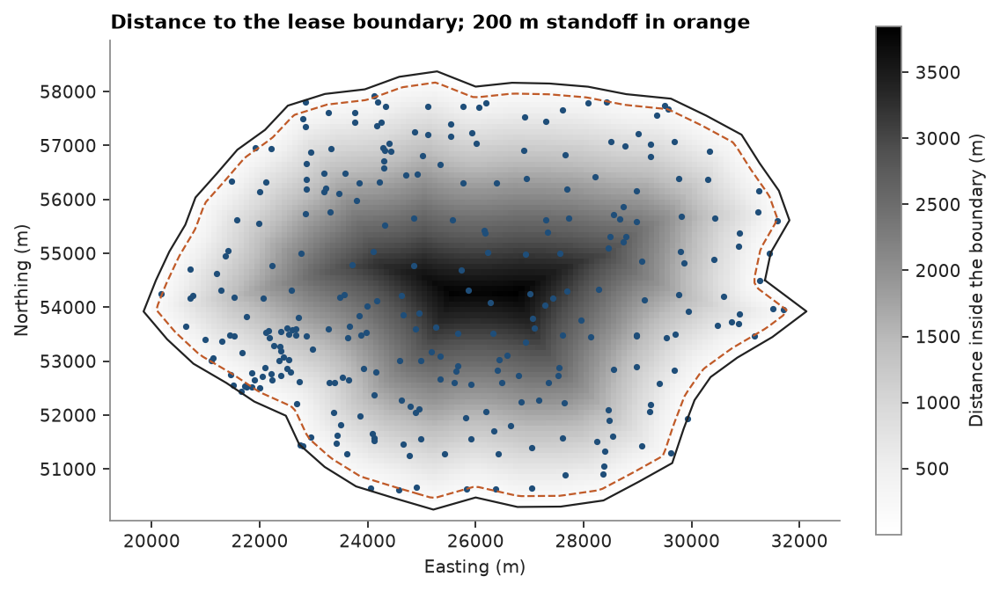
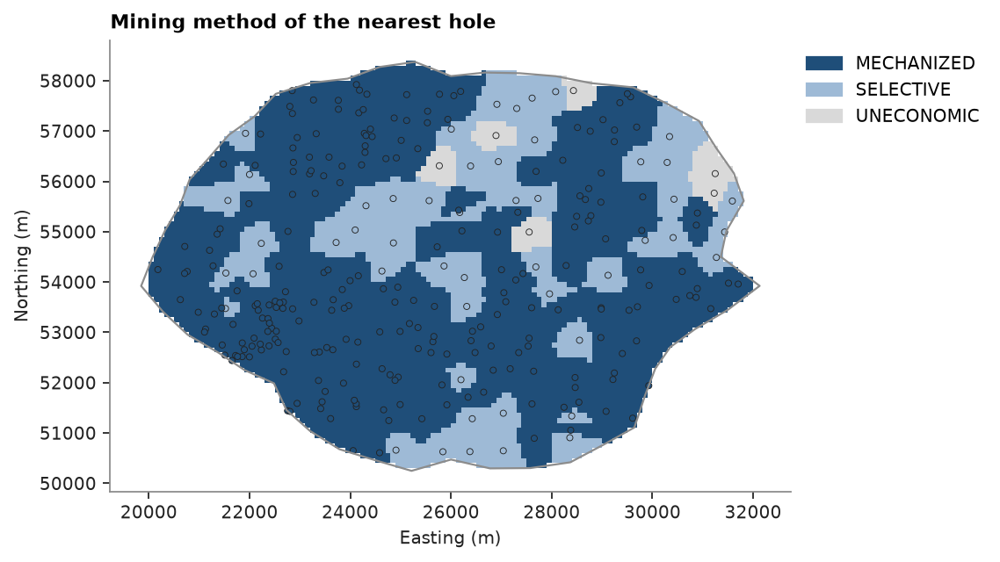
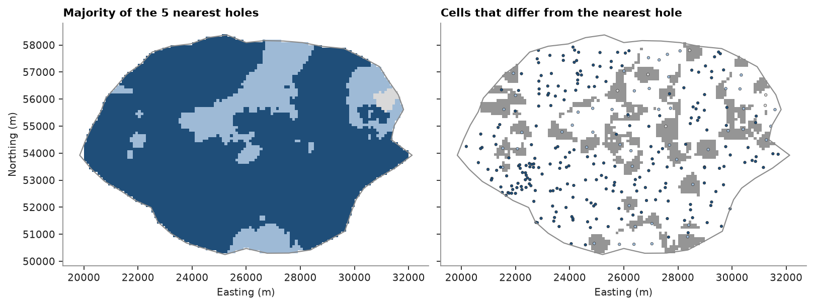
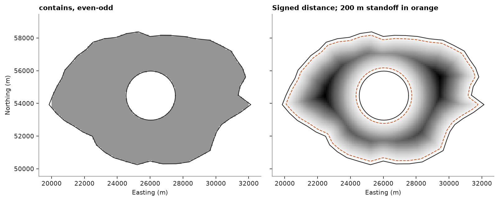

# polygons

a coal lease: 295 boreholes, each tagged with the mining method its seam suits, a 48-vertex lease boundary and a
100 m grid. polygons select what lies in the lease and measure how far each point is from its edge, and domains
spread from the holes to the grid.

<details><summary>Python</summary>

```python
import boitata as bt
import matplotlib.pyplot as plt
import numpy as np
from common import ACCENT, GRAY, HIGHLIGHT, INK, LIGHT, map_axes, save
```

</details>

## inside the lease

the boundary is a closed `Polylines`. its single part is the `(n, 2)` ring that `point_in_polygon` tests points
against, with the even-odd rule.

<details><summary>Python</summary>

```python
data = bt.datasets.coal_seam_thickness()
holes, grid, boundary = data["boreholes"], data["grid"], data["boundary"]
print(boundary)
lease = boundary.parts[0][:, :2]
xy, centers = holes.coords[:, :2], grid.coords[:, :2]
inside = bt.point_in_polygon(centers, lease)
print(f"{inside.sum()} of {len(grid)} cells inside, {inside.sum() * 100 * 100 / 1e6:.1f} km²")
print(f"agreement with the INSIDE flag: {np.mean(inside == (grid['INSIDE'] == 1)):.1%}")
print(f"{bt.point_in_polygon(xy, lease).sum()} of {len(xy)} holes inside")


def outline(ax, ring, **kwargs):
    ax.plot(*np.vstack([ring, ring[:1]]).T, **kwargs)
```

</details>

```text
Polylines(1 features, 1 parts, crs: none)
7162 of 10800 cells inside, 71.6 km²
agreement with the INSIDE flag: 100.0%
295 of 295 holes inside
```

## distance to the boundary

`polygon_distance` is the plan distance to the nearest edge; with `signed=True` points inside are negative. a
200 m standoff along the boundary, where no mining is allowed, is the cells within 200 m inside it.

<details><summary>Python</summary>

```python
distance = bt.polygon_distance(centers, lease, signed=True)
standoff = (distance > -200) & (distance < 0)
print(f"standoff: {standoff.sum()} cells, {standoff.sum() * 100 * 100 / 1e6:.1f} km²")
to_edge = -bt.polygon_distance(xy, lease, signed=True)
print(
    f"holes from the boundary: {to_edge.min():.1f} to {to_edge.max():.0f} m, {np.sum(to_edge < 200)} within 200 m"
)

fig, ax = plt.subplots(figsize=(7, 4.6), layout="constrained")
bt.plot.section(grid, np.where(inside, -distance, np.nan), ax=ax, colorbar=False, cmap="Greys")
fig.colorbar(ax.collections[0], ax=ax, shrink=0.8, label="Distance inside the boundary (m)")
ax.contour(
    grid.grid(grid.x)[0],
    grid.grid(grid.y)[0],
    grid.grid(distance)[0],
    levels=[-200],
    colors=HIGHLIGHT,
    linewidths=1,
)
outline(ax, lease, color=INK, lw=1)
ax.scatter(*xy.T, s=5, color=ACCENT)
map_axes(ax, "Distance to the lease boundary; 200 m standoff in orange")
save(fig, "distance")
```

</details>

```text
standoff: 640 cells, 6.4 km²
holes from the boundary: 0.1 to 3775 m, 23 within 200 m
```



## domains from the holes

`assign_domain` gives each target the domain of its nearest sample, read from the `domain_column` of the holes.
here the targets are the cells in the lease and the domain is the mining method. labels come back as a list, with
a confidence per target: the share of the `n` nearest holes (5 by default) that carry its label.

<details><summary>Python</summary>

```python
cells = grid.filter(inside)
labels, confidence = bt.assign_domain(cells, coords=holes, domain_column="CATEGORY")
methods = bt.Categories(["MECHANIZED", "SELECTIVE", "UNECONOMIC"], colors=[ACCENT, "#9ebad6", LIGHT])
codes = methods.encode(labels)
logged = methods.encode(holes["CATEGORY"])
for name, cell_share, hole_share in zip(
    methods.names, methods.shares(codes), methods.shares(logged), strict=True
):
    print(f"{name:>10}: {cell_share:6.1%} of the lease, {hole_share:6.1%} of the holes")

fig, ax = plt.subplots(figsize=(7, 4.6), layout="constrained")
bt.plot.section(cells, codes, scheme=methods, colorbar=False, ax=ax)
outline(ax, lease, color=GRAY, lw=1)
cmap, norm = bt.plot.category_colors(methods)
ax.scatter(*xy.T, c=logged, cmap=cmap, norm=norm, s=10, edgecolors=INK, linewidths=0.4)
bt.plot.category_legend(methods, ax, loc="upper left", bbox_to_anchor=(1, 1))
map_axes(ax, "Mining method of the nearest hole")
save(fig, "domains")
```

</details>

```text
MECHANIZED:  69.7% of the lease,  81.0% of the holes
 SELECTIVE:  26.9% of the lease,  16.9% of the holes
UNECONOMIC:   3.4% of the lease,   2.0% of the holes
```



`MECHANIZED` holes are 81.0 % of the holes, but their domain covers 69.7 % of the lease, because the infill went
where the seam is thick. counting cells instead of holes declusters the shares.

## majority vote

`method="majority"` takes the most frequent label among the `n` nearest holes instead, and a tie goes to the label
of the nearest hole. a lone hole among holes of another method no longer claims its own patch.

<details><summary>Python</summary>

```python
majority, agreement = bt.assign_domain(cells, coords=holes, domain_column="CATEGORY", method="majority")
changed = np.array(labels) != np.array(majority)
print(f"{changed.sum()} of {len(cells)} cells change label ({changed.mean():.1%})")
print(f"mean confidence: nearest {confidence.mean():.2f}, majority {agreement.mean():.2f}")
for name, share in zip(methods.names, methods.shares(methods.encode(majority)), strict=True):
    print(f"{name:>10}: {share:6.1%} of the lease")

fig, (a, b) = plt.subplots(1, 2, figsize=(10, 3.8), sharey=True, layout="constrained")
bt.plot.section(cells, methods.encode(majority), scheme=methods, colorbar=False, ax=a)
outline(a, lease, color=GRAY, lw=1)
map_axes(a, "Majority of the 5 nearest holes")
bt.plot.section(cells, changed.astype(float), ax=b, colorbar=False, cmap="Greys", vmin=0, vmax=2)
outline(b, lease, color=GRAY, lw=1)
b.scatter(*xy.T, c=logged, cmap=cmap, norm=norm, s=6, edgecolors=INK, linewidths=0.3)
map_axes(b, "Cells that differ from the nearest hole")
b.set_ylabel("")
save(fig, "majority")
```

</details>

```text
1314 of 7162 cells change label (18.3%)
mean confidence: nearest 0.75, majority 0.81
MECHANIZED:  80.4% of the lease
 SELECTIVE:  18.8% of the lease
UNECONOMIC:   0.7% of the lease
```



the changed cells sit around isolated `SELECTIVE` holes, now outvoted by their `MECHANIZED` neighbors, and
`MECHANIZED` grows from 69.7 % to 80.4 % of the lease. majority smooths the map but gives back the declustering:
where the drilling is dense, one method wins most votes.

## a polygon with a hole

a lease often excludes an area inside it, here a 1.5 km circle around a point in the middle. the exclusion is a
second closed part of the lease feature. `Polylines` decide inside by even-odd counting over a feature's closed
parts, so a ring inside another is a hole. `contains` leaves the exclusion out, `area` subtracts it and
`distance` measures to the nearest ring, negative inside, so the 200 m standoff now runs along both rings.
`PolygonSelector`, `point_in_polygon` and `BlockModel.subblock` take the same `Polylines`.

<details><summary>Python</summary>

```python
center = lease.mean(axis=0)
angle = np.linspace(0, 2 * np.pi, 60, endpoint=False)
exclusion = center + 1500 * np.column_stack([np.cos(angle), np.sin(angle)])
leased = bt.Polylines([lease, exclusion], closed=True, features=[0, 0], attributes={"name": ["lease"]})
kept = leased.contains(centers)
in_exclusion = bt.point_in_polygon(centers, exclusion)
print(
    f"area: {boundary.area()[0] / 1e6:.2f} km² lease, {leased.area()[0] / 1e6:.2f} km² net of the exclusion"
)
print(
    f"cells kept: {kept.sum()}, {np.sum(kept & in_exclusion)} of the {in_exclusion.sum()} in the exclusion zone"
)
print(f"PolygonSelector agrees: {np.array_equal(bt.PolygonSelector(leased).contains(centers), kept)}")
signed = leased.distance(centers, signed=True)
standoff = (signed > -200) & (signed < 0)
print(f"standoff along both rings: {standoff.sum()} cells, {standoff.sum() * 100 * 100 / 1e6:.1f} km²")

fig, (a, b) = plt.subplots(1, 2, figsize=(10, 3.8), sharey=True, layout="constrained")
bt.plot.section(grid, kept.astype(float), ax=a, colorbar=False, cmap="Greys", vmin=0, vmax=2)
bt.plot.section(grid, np.where(kept, -signed, np.nan), ax=b, colorbar=False, cmap="Greys")
b.contour(
    grid.grid(grid.x)[0],
    grid.grid(grid.y)[0],
    grid.grid(signed)[0],
    levels=[-200],
    colors=HIGHLIGHT,
    linewidths=1,
)
for ax, title in ((a, "contains, even-odd"), (b, "Signed distance; 200 m standoff in orange")):
    outline(ax, lease, color=INK, lw=1)
    outline(ax, exclusion, color=INK, lw=1)
    map_axes(ax, title)
b.set_ylabel("")
save(fig, "hole")
```

</details>

```text
area: 71.65 km² lease, 64.59 km² net of the exclusion
cells kept: 6458, 0 of the 704 in the exclusion zone
PolygonSelector agrees: True
standoff along both rings: 843 cells, 8.4 km²
```



Full script: [`example_02_08.py`](example_02_08.py)
