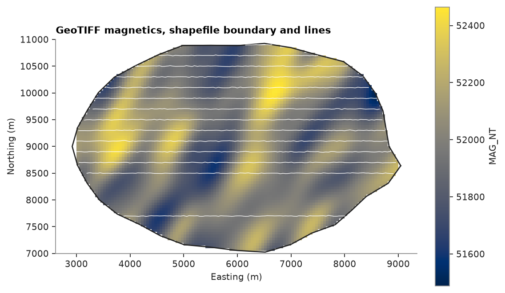

# shapefiles, geopackage and GeoTIFF

GIS software exchanges points, lines and polygons as shapefiles or geopackages, and rasters as GeoTIFF.
`write_shapefile`, `write_geopackage` and `write_geotiff` write a `PointSet`, `Polylines` or 2D `BlockModel` with
its CRS. `read_shapefile`, `read_geopackage` and `read_geotiff` return the same container.

<details><summary>Python</summary>

```python
import tempfile

import boitata as bt
import matplotlib.pyplot as plt
import numpy as np
from common import INK, map_axes, save

data = bt.datasets.soil_geochemistry_survey()
samples, boundary, covariates = data["samples"], data["boundary"], data["covariates"]
print(samples)
print(boundary)
print(covariates)
```

</details>

```text
PointSet(1227 points, crs: none)
  ID: Float64
  CU_PPM: Float64
  ZN_PPM: Float64
  AU_PPB: Float64
  AS_PPM: Float64
  AU_BDL: Float64
  AS_BDL: Float64
Polylines(1 features, 1 parts, crs: none)
BlockModel(regular, 9600 of 9600 cells, count [120, 80, 1], size [50.0, 50.0, 1.0], rotation [0.0, 0.0, 0.0])
  ELEVATION_M: Float64
  MAG_NT: Float64
  LITHOLOGY: Utf8
  INSIDE: Float64
```

## shapefiles

`write_shapefile` stores the coordinates, the attributes (names of at most 10 characters) and, when the container
has one, the CRS in a `.prj`. points and polylines go to separate files. the format wants outer rings clockwise, so
the counter-clockwise boundary comes back with its vertices in reverse order.

<details><summary>Python</summary>

```python
folder = Path(tempfile.mkdtemp())
bt.write_shapefile(folder / "samples.shp", samples)
bt.write_shapefile(folder / "boundary.shp", boundary)
print(sorted(p.name for p in folder.glob("samples.*")))
points, outline = bt.read_shapefile(folder / "samples.shp"), bt.read_shapefile(folder / "boundary.shp")
print("same points:", np.array_equal(points.coords, samples.coords))
print(
    "same boundary, reversed:",
    np.array_equal(outline.coords, boundary.coords[::-1]),
    "| closed:",
    outline.closed,
)
```

</details>

```text
['samples.cpg', 'samples.dbf', 'samples.shp', 'samples.shx']
same points: True
same boundary, reversed: True | closed: [ True]
```

a `Polylines` feature is made of parts. a closed part is a ring whose last vertex joins the first, and a ring inside
another ring of the same feature is a hole. open parts are lines: the samples lie on east-west survey lines about
200 m apart, and each line, joined sample to sample, goes to a line shapefile.

<details><summary>Python</summary>

```python
north = np.round(samples.y, -2)
rows = [samples.coords[north == y][np.argsort(samples.x[north == y]), :2] for y in np.unique(north)]
survey = bt.Polylines(rows, attributes={"NORTHING": np.unique(north)})
bt.write_shapefile(folder / "lines.shp", survey)
lines = bt.read_shapefile(folder / "lines.shp")
print(lines)
```

</details>

```text
Polylines(14 features, 14 parts, crs: none)
  NORTHING: Float64
```

## geopackage

a geopackage is a single SQLite file holding many layers, with attribute names of any length and the CRS as an EPSG
code or WKT. `write_geopackage` adds a layer, or replaces the one of the same name. `read_geopackage` needs `layer=`
when the file holds more than one. python's own `sqlite3` reads and writes the tables.

<details><summary>Python</summary>

```python
package = folder / "survey.gpkg"
bt.write_geopackage(package, samples, layer="samples")
bt.write_geopackage(package, boundary, layer="boundary")
bt.write_geopackage(package, survey, layer="lines")
points = bt.read_geopackage(package, layer="samples")
print(points)
print("same points:", np.array_equal(points.coords, samples.coords), "| CRS:", points.crs)
print(
    "same boundary area:", np.allclose(bt.read_geopackage(package, layer="boundary").area(), boundary.area())
)
```

</details>

```text
PointSet(1227 points, crs: none)
  ID: Float64
  CU_PPM: Float64
  ZN_PPM: Float64
  AU_PPB: Float64
  AS_PPM: Float64
  AU_BDL: Float64
  AS_BDL: Float64
same points: True | CRS: None
same boundary area: True
```

## GeoTIFF

`write_geotiff` writes each column of a 2D grid as a band, nulls as the `nodata` value and the CRS in the
geokeys, so GIS software opens it as a georeferenced raster. it handles rotated grids, and writes a masked model
with nodata in its absent cells: here only the cells inside the survey area remain. bands hold numbers, so the
lithology names go in as the codes of a `Categories` scheme.

<details><summary>Python</summary>

```python
scheme = bt.Categories.from_values(covariates["LITHOLOGY"])
numeric = bt.BlockModel(
    covariates.origin,
    covariates.size,
    covariates.count,
    attributes={
        "ELEVATION_M": covariates["ELEVATION_M"],
        "MAG_NT": covariates["MAG_NT"],
        "LITHOLOGY": scheme.encode(covariates["LITHOLOGY"]),
    },
)
inside = numeric.filter(covariates["INSIDE"] == 1)
bt.write_geotiff(folder / "covariates.tif", inside)
raster = bt.read_geotiff(folder / "covariates.tif")
print(raster)
print(f"{(folder / 'covariates.tif').stat().st_size / 1e6:.2f} MB")
magnetics = raster["MAG_NT"]
present = np.isfinite(magnetics)
print(
    f"same origin: {raster.origin == covariates.origin} | cells with data: {present.sum()} of {len(magnetics)}"
)
for name, n in zip(scheme.names, np.bincount(raster["LITHOLOGY"][present].astype(int))):
    print(f"{name:>16}: {n} cells")
```

</details>

```text
BlockModel(regular, 9600 of 9600 cells, count [120, 80, 1], size [50.0, 50.0, 1.0], rotation [0.0, 0.0, 0.0])
  ELEVATION_M: Float64
  MAG_NT: Float64
  LITHOLOGY: Float64
0.04 MB
same origin: True | cells with data: 7193 of 9600
 FELSIC_VOLCANIC: 1065 cells
         GRANITE: 1687 cells
  MAFIC_VOLCANIC: 2499 cells
    METASEDIMENT: 1942 cells
```

the raster comes back as a regular grid: the 2407 cells outside the survey area are null in every band.

<details><summary>Python</summary>

```python
(x0, y0, _), (x1, y1, _) = raster.bounds
fig, ax = plt.subplots(figsize=(7, 5), layout="constrained")
image = ax.imshow(raster.grid("MAG_NT")[0], origin="lower", extent=(x0, x1, y0, y1), cmap="cividis")
for part in outline.parts:
    ring = np.vstack([part, part[:1]])
    ax.plot(ring[:, 0], ring[:, 1], color=INK, lw=1.2)
for part in lines.parts:
    ax.plot(part[:, 0], part[:, 1], color="white", lw=0.6)
fig.colorbar(image, ax=ax, shrink=0.8, label="MAG_NT")
map_axes(ax, "GeoTIFF magnetics, shapefile boundary and lines")
save(fig, "gis")
```

</details>



Full script: [`example_02_09.py`](example_02_09.py)
