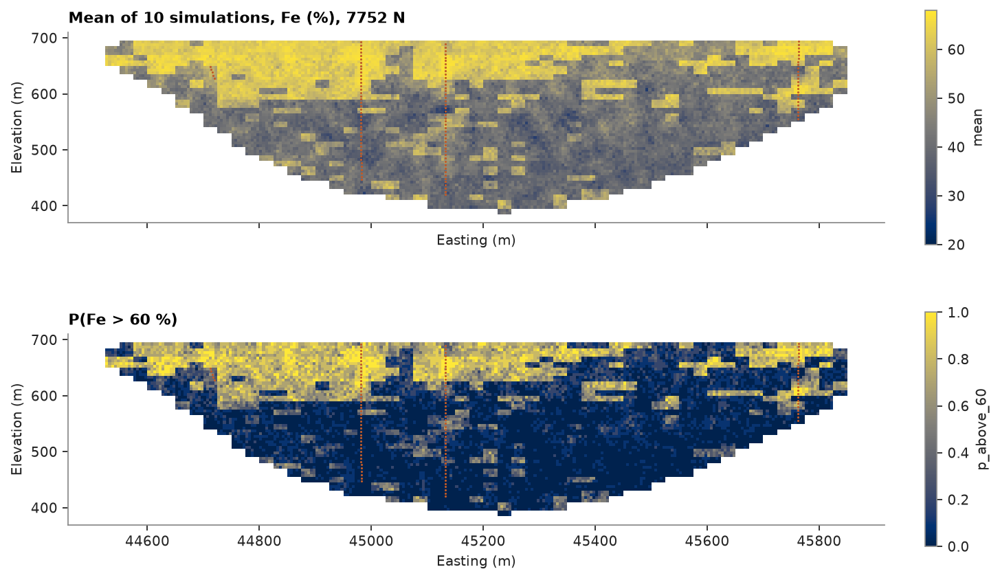

# Models larger than memory

A block model can stay in a Parquet file and be processed a chunk at a time, so its size is limited by the disk, not
by memory. Here the iron ore of an iron formation plateau is simulated on 5 m blocks, millions of them, by domain and
around a trend, without ever holding more than a million blocks.

<details><summary>Python</summary>

```python
import shutil
import tempfile
import time

import boitata as bt
import matplotlib.pyplot as plt
import numpy as np
from common import HIGHLIGHT, save
```

</details>

The dataset's block model codes each 25 × 25 × 12 m block with a lithology. Two ore domains group them: hematite
(friable, compact and canga) and itabirite (friable and compact); laterite and mafic dykes are left out. The 6 m
composites take the domain of the block they fall in.

<details><summary>Python</summary>

```python
data = bt.datasets.iron_formation_plateau()
model = data["block_model"]
DOMAINS = {"HF": "hematite", "HC": "hematite", "CG": "hematite", "IF": "itabirite", "IC": "itabirite"}
coded = np.array([DOMAINS.get(c, "") for c in np.asarray(model["LITH"], dtype=object)], dtype=object)
model = model.with_columns({"domain": coded}).mask(coded != "")
coded = coded[coded != ""]

holes = bt.Drillholes(data["collars"], data["surveys"], data["assays"])
composites = holes.composite(6.0, ["FE_PCT"])
row = model.row_at(composites.coords)
keep = (row >= 0) & ~np.isnan(composites["FE_PCT"])
xyz, fe, domain = composites.coords[keep], composites["FE_PCT"][keep], coded[row[keep]]
hole = np.asarray(composites["HOLE_ID"], dtype=object)[keep]
for name in ("hematite", "itabirite"):
    inside = domain == name
    count = len(model.mask(model["domain"] == name))
    print(f"{name:10} {count:6,} blocks of 25 m, {inside.sum():5} composites")
```

</details>

```text
hematite   14,889 blocks of 25 m,  1794 composites
itabirite  32,771 blocks of 25 m,  3635 composites
```

`from_extents` sizes a 5 m grid on the block model ([block model from extents](../../02-data-and-geometry/12-block-model-from-extents/README.md)). Only the blocks whose center falls in an ore block
are kept, found one level at a time; they are a masked model, the grid geometry plus the sorted index of the cells
present, written to Parquet. `BlockModelFile` opens it without reading the blocks.

<details><summary>Python</summary>

```python
folder = Path(tempfile.mkdtemp())
grid = bt.BlockModel.from_extents(model, size=(5, 5, 5), snap=True)
nx, ny, nz = grid.count
plan = grid.centroids[: nx * ny]
kept = [k * nx * ny + np.flatnonzero(model.row_at(plan + (0, 0, 5 * k)) >= 0) for k in range(nz)]
blocks = bt.BlockModel(grid.origin, grid.size, grid.count, index=np.concatenate(kept).astype(np.uint64))
bt.write_parquet(folder / "blocks.parquet", blocks)
file = bt.BlockModelFile(folder / "blocks.parquet")
size = (folder / "blocks.parquet").stat().st_size / 1e6
print(f"grid {grid.count}: {len(file):,} of {len(grid):,} blocks of 5 m kept, {size:.0f} MB")
```

</details>

```text
grid [445, 405, 80]: 2,849,350 of 14,418,000 blocks of 5 m kept, 0 MB
```

The plateau is weathered from the top, so within a domain iron still drifts with position. A smooth trend per
domain ([smooth trend](../../04-transforms/08-smooth-trend/README.md)), with a 400 m kernel flattened to 80 m vertically, takes that out, and the residuals are
simulated. The trend is smooth enough to be evaluated on the 25 m blocks. `map_blocks` streams the file through any
function of a chunk and writes the columns it returns next to the input's: here each block's domain and trend,
looked up in the 25 m model.

<details><summary>Python</summary>

```python
at_data, at_model = np.zeros(len(fe)), np.zeros(len(model))
for name in ("hematite", "itabirite"):
    trend, _ = bt.detrend(xyz[domain == name], fe[domain == name], bandwidth=400.0, ratios=(1.0, 0.2))
    at_data[domain == name] = trend.predict(xyz[domain == name])
    at_model[coded == name] = trend.predict(model.centroids[coded == name])
model = model.with_column("trend", at_model)


def attributes(chunk):
    row = model.row_at(chunk.centroids)
    return {"domain": coded[row], "trend": at_model[row]}


start = time.perf_counter()
bt.map_blocks(folder / "blocks.parquet", folder / "attributes.parquet", attributes)
print(f"domains and trend in {time.perf_counter() - start:.0f} s")
print(f"trend at the composites: variance {at_data.var():.0f} of {fe.var():.0f} %²")
```

</details>

```text
domains and trend in 1 s
trend at the composites: variance 65 of 175 %²
```

Turning bands simulates every realization's bands once over the model's extent, then evaluates and conditions
them chunk by chunk. Fitted with the domains and the trend at the data, each domain gets its own normal-score
transform of the residuals; `simulate_to_parquet` then reads each block's domain and trend from the columns named
by `domain_column` and `trend`. It writes the same summary `simulate` would return for the whole model, plus each
realization's global statistics. `keep=` writes chosen realizations beside the summary, here the first, as
`realization_0`.

<details><summary>Python</summary>

```python
scores = bt.NormalScore().fit_transform(fe - at_data)
fitted = bt.experimental_variogram(xyz, scores, 15.0, 300.0).fit("spherical")
sill = fitted.nugget + fitted.structures[0].sill
reach = fitted.structures[0].range
gaussian = bt.Variogram([("spherical", fitted.structures[0].sill / sill, reach)], nugget=fitted.nugget / sill)
print(f"residual scores: nugget {gaussian.nugget:.2f}, range {reach:.0f} m")
bands = bt.TurningBands(gaussian, bands=100, search=bt.Search(radius=reach, max_samples=16))
bands.fit(xyz, fe, trend=at_data, domains=domain, holes=hole)

start = time.perf_counter()
result = bands.simulate_to_parquet(
    folder / "attributes.parquet",
    folder / "simulated.parquet",
    n=10,
    seed=1,
    cutoffs=[60.0],
    keep=[0],
    domain_column="domain",
    trend="trend",
)
seconds = time.perf_counter() - start
low, high = np.quantile(result["realization_above"][:, 0], [0.1, 0.9])
print(f"10 realizations in {seconds:.0f} s; blocks above 60 % Fe: P10 {low:.1%}, P90 {high:.1%}")
print(f"output {(folder / 'simulated.parquet').stat().st_size / 1e6:.0f} MB")
first = np.concatenate(
    [
        c["realization_0"]
        for c in bt.BlockModelFile(folder / "simulated.parquet").chunks(columns=["realization_0"])
    ]
)
print(f"first realization: mean {first.mean():.2f} % Fe, as accumulated {result['realization_mean'][0]:.2f}")
```

</details>

```text
residual scores: nugget 0.36, range 35 m
10 realizations in 15 s; blocks above 60 % Fe: P10 22.3%, P90 22.6%
output 76 MB
first realization: mean 46.78 % Fe, as accumulated 46.78
```

Mining selects the 25 × 25 × 12 m blocks, not 5 m ones. With `discretization`, each block of a file is simulated
at nodes, here 3 × 3 × 2, and the realizations are averaged over the block, as
`simulate(model.discretize(...), blocks=model)` would; a node takes its block's domain and trend. The blocks are
read a chunk at a time, so their nodes never outgrow memory either.

<details><summary>Python</summary>

```python
bt.write_parquet(folder / "model.parquet", model)
start = time.perf_counter()
panel = bands.simulate_to_parquet(
    folder / "model.parquet",
    folder / "model_simulated.parquet",
    n=10,
    seed=1,
    cutoffs=[60.0],
    domain_column="domain",
    trend="trend",
    discretization=(3, 3, 2),
)
seconds = time.perf_counter() - start
low, high = np.quantile(panel["realization_above"][:, 0], [0.1, 0.9])
print(f"{len(model):,} blocks of 25 m in {seconds:.0f} s; above 60 % Fe: P10 {low:.1%}, P90 {high:.1%}")
```

</details>

```text
47,660 blocks of 25 m in 2 s; above 60 % Fe: P10 15.0%, P90 15.4%
```

Averaging smooths the highs: about 15 % of the 25 m blocks pass 60 % Fe, against 22 % of the 5 m blocks.

The output is too big to want in memory, so the east–west section with the most composites is collected from the
chunks, reading only the columns it needs, into a small model of its own.

<details><summary>Python</summary>

```python
row = int(np.bincount(((xyz[:, 1] - grid.origin[1]) // 5).astype(int), minlength=ny).argmax())
columns = ["mean", "p_above_60"]
parts, index = {name: [] for name in columns}, []
for chunk in bt.BlockModelFile(folder / "simulated.parquet").chunks(columns=columns):
    on = (chunk.index // nx) % ny == row
    index.append(chunk.index[on])
    for name in columns:
        parts[name].append(chunk[name][on])
index = np.concatenate(index)
section = bt.BlockModel(
    (grid.origin[0], grid.origin[1] + 5 * row, grid.origin[2]),
    grid.size,
    (nx, 1, nz),
    index=index % nx + nx * (index // (nx * ny)),
    attributes={name: np.concatenate(parts[name]) for name in columns},
)
north = grid.origin[1] + 5 * (row + 0.5)
near = np.abs(xyz[:, 1] - north) < 5
fig, axes = plt.subplots(2, 1, figsize=(9, 5.5), layout="constrained", sharex=True)
bt.plot.section(section, "mean", axis="y", index=0, vmin=20, vmax=68, ax=axes[0])
bt.plot.section(section, "p_above_60", axis="y", index=0, vmin=0, vmax=1, ax=axes[1])
for ax, title in zip(axes, (f"Mean of 10 simulations, Fe (%), {north:.0f} N", "P(Fe > 60 %)"), strict=True):
    ax.scatter(xyz[near, 0], xyz[near, 2], s=2, color=HIGHLIGHT, linewidths=0)
    ax.set(title=title, xlabel="Easting (m)", ylabel="Elevation (m)")
save(fig, "section")
```

</details>



Full script: [`example_02_10.py`](example_02_10.py)
