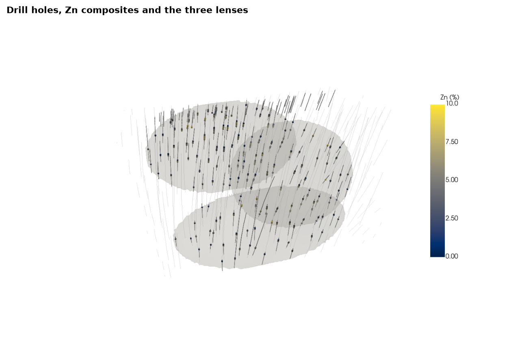
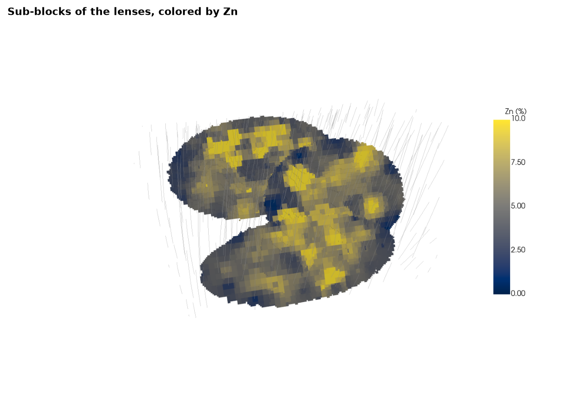
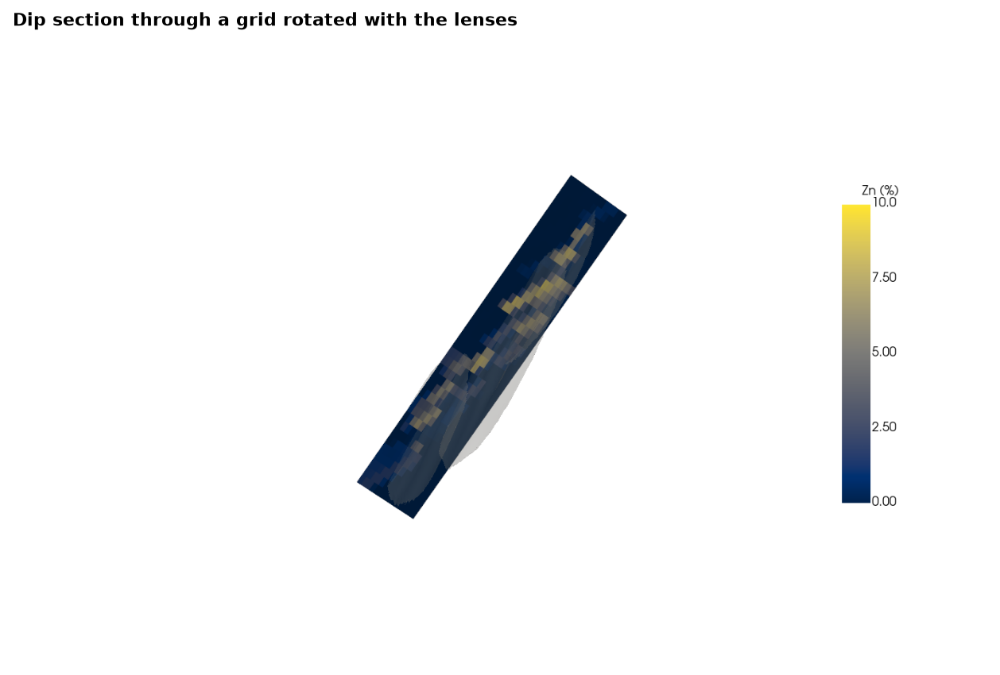

# 3D views

`bt.plot3d` draws drill holes, points, meshes and block models in a 3D scene that runs in the browser
(``pip install boitata[3d]`` for the notebook widget). the scenes show three stacked sulphide lenses with the holes
that cut them, their zinc composites, a sub-blocked model of the lenses and a section through a model rotated with
them. each scene renders to an image with `screenshot`; in the documentation a click on the image loads the live
scene.

<details><summary>Python</summary>

```python
import boitata as bt
import numpy as np
from common import GRAY, LIGHT, show

ZN = {"cmap": "cividis", "clim": (0, 10), "label": "Zn (%)"}
```

</details>

a `Drillholes` without intervals draws its desurveyed traces, a `PointSet` points, a `Mesh` triangles. only the
holes collared over the lenses are drawn. zinc colors the composites inside the lenses; the others stay gray.

<details><summary>Python</summary>

```python
data = bt.datasets.stacked_sulphide_lenses()
holes = bt.Drillholes(data["collars"], data["surveys"], data["assays"])
lenses = [data[f"lens_{i}"] for i in (1, 2, 3)]
composites = holes.composite(2.0, ["ZN_PCT"])
composites = composites.filter(~np.isnan(composites["ZN_PCT"]))
ore = np.any([lens.contains(composites.coords) for lens in lenses], axis=0)
print(f"{len(holes.holes)} holes, {len(composites):,} composites of 2 m, {ore.sum():,} inside a lens")

lo = np.min([lens.bounds[0] for lens in lenses], axis=0) - 50
hi = np.max([lens.bounds[1] for lens in lenses], axis=0) + 50
xy = np.c_[data["collars"]["X"], data["collars"]["Y"]]
over = data["collars"].filter(np.all((xy > lo[:2]) & (xy < hi[:2]), axis=1))
traces = bt.Drillholes(over, data["surveys"])
near = np.all((composites.coords > lo) & (composites.coords < hi), axis=1)

scene = bt.plot3d.Scene()
scene.add(traces, name="holes", color=GRAY, line_width=1, opacity=0.5)
scene.add(composites.filter(near & ~ore), name="host", color=LIGHT, point_size=2)
scene.add(composites.filter(ore), "ZN_PCT", name="ore", point_size=6, **ZN)
for i, lens in enumerate(lenses, 1):
    scene.add(lens, name=f"lens {i}", color=GRAY, opacity=0.15)
scene.view(azimuth=305, dip=30)
show(scene, "holes", "Drill holes, Zn composites and the three lenses")
```

</details>

```text
289 holes, 13,312 composites of 2 m, 1,135 inside a lens
```



`from_meshes` sub-blocks a grid rotated with the lenses ([block model from extents](../../02-data-and-geometry/12-block-model-from-extents/README.md)) against the solids, and inverse distance fills
the sub-blocks with the zinc of the composites inside the lenses. each row draws as a box along the model's
rotated axes, sub-blocks at their own size.

<details><summary>Python</summary>

```python
rotation = (22.5, 0.0, 55.0)
size = (20, 20, 10)
frame = bt.BlockModel.from_extents(*lenses, size=size, buffer=20, rotation=rotation)
blocks = bt.BlockModel.from_meshes(
    frame.origin,
    size,
    frame.count,
    [(lens, "inside", f"lens {i}") for i, lens in enumerate(lenses, 1)],
    subgrid=4,
    fill="host",
    rotation=rotation,
)
blocks = blocks.filter(np.asarray(blocks["domain"], dtype=object) != "host")
search = bt.Search(radius=100, min_samples=1, max_samples=12)
idw = bt.InverseDistance(search, power=2).fit(composites.coords[ore], composites["ZN_PCT"][ore])
blocks = blocks.with_column("zn", idw.predict(blocks))
solid = sum(lens.volume for lens in lenses)
print(f"{len(blocks):,} sub-blocks, {blocks.volumes.sum() / 1e6:.2f} Mm3 for {solid / 1e6:.2f} Mm3 of lens")

scene = bt.plot3d.Scene()
scene.add(blocks, "zn", name="sub-blocks", **ZN)
scene.add(traces, name="holes", color=GRAY, line_width=1, opacity=0.4)
scene.view(azimuth=305, dip=30)
show(scene, "subblocks", "Sub-blocks of the lenses, colored by Zn")
```

</details>

```text
9,021 sub-blocks, 6.35 Mm3 for 6.34 Mm3 of lens
```



a regular model keeps its geometry implicit; the viewer builds its boxes from the centers, sizes and rotation.
filled with the inverse-distance zinc of all composites, the rotated grid is cut here by a `section` across
strike, through its center and one block wide: a dip section where the three lenses are the high-grade bands.
blocks with no composite within 100 m are null and never drawn.

<details><summary>Python</summary>

```python
everywhere = bt.InverseDistance(search, power=2).fit(composites.coords, composites["ZN_PCT"])
rotated = frame.with_column("zn", everywhere.predict(frame))
estimated = np.isfinite(rotated["zn"]).mean()
print(f"rotated grid {frame.count}: {estimated:.0%} of {len(frame):,} blocks estimated")
center = rotated.coords.mean(axis=0)
across = np.radians(rotation[0] + 90)
reach = 400 * np.array([np.sin(across), np.cos(across), 0])
scene = bt.plot3d.Scene()
scene.add(rotated, "zn", name="rotated grid", **ZN)
for i, lens in enumerate(lenses, 1):
    scene.add(lens, name=f"lens {i}", color=LIGHT, opacity=0.2)
scene.section([center - reach, center + reach], width=20)
scene.view(azimuth=rotation[0] + 180, dip=10)
show(scene, "section", "Dip section through a grid rotated with the lenses")
```

</details>

```text
rotated grid [38, 47, 14]: 94% of 25,004 blocks estimated
```



Full script: [`example_02_11.py`](example_02_11.py)
