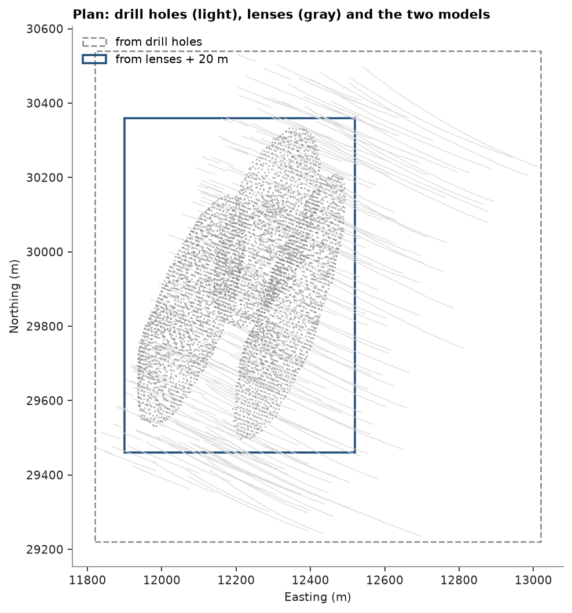
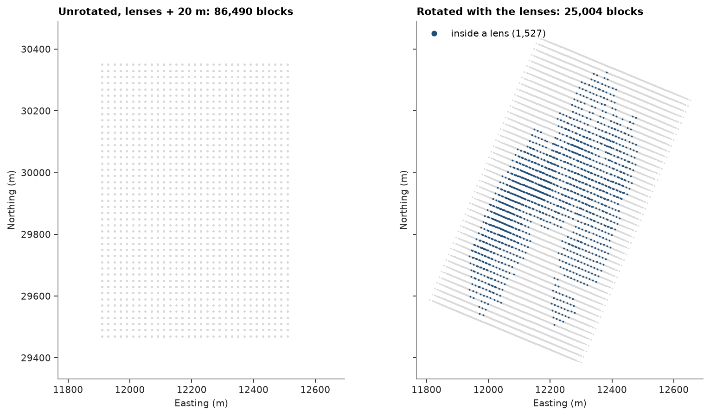

# block model from extents

`BlockModel.from_extents` sizes a grid from what it must cover: drill holes, meshes, points, lines or
another grid. it measures the bounding box along the grid axes (rotated, if you give a rotation), adds a
buffer, and can snap the origin to a multiple of the block size so that grids built from different data line
up. here three stacked sulphide lenses get a model from the drill holes, a tighter one from the lens solids,
a rotated one that follows the lenses, and one with only the blocks inside them.

<details><summary>Python</summary>

```python
import boitata as bt
import matplotlib.pyplot as plt
import numpy as np
from common import ACCENT, GRAY, LIGHT, map_axes, save

data = bt.datasets.stacked_sulphide_lenses()
holes = bt.Drillholes(data["collars"], data["surveys"], data["assays"])
lenses = [data[f"lens_{i}"] for i in (1, 2, 3)]
size = (20, 20, 10)
```

</details>

a model around all holes covers the whole drilled volume. one around the lens solids plus a 20 m buffer is a
quarter of it. `snap=True` puts both origins on multiples of the block size, so their blocks coincide.

<details><summary>Python</summary>

```python
drilled = bt.BlockModel.from_extents(holes, size=size, snap=True)
around = bt.BlockModel.from_extents(*lenses, size=size, buffer=20, snap=True)
for name, model in [("drill holes", drilled), ("lenses + 20 m", around)]:
    print(f"{name:14} origin {model.origin}  count {model.count}  {len(model):,} blocks")


def outline(ax, model, **style):
    (x0, y0, _), (dx, dy, _), (nx, ny, _) = model.origin, model.size, model.count
    ax.add_patch(plt.Rectangle((x0, y0), nx * dx, ny * dy, fill=False, **style))


paths = holes.paths()
fig, ax = plt.subplots(figsize=(6.5, 6.5), layout="constrained")
for hole in holes.holes:
    on = paths["HOLE_ID"] == hole
    ax.plot(paths["x"][on], paths["y"][on], color=LIGHT, lw=0.6)
for lens in lenses:
    ax.plot(*lens.coords[::7, :2].T, ".", color=GRAY, ms=0.6)
outline(ax, drilled, ec=GRAY, lw=1.2, ls="--", label="from drill holes")
outline(ax, around, ec=ACCENT, lw=1.6, label="from lenses + 20 m")
ax.legend(loc="upper left")
ax.autoscale_view()
map_axes(ax, "Plan: drill holes (light), lenses (gray) and the two models")
save(fig, "extents")
```

</details>

```text
drill holes    origin [11820.0, 29220.0, -390.0]  count [60, 66, 80]  316,800 blocks
lenses + 20 m  origin [11900.0, 29460.0, -260.0]  count [31, 45, 62]  86,490 blocks
```



the lenses strike about N22.5E and dip about 55 degrees. a grid rotated with them (y along strike, z
across the lenses) needs far fewer blocks for the same buffer, because the extents are measured along its axes.

<details><summary>Python</summary>

```python
rotation = (22.5, 0.0, 55.0)
aligned = bt.BlockModel.from_extents(*lenses, size=size, buffer=20, rotation=rotation)
print(f"aligned        count {aligned.count}  {len(aligned):,} blocks ({len(aligned) / len(around):.0%})")
```

</details>

```text
aligned        count [38, 47, 14]  25,004 blocks (29%)
```

to keep only the blocks whose centroid falls inside a lens, use `mask` with `Mesh.contains`:

<details><summary>Python</summary>

```python
inside = np.any([lens.contains(aligned.coords) for lens in lenses], axis=0)
ore = aligned.filter(inside)
block_volume = np.prod(size) * len(ore)
solid_volume = sum(lens.volume for lens in lenses)
print(
    f"{len(ore):,} blocks inside, {block_volume / 1e6:.2f} Mm3 of blocks for {solid_volume / 1e6:.2f} Mm3 of lens"
)

fig, axes = plt.subplots(1, 2, figsize=(10, 5.5), sharex=True, sharey=True, layout="constrained")
for ax, model, title in [
    (axes[0], around, "Unrotated, lenses + 20 m"),
    (axes[1], aligned, "Rotated with the lenses"),
]:
    xy = model.coords[:, :2]
    ax.plot(*xy.T, ".", color=LIGHT, ms=1)
    map_axes(ax, f"{title}: {len(model):,} blocks")
xy = ore.coords[:, :2]
axes[1].plot(*xy.T, ".", color=ACCENT, ms=1.5, label=f"inside a lens ({len(ore):,})")
axes[1].legend(loc="upper left", markerscale=6)
save(fig, "aligned")
```

</details>

```text
1,527 blocks inside, 6.11 Mm3 of blocks for 6.34 Mm3 of lens
```



Full script: [`example_02_12.py`](example_02_12.py)
