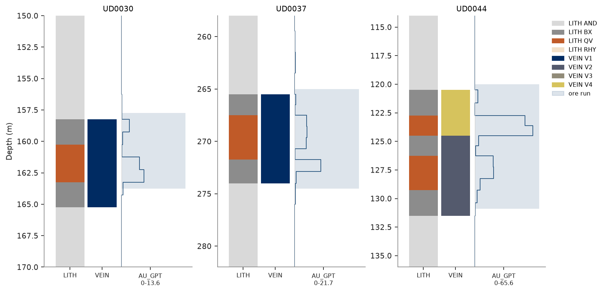
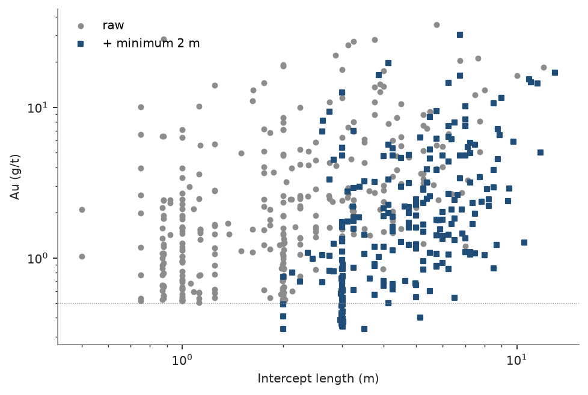

# runs and strip logs

grade control asks where each hole is ore: the contiguous runs of samples above a cutoff, from and to, with their
length-weighted grade. raw runs follow each sample, but a mine cannot dig a 1 m pod of ore or skip a 1 m band of
waste. `Drillholes.runs` cleans them with three rules: internal dilution takes short waste bands into the ore around
them, an edge skin adds waste on each side of each ore run, and a minimum mining length merges short runs into their
neighbors. `bt.plot.strip_log` draws the result down a hole, beside the lithology and the grade.

<details><summary>Python</summary>

```python
import boitata as bt
import matplotlib.pyplot as plt
import numpy as np
from common import ACCENT, GRAY, HIGHLIGHT, LIGHT, save

data = bt.datasets.vein_gold_grade_control()
kind = dict(zip(data["collars"]["HOLE_ID"], data["collars"]["TYPE"], strict=True))
intervals = bt.merge_intervals(data["assays"], data["lithology"])
intervals = intervals.filter(np.array([kind[h] == "DD" for h in intervals["HOLE_ID"]]))
holes = bt.Drillholes(data["collars"], data["surveys"], intervals)
length = intervals["TO"] - intervals["FROM"]
metal = np.nansum(intervals["AU_GPT"] * length)
print(f"{np.sum(length[~np.isnan(intervals['AU_GPT'])]):.0f} m of assayed core, {metal:.0f} g/t x m of gold")
```

</details>

```text
40830 m of assayed core, 5367 g/t x m of gold
```

## runs above a cutoff

at 0.5 g/t each assay is ore or waste, and each change of flag down a hole starts a new run. each rule then takes
the runs of the previous line: up to 3 m of internal dilution, a skin of 0.5 m at each edge, a minimum length of
2 m. the runs of a hole partition its assays, so Σ grade × length over all runs gives back the assay metal for
each rule. only the share that lands in ore changes.

<details><summary>Python</summary>

```python
CUTOFF = 0.5
rules = {
    "raw": {},
    "+ dilution 3 m": {"max_dilution": 3.0},
    "+ edges 0.5 m": {"max_dilution": 3.0, "edge": 0.5},
    "+ minimum 2 m": {"max_dilution": 3.0, "edge": 0.5, "min_length": 2.0},
}
runs = {name: holes.runs("AU_GPT", cutoff=CUTOFF, **kw) for name, kw in rules.items()}
print(f"{'':16}{'ore runs':>9}{'ore (m)':>9}{'Au (g/t)':>9}{'metal in ore':>13}{'balance':>9}")
for name, r in runs.items():
    ore, L, au = r["ore"], r["length"], r["AU_GPT"]
    total = np.dot(L, au)
    print(
        f"{name:16}{ore.sum():9}{L[ore].sum():9.0f}{np.dot(L[ore], au[ore]) / L[ore].sum():9.2f}"
        f"{100 * np.dot(L[ore], au[ore]) / metal:12.1f}%{total - metal:9.1e}"
    )
```

</details>

```text
                 ore runs  ore (m) Au (g/t) metal in ore  balance
raw                   337      811     5.11        77.2% -9.1e-13
+ dilution 3 m        240      918     4.54        77.6% -9.1e-13
+ edges 0.5 m         238     1157     3.63        78.2%  0.0e+00
+ minimum 2 m         230     1144     3.65        77.9%  0.0e+00
```

dilution joins raw runs into fewer, longer ones at a lower grade, and the metal in ore barely moves because the
waste it takes in is lean. the edge skins add a meter of waste to each run, where most of the tonnage grows. a 1 m
pod that reaches 2 m with its skins then survives the minimum length. the minimum length drops the pods that stay
shorter and fills the waste gaps shorter than 2 m.

## internal dilution by hand

hole UD0030 cuts vein V1 as 1 m of ore, 2 m of waste, then 2 m of ore:

<details><summary>Python</summary>

```python
raw = runs["raw"]
near = (raw["HOLE_ID"] == "UD0030") & (raw["from"] > 157) & (raw["to"] < 164)
for f, t, au, ore in zip(
    raw["from"][near], raw["to"][near], raw["AU_GPT"][near], raw["ore"][near], strict=True
):
    print(f"{f:7.2f} {t:7.2f} {au:5.2f} g/t {'ore' if ore else 'waste'}")
L = (raw["to"] - raw["from"])[near]
by_hand = np.dot(L, raw["AU_GPT"][near]) / L.sum()
diluted = runs["+ dilution 3 m"]
row = np.flatnonzero((diluted["HOLE_ID"] == "UD0030") & (diluted["from"] == 158.25))[0]
print(f"by hand: {by_hand:.3f} g/t over {L.sum():.2f} m")
print(f"runs:    {diluted['AU_GPT'][row]:.3f} g/t over {diluted['length'][row]:.2f} m")
```

</details>

```text
 158.25  159.25  1.88 g/t ore
 159.25  161.25  0.21 g/t waste
 161.25  163.25  4.81 g/t ore
by hand: 2.382 g/t over 5.00 m
runs:    2.382 g/t over 5.00 m
```

the waste band spans 2 m, within the 3 m allowed, and the three runs together grade 2.38 g/t, above the cutoff, so
the rule takes it in. had the combined grade fallen below 0.5 g/t, the two ore runs would have stayed apart.

## strip logs

three holes through the veins, each with its lithology, vein, gold and final ore runs. gold is drawn as a step per
assay, from zero at the left of its track to the highest assay of the holes drawn at the right.

<details><summary>Python</summary>

```python
final = runs["+ minimum 2 m"]
lith = bt.Categories(["AND", "BX", "QV", "RHY"], colors=[LIGHT, GRAY, HIGHLIGHT, "#f2e0c9"])
vein = bt.Categories(["V1", "V2", "V3", "V4"])
windows = {"UD0030": (150, 170), "UD0037": (258, 282), "UD0044": (114, 136)}
fig, axes = plt.subplots(1, 3, figsize=(10, 4.8), layout="constrained")
for ax, (hole, (top, bottom)) in zip(axes, windows.items(), strict=True):
    bt.plot.strip_log(
        holes,
        hole,
        columns=["AU_GPT"],
        categories=["LITH", "VEIN"],
        scheme={"LITH": lith, "VEIN": vein},
        runs=final,
        ax=ax,
        color=ACCENT,
    )
    ax.set_ylim(bottom, top)
    if ax is not axes[-1]:
        ax.get_legend().remove()
    if ax is not axes[0]:
        ax.set_ylabel("")
save(fig, "strip_logs")
```

</details>



each ore run covers the quartz vein and the gold-bearing breccia around it, with the lean assays between them
taken in as internal dilution. in UD0044 veins V4 and V2 touch and one intercept spans both. the shading starts half
a meter above the first ore assay and ends half a meter below the last: the skins.

## ore intercepts

each ore run of the final line is one intercept: its length and grade against those of the raw runs, and the five
with the most metal.

<details><summary>Python</summary>

```python
fig, ax = plt.subplots(figsize=(6, 4), layout="constrained")
for name, color, marker in [("raw", GRAY, "o"), ("+ minimum 2 m", ACCENT, "s")]:
    r = runs[name]
    ore = r["ore"]
    ax.scatter(r["to"][ore] - r["from"][ore], r["AU_GPT"][ore], s=12, color=color, marker=marker, label=name)
ax.axhline(CUTOFF, color=GRAY, lw=0.6, ls=":")
ax.set(xscale="log", yscale="log", xlabel="Intercept length (m)", ylabel="Au (g/t)")
ax.legend()
save(fig, "intercepts")

ore = final["ore"]
below = ore & (final["AU_GPT"] < CUTOFF)
print(f"{below.sum()} final intercepts grade below {CUTOFF} g/t")
top = np.argsort(-(final["length"] * final["AU_GPT"])[ore])[:5]
print(f"{'hole':8}{'from':>8}{'to':>8}{'m':>6}{'Au g/t':>8}")
for k in np.flatnonzero(ore)[top]:
    print(
        f"{final['HOLE_ID'][k]:8}{final['from'][k]:8.2f}{final['to'][k]:8.2f}"
        f"{final['length'][k]:6.1f}{final['AU_GPT'][k]:8.2f}"
    )
```

</details>

```text
26 final intercepts grade below 0.5 g/t
hole        from      to     m  Au g/t
UD0025    322.25  335.25  13.0   17.03
UD0064    165.75  172.50   6.8   30.24
UD0044    120.00  130.88  10.9   15.30
UD0019    374.50  386.00  11.5   14.40
UD0059    182.25  193.25  11.0   14.71
```



no raw intercept is shorter than one assay, and each final one spans at least 2 m. the pods under 1 m are gone or
grown by their skins to 2 m and more. at 3 m, a column of intercepts marks the 2 m pods with their two skins. the
skins cost grade: a lean pod diluted by 1 m of waste can end below the cutoff, and those intercepts deserve a
second look before they go to the mine plan.

## runs of a category

with `category=` and `ore=` the flag comes from a column instead of a cutoff, here the quartz vein. the same rules
apply, but without a cutoff internal dilution would take in any short band, so only the minimum length applies.

<details><summary>Python</summary>

```python
for min_length in [0.0, 2.0]:
    qv = holes.runs("AU_GPT", category="LITH", ore=["QV"], min_length=min_length)
    ore = qv["ore"]
    L, au = qv["length"][ore], qv["AU_GPT"][ore]
    print(
        f"minimum {min_length:.0f} m: {ore.sum()} quartz vein runs, {L.sum():.0f} m at {np.dot(L, au) / L.sum():.2f} g/t"
    )
```

</details>

```text
minimum 0 m: 206 quartz vein runs, 436 m at 7.80 g/t
minimum 2 m: 93 quartz vein runs, 308 m at 7.88 g/t
```

half of the quartz vein runs are thinner than 2 m. at a 2 m minimum they fall to waste, and the rest take in the
thin waste bands between vein runs: fewer, thicker runs, at about the same grade.

Full script: [`example_02_13.py`](example_02_13.py)
