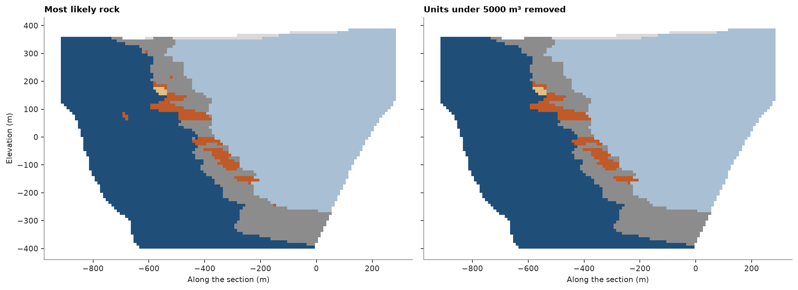
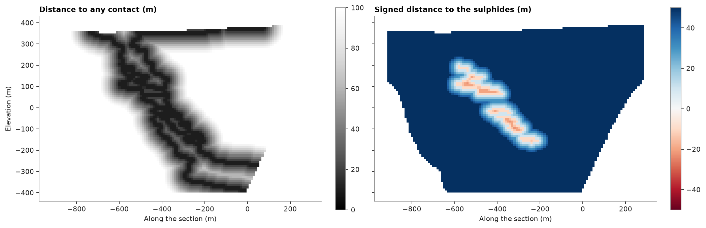
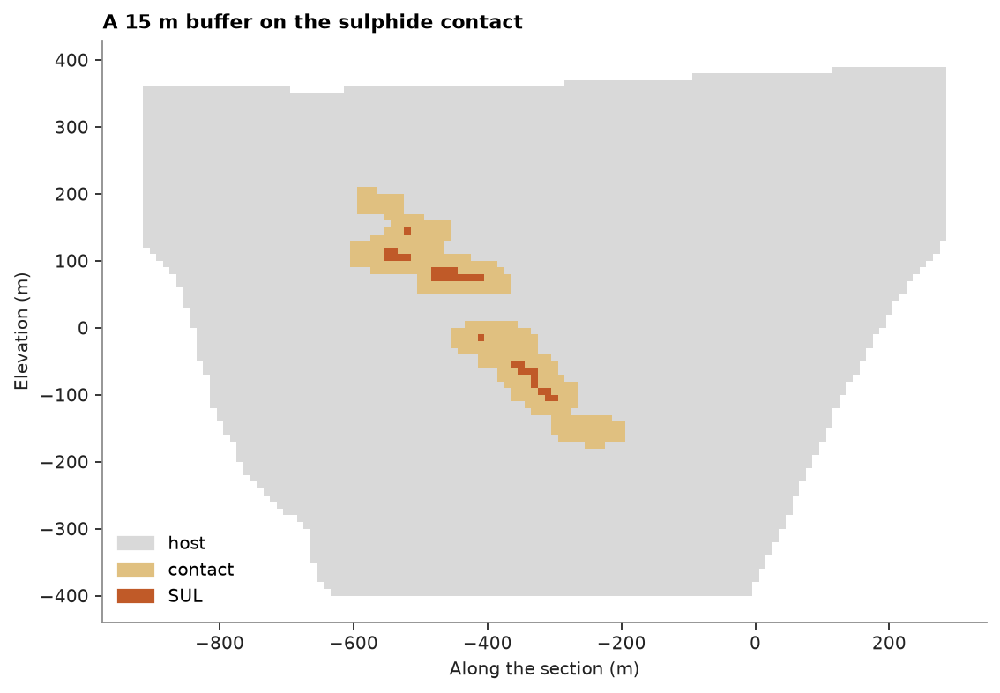

# Domain cleanup

A rock-type model estimated or simulated block by block carries specks: single blocks or small clusters of one
rock inside another, too small to mine or to model apart. `remove_small_units` finds the connected units of each
rock and gives every unit below a minimum volume to the rock around it. `contact_distance` then measures how far each
block is from a contact, and `buffer_domains` labels the blocks within a given distance of one: the transition zone
where a soft boundary ([soft boundaries](../../06-kriging/13-soft-boundaries/README.md)) lets samples cross.

<details><summary>Python</summary>

```python
import boitata as bt
import matplotlib.pyplot as plt
import numpy as np
from common import save
```

</details>

## A speckled rock model

The most likely rock from [categorical indicator kriging](../../07-categories-and-domains/05-categorical-indicator-kriging/README.md) of the logged rock types of the stacked sulphide
lenses on a vertical section across strike, cells of 10 m, one cell thick. Cells the search left unestimated are
dropped. Choosing the most likely rock cell by cell leaves specks, such as the sulphide cells inside the footwall
volcanics on the left.

<details><summary>Python</summary>

```python
data = bt.datasets.stacked_sulphide_lenses()
drillholes = bt.Drillholes(data["collars"], data["surveys"], data["lithology"])
composites = drillholes.composite(5.0, [], categories=["LITH"])
scheme = bt.Categories(
    ["OB", "HWS", "VCL", "SUL", "FWV"],
    mapping={"MS": "SUL", "SMS": "SUL", "STR": "SUL"},
    other="DYK",
    colors=["#d9d9d9", "#a9bfd3", "#8c8c8c", "#c05a28", "#1f4e79", "#e0c080"],
)
weights = bt.cell_declustering(composites, scheme.encode(composites["LITH"]), cell_size=50.0).weights
layers = (23.0, 55.0, 0.0)
variograms = [
    bt.Variogram([("spherical", 0.9, 400.0)], nugget=0.1, rotation=(0.0, 0.0, 0.0), ratios=(1.0, 0.05)),
    bt.Variogram([("spherical", 0.9, 500.0)], nugget=0.1, rotation=layers, ratios=(0.8, 0.2)),
    bt.Variogram([("spherical", 0.85, 400.0)], nugget=0.15, rotation=layers, ratios=(0.8, 0.2)),
    bt.Variogram([("spherical", 0.8, 150.0)], nugget=0.2, rotation=layers, ratios=(0.8, 0.25)),
    bt.Variogram([("spherical", 0.9, 500.0)], nugget=0.1, rotation=layers, ratios=(0.8, 0.2)),
    bt.Variogram([("spherical", 0.7, 40.0)], nugget=0.3),
]
passes = [
    bt.Search(150.0, max_samples=24, max_per_hole=6, rotation=layers, ratios=(1.0, 0.4)),
    bt.Search(300.0, max_samples=24, rotation=layers, ratios=(1.0, 0.4)),
]
cik = bt.CategoricalIndicatorKriging(variograms, passes, scheme=scheme)
cik.fit(composites, "LITH", weights=weights, holes="HOLE_ID")

center = np.array([12350.0, 29900.0, 0.0])
across = np.array([np.sin(np.radians(113.0)), np.cos(np.radians(113.0)), 0.0])
along = np.array([np.sin(np.radians(23.0)), np.cos(np.radians(23.0)), 0.0])
origin = center - 600.0 * across - 5.0 * along + [0.0, 0.0, -400.0]
section = bt.BlockModel(origin, (10.0, 10.0, 10.0), (120, 1, 80), rotation=(23.0, 0.0, 0.0))
topography = data["topography"]
rows = topography.row_at(section.centroids[:, :2])
section = section.mask((rows >= 0) & (section.centroids[:, 2] < topography["Z"][rows]))
most_likely = cik.predict(section).most_likely
section = section.mask(~np.isnan(most_likely))
section = section.with_columns({"rock": most_likely[~np.isnan(most_likely)]})
print(f"{len(section)} cells of {section.volumes[0]:.0f} m³")
```

</details>

```text
7645 cells of 1000 m³
```

## Removing the specks

A unit is a set of blocks of one rock joined through shared faces (`connectivity=6`, here the four neighbors in
the section) or also through edges and corners (`connectivity=26`). Units are taken smallest first; each goes to
the rock with the most volume among the blocks touching it, and merges with the units of that rock. A unit left
below the minimum is one with no neighbor to join, walled in by absent cells or, with `domains=`, by other domains;
here there are none. The minimum is five cells, 5000 m³. The total volume does not change, only its split.

<details><summary>Python</summary>

```python
section = section.with_columns({"clean": bt.remove_small_units(section, "rock", min_volume=5000.0)})
volume = section.volumes
changed = section["rock"] != section["clean"]
print(f"{changed.sum()} cells change rock")
print(f"{'':<5}{'before (m³)':>13}{'after (m³)':>12}")
for code, name in enumerate(scheme.names):
    before, after = volume[section["rock"] == code].sum(), volume[section["clean"] == code].sum()
    print(f"{name:<5}{before:13.0f}{after:12.0f}")
print(f"total volume kept: {volume[section['rock'] >= 0].sum() == volume[section['clean'] >= 0].sum()}")
```

</details>

```text
12 cells change rock
       before (m³)  after (m³)
OB           67000       64000
HWS        3549000     3551000
VCL         929000      932000
SUL         188000      181000
FWV        2901000     2906000
DYK          11000       11000
total volume kept: True
```

<details><summary>Python</summary>

```python
fig, axes = plt.subplots(1, 2, figsize=(13, 4.8), layout="constrained", sharey=True)
for ax, column, title in zip(axes, ["rock", "clean"], ["Most likely rock", "Units under 5000 m³ removed"]):
    bt.plot.section(section, column, axis="y", index=0, scheme=scheme, colorbar=False, ax=ax)
    ax.set_title(title)
    ax.set_xlabel("Along the section (m)")
axes[0].set_ylabel("Elevation (m)")
axes[1].set_ylabel("")
save(fig, "cleanup")
```

</details>



## Distance to the contacts

`contact_distance` gives each block the distance from its centroid to the nearest block centroid of another rock,
or with `target=`, of that rock. Blocks of the target get the distance to the nearest block outside it, negative
by default, so the field is signed across the target's contact. Distances are exact in any layout and rotation,
and the two blocks either side of a contact get the same distance.

<details><summary>Python</summary>

```python
to_sulphide = bt.contact_distance(section, "clean", target=scheme.names.index("SUL"))
to_any = bt.contact_distance(section, "clean")
fig, axes = plt.subplots(1, 2, figsize=(13, 4.8), layout="constrained", sharey=True)
bt.plot.section(section, to_any, axis="y", index=0, vmin=0.0, vmax=100.0, cmap="Greys_r", ax=axes[0])
axes[0].set_title("Distance to any contact (m)")
bt.plot.section(section, to_sulphide, axis="y", index=0, vmin=-50.0, vmax=50.0, cmap="RdBu", ax=axes[1])
axes[1].set_title("Signed distance to the sulphides (m)")
for ax in axes:
    ax.set_xlabel("Along the section (m)")
axes[0].set_ylabel("Elevation (m)")
axes[1].set_ylabel("")
save(fig, "distances")
```

</details>



## Contact buffers

`buffer_domains` relabels every block within `distance` of a contact as `label`, here the blocks within 15 m of
the sulphide contact: those sharing a face or an edge with a block across it. Both sides of a contact read the
same distance, so the buffer takes one ring of blocks inside the sulphides and one outside; the host ring is the
longer one, as it wraps the lenses, and the thinnest lenses fall inside the buffer whole. The buffer is a domain
of its own for statistics, or the zone in which a soft boundary shares samples between the sulphides and their
host.

<details><summary>Python</summary>

```python
sulphide = np.where(section["clean"] == scheme.names.index("SUL"), "SUL", "host")
zone = bt.buffer_domains(section, sulphide, distance=15.0, target="SUL")
zones = bt.Categories(["host", "contact", "SUL"], colors=["#d9d9d9", "#e0c080", "#c05a28"])
section = section.with_columns({"zone": zones.encode(zone)})
for name in ("SUL", "host"):
    print(f"{name} cells in the buffer: {np.sum((zone == 'contact') & (sulphide == name))}")

fig, ax = plt.subplots(figsize=(8, 4.8), layout="constrained")
bt.plot.section(section, "zone", axis="y", index=0, scheme=zones, colorbar=False, ax=ax)
bt.plot.category_legend(zones, ax=ax, loc="lower left")
ax.set_title("A 15 m buffer on the sulphide contact")
ax.set_xlabel("Along the section (m)")
ax.set_ylabel("Elevation (m)")
save(fig, "buffer")
```

</details>

```text
SUL cells in the buffer: 150
host cells in the buffer: 199
```



Full script: [`example_02_14.py`](example_02_14.py)
