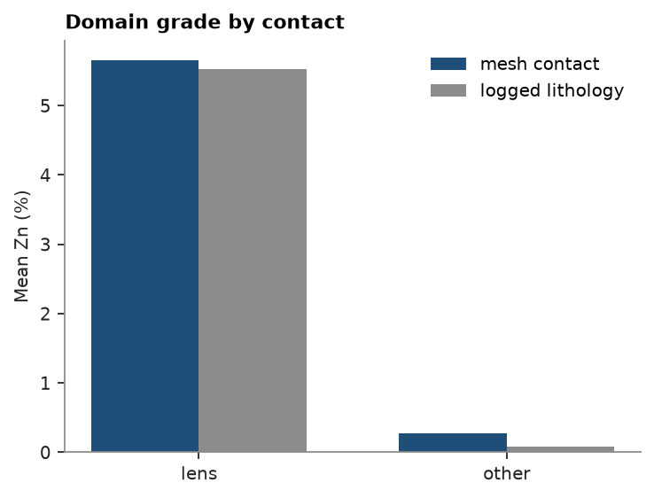

# Mesh-crossing interval splits

An assay interval rarely starts or ends exactly at a geological contact: a logger picks the nearest sample
boundary, not the true crossing. `Drillholes.mesh_intervals` walks each hole's desurveyed path against a closed
`Mesh` and returns the exact depths where it crosses the surface, ready to `merge_intervals` with the assays so a
composite can be domained hard at the mesh instead of at a logged pick.

<details><summary>Python</summary>

```python
import ceres as cs
import matplotlib.pyplot as plt
import numpy as np
from common import ACCENT, GRAY, save
```

</details>

<details><summary>Python</summary>

```python
data = cs.datasets.stacked_sulphide_lenses()
lens = data["lens_1"]
collar, survey, assay, lithology = data["collars"], data["surveys"], data["assays"], data["lithology"]
holes = cs.Drillholes(collar, survey, assay)
crossings = holes.mesh_intervals(lens, step=0.5, tolerance=0.01)
print(f"{crossings.num_rows} runs down {len(holes)} holes, {int(np.sum(crossings['INSIDE']))} inside lens 1")
```

</details>

```text
442 runs down 289 holes, 79 inside lens 1
```

`mesh_intervals` samples each hole's path every `step` and bisects to `tolerance` wherever it crosses the mesh, so
every depth down every hole falls in exactly one run of `INSIDE`. Its columns match `merge_intervals`'s own
defaults, so it splits the assays at those depths with no renaming.

<details><summary>Python</summary>

```python
domain = np.where(np.asarray(crossings["INSIDE"]), "lens", "other")
boundary = {
    "HOLE_ID": crossings["HOLE_ID"],
    "FROM": crossings["FROM"],
    "TO": crossings["TO"],
    "DOMAIN": domain,
}
mesh_split = cs.merge_intervals(assay, boundary)
mesh_comps = cs.Drillholes(collar, survey, mesh_split).composite(None, ["ZN_PCT"], domain="DOMAIN")
```

</details>

[Contact surfaces](../../11-geological-modeling/02-contact-surfaces/README.md) domains the same holes from the logged lithology instead: `MS` and `SMS` intervals stand for a sulphide
lens. That pick is only as good as where the logger set the contact, and it does not tell the three lenses apart.

<details><summary>Python</summary>

```python
lith_split = cs.merge_intervals(assay, lithology)
lith_domain = np.where(np.isin(np.asarray(lith_split["LITH"], dtype=object), ["MS", "SMS"]), "lens", "other")
lith_table = {**{c: lith_split[c] for c in lith_split.column_names}, "DOMAIN": lith_domain}
lith_comps = cs.Drillholes(collar, survey, lith_table).composite(None, ["ZN_PCT"], domain="DOMAIN")


def grade_by_domain(comps):
    stats = cs.describe_by("ZN_PCT", "DOMAIN", data=comps)
    return dict(zip(stats["category"], stats["mean"])), dict(zip(stats["category"], stats["n"]))


mesh_mean, mesh_n = grade_by_domain(mesh_comps)
lith_mean, lith_n = grade_by_domain(lith_comps)
print(f"     mesh contact: lens mean Zn {mesh_mean['lens']:.2f}%, n={mesh_n['lens']:.0f}")
print(f"logged lithology: lens mean Zn {lith_mean['lens']:.2f}%, n={lith_n['lens']:.0f}")
```

</details>

```text
     mesh contact: lens mean Zn 5.66%, n=78
logged lithology: lens mean Zn 5.52%, n=180
```

The lithology domain leaks in sulphide picked in the other two lenses and, since it is not corrected to the
solid, some contacts sit a sample or two off the true one; both pull its lens grade away from the mesh's.

<details><summary>Python</summary>

```python
labels = ["lens", "other"]
x = np.arange(len(labels))
width = 0.35
fig, ax = plt.subplots(figsize=(4.5, 3.4), layout="constrained")
for i, (name, mean, color) in enumerate(
    [("mesh contact", mesh_mean, ACCENT), ("logged lithology", lith_mean, GRAY)]
):
    ax.bar(x + (i - 0.5) * width, [mean[k] for k in labels], width, color=color, label=name)
ax.set(xticks=x, xticklabels=labels, ylabel="Mean Zn (%)", title="Domain grade by contact")
ax.legend()
save(fig, "grade")
```

</details>



Full script: [`example_15.py`](example_15.py)
