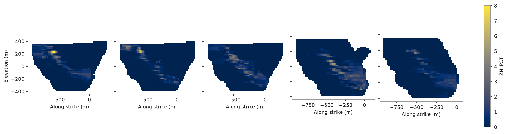

# stepped sections

`bt.plot.fence` slices a block model on several parallel planes stepped along a corridor, all sharing one color
scale. it draws a fence of cross sections through the stacked sulphide lenses in one call, where the maps in
[target distribution correction](../../04-transforms/10-target-distribution-correction/README.md) used a hand-rolled `plt.subplots` loop.

<details><summary>Python</summary>

```python
import boitata as bt
import matplotlib.pyplot as plt
import numpy as np
from common import save
```

</details>

## a grade model across the lenses

zinc kriged from the 5 m composites (as in [domain change tables](../../07-categories-and-domains/02-domain-change-tables/README.md)) onto a block model spanning the deposit, cells of 20 m,
masked to the topography.

<details><summary>Python</summary>

```python
data = bt.datasets.stacked_sulphide_lenses()
intervals = bt.merge_intervals(data["assays"], data["lithology"])
drillholes = bt.Drillholes(data["collars"], data["surveys"], intervals)
composites = drillholes.composite(5.0, ["ZN_PCT"], categories=["LITH"])
known = composites.filter(~np.isnan(composites["ZN_PCT"]))

layers = (23.0, 55.0, 0.0)
variogram = bt.Variogram([("spherical", 0.8, 200.0)], nugget=0.2, rotation=layers, ratios=(0.8, 0.2))
search = bt.Search(300.0, max_samples=24, max_per_hole=6, rotation=layers, ratios=(1.0, 0.4))

center = np.array([12350.0, 29900.0, 0.0])
across = np.array([np.sin(np.radians(113.0)), np.cos(np.radians(113.0)), 0.0])
along = np.array([np.sin(np.radians(23.0)), np.cos(np.radians(23.0)), 0.0])
origin = center - 600.0 * across - 300.0 * along + (0.0, 0.0, -400.0)
model = bt.BlockModel(origin, (20.0, 20.0, 20.0), (60, 30, 40), rotation=(23.0, 0.0, 0.0))
topography = data["topography"]
rows = topography.row_at(model.coords[:, :2])
model = model.filter((rows >= 0) & (model.coords[:, 2] < topography["Z"][rows]))
kriged = bt.OrdinaryKriging(variogram, search).fit(known, "ZN_PCT", holes="HOLE_ID").predict(model)
model = model.filter(~np.isnan(kriged)).with_columns({"ZN_PCT": kriged[~np.isnan(kriged)]})
print(f"{len(model):,} blocks of 20 m")
```

</details>

```text
51,013 blocks of 20 m
```

## the old way: a manual loop

[target distribution correction](../../04-transforms/10-target-distribution-correction/README.md) drew its two maps by hand: `plt.subplots(1, n, sharey=True)`, one `bt.plot.section(..., colorbar=False,
ax=ax)` per panel, `vmin`/`vmax` matched by hand across them, and one `fig.colorbar` at the end reading the last
panel's image. the same recipe, repeated for five sections stepped 125 m apart along strike:

<details><summary>Python</summary>

```python
positions = [center + t * along for t in np.linspace(-250.0, 250.0, 5)]
fig, axes = plt.subplots(1, len(positions), figsize=(13, 4), layout="constrained", sharey=True)
for ax, position in zip(axes, positions, strict=True):
    bt.plot.section(model, "ZN_PCT", plane=(position, 113.0, 90.0), vmin=0, vmax=8, colorbar=False, ax=ax)
for ax in axes[1:]:
    ax.set_ylabel("")
fig.colorbar(axes[-1].collections[0], ax=axes, shrink=0.8, label="ZN_PCT")
save(fig, "manual")
```

</details>



## `bt.plot.fence`

the same five sections in one call. all panels share `azimuth` and `dip`, and `fence` finds `vmin`/`vmax` across
them unless you give them, as `section` takes them.

<details><summary>Python</summary>

```python
fig, axes = bt.plot.fence(model, "ZN_PCT", positions, azimuth=113.0, dip=90.0)
save(fig, "fence")
```

</details>


Full script: [`example_02_16.py`](example_02_16.py)
