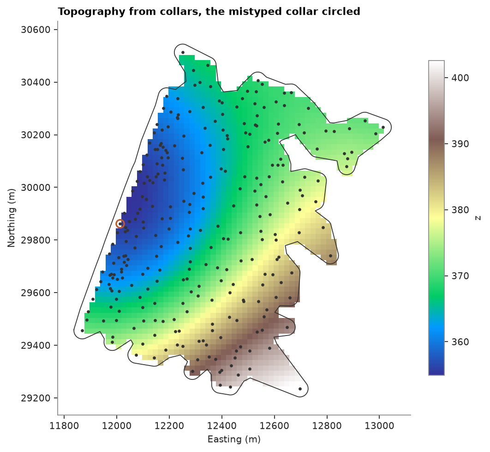

# topography from points

collar elevations sample the ground surface. `topography` triangulates them into a surface and a grid, clipped to the
drilled area, and checks each collar against the surface through the others: a collar far off that surface was likely
surveyed or typed wrong.

<details><summary>Python</summary>

```python
import boitata as bt
import matplotlib.pyplot as plt
import numpy as np
from common import HIGHLIGHT, map_axes, save

data = bt.datasets.stacked_sulphide_lenses()
collars = bt.PointSet.from_table(data["collars"], z="Z")
truth = data["topography"]
```

</details>

the delaunay surface is linear within each triangle and passes through every collar. by default the grid is clipped
to a concave outline of the collars, buffered by their spacing; cells outside it stay null.

<details><summary>Python</summary>

```python
t = bt.topography(collars, cell=20.0)
z = t.grid["z"]
print(
    f"grid {t.grid.count[0]} x {t.grid.count[1]} cells of 20 m, {np.isfinite(z).mean():.0%} inside the outline"
)

true_z = truth["Z"][truth.row_at(t.grid.centroids)]
error = z - true_z
print(
    f"against the true surface: mean {np.nanmean(error):+.2f} m, 90% within {np.nanpercentile(np.abs(error), 90):.2f} m"
)
```

</details>

```text
grid 61 x 68 cells of 20 m, 48% inside the outline
against the true surface: mean +0.38 m, 90% within 0.69 m
```

each collar's residual is its elevation minus the surface through the other collars. the default threshold, 3 robust
standard deviations of the residuals, adapts to the data: on these clean collars it sits a quarter of a meter out and
catches only the bends of the terrain between holes. a collar is flagged only where its residual also beats those of
its neighbors, since one bad collar pulls its neighbors' residuals up too.

<details><summary>Python</summary>

```python
print(f"default threshold {t.max_residual:.2f} m: {t.flagged.sum()} of {len(collars)} flagged")
print(f"largest residual {np.abs(t.residuals).max():.2f} m")
```

</details>

```text
default threshold 0.24 m: 12 of 289 flagged
largest residual 3.82 m
```

a typed elevation 10 m too high on one collar stands out against a threshold set from the survey's accuracy. the
other collars past 2 m each have a neighbor with a larger residual, so only the mistyped one is flagged.

<details><summary>Python</summary>

```python
holes = np.asarray(data["collars"]["HOLE_ID"])
typo = collars.coords.copy()
typo[100, 2] += 10.0
checked = bt.topography(typo, cell=20.0, max_residual=2.0)
for hole, r in zip(holes[checked.flagged], checked.residuals[checked.flagged], strict=True):
    print(f"flagged {hole}: {r:+.2f} m")
print(f"other residuals above 2 m: {(np.abs(checked.residuals) > 2).sum() - checked.flagged.sum()}")

fig, ax = plt.subplots(figsize=(6.5, 6), layout="constrained")
bt.plot.section(t.grid, "z", axis="z", ax=ax, cmap="terrain")
ring = t.outline.parts[0]
ax.plot(*np.vstack([ring, ring[:1]])[:, :2].T, color="0.2", lw=0.8)
ax.scatter(*collars.coords[:, :2].T, s=4, color="0.2")
ax.scatter(*typo[checked.flagged, :2].T, s=60, facecolors="none", edgecolors=HIGHLIGHT, linewidths=1.5)
map_axes(ax, "Topography from collars, the mistyped collar circled")
save(fig, "topography")
```

</details>

```text
flagged DD0101: +9.80 m
other residuals above 2 m: 5
```



Full script: [`example_02_19.py`](example_02_19.py)
