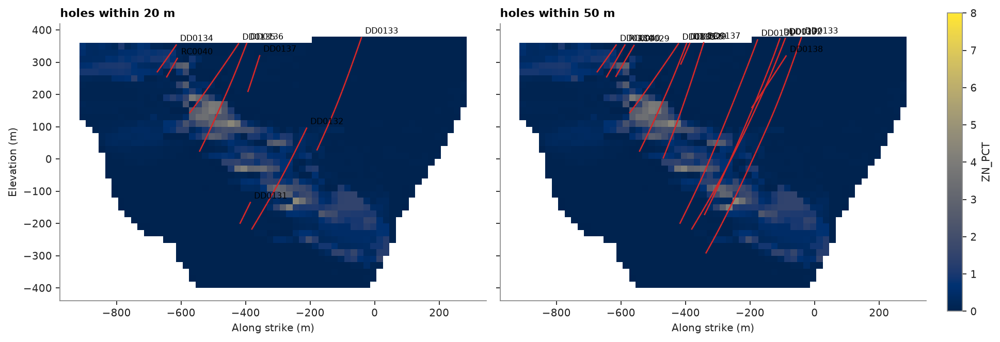

# sections with holes

`bt.plot.section` cuts a block model on a plane given by `origin`, `azimuth` and `dip`, draws the blocks at true
scale, and with `holes` projects the drill-hole traces within `width` of the plane on top: the usual check that a
model honours the holes it came from.

<details><summary>Python</summary>

```python
import boitata as bt
import matplotlib.pyplot as plt
import numpy as np
from common import save
```

</details>

## a grade model across the lenses

zinc kriged from the 5 m composites onto 20 m blocks, masked to the topography, as in
[stepped sections](../../02-data-and-geometry/16-stepped-sections/README.md).

<details><summary>Python</summary>

```python
data = bt.datasets.stacked_sulphide_lenses()
intervals = bt.merge_intervals(data["assays"], data["lithology"])
drillholes = bt.Drillholes(data["collars"], data["surveys"], intervals)
composites = drillholes.composite(5.0, ["ZN_PCT"], categories=["LITH"])
known = composites.drop_null("ZN_PCT")

layers = (23.0, 55.0, 0.0)
variogram = bt.Variogram([("spherical", 0.8, 200.0)], nugget=0.2, rotation=layers, ratios=(0.8, 0.2))
search = bt.Search(300.0, max_samples=24, max_per_hole=6, rotation=layers, ratios=(1.0, 0.4))

center = np.array([12350.0, 29900.0, 0.0])
across = np.array([np.sin(np.radians(113.0)), np.cos(np.radians(113.0)), 0.0])
along = np.array([np.sin(np.radians(23.0)), np.cos(np.radians(23.0)), 0.0])
origin = center - 600.0 * across - 300.0 * along + (0.0, 0.0, -400.0)
model = bt.BlockModel(origin, (20.0, 20.0, 20.0), (60, 30, 40), rotation=(23.0, 0.0, 0.0))
topography = data["topography"]
model = model.filter(model.z < topography.sample(model.coords[:, :2], "Z"))
kriged = bt.OrdinaryKriging(variogram, search).fit(known, "ZN_PCT", holes="HOLE_ID").predict(model)
model = model.with_columns({"ZN_PCT": kriged}).drop_null("ZN_PCT")
print(f"{len(model):,} blocks of 20 m")
```

</details>

```text
51,013 blocks of 20 m
```

## one section, two widths

a vertical section across strike (113°) through the middle of the deposit. a 20 m slab keeps only the holes
drilled on that line; 50 m also brings in the neighbouring lines, projected onto the plane. blocks without an
estimate stay blank.

<details><summary>Python</summary>

```python
fig, axes = plt.subplots(1, 2, figsize=(12, 4.6), layout="constrained", sharey=True)
for ax, width in zip(axes, (20.0, 50.0), strict=True):
    bt.plot.section(
        model,
        "ZN_PCT",
        origin=center,
        azimuth=113.0,
        dip=90.0,
        holes=drillholes,
        width=width,
        vmin=0,
        vmax=8,
        colorbar=ax is axes[-1],
        ax=ax,
    )
    ax.set_title(f"holes within {width:.0f} m")
axes[1].set_ylabel("")
save(fig, "section")
```

</details>



Full script: [`example_02_20.py`](example_02_20.py)
