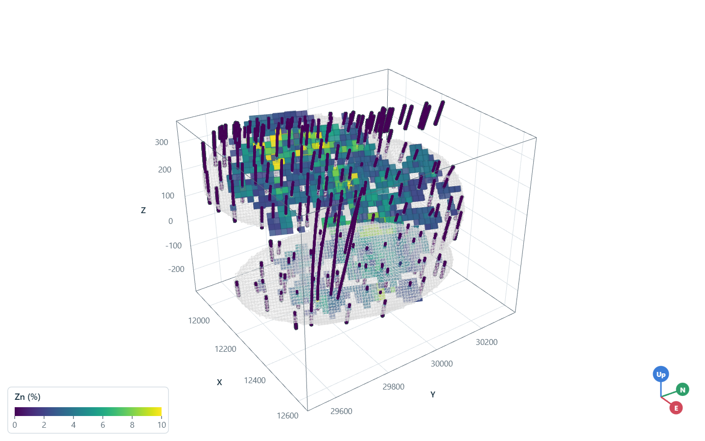
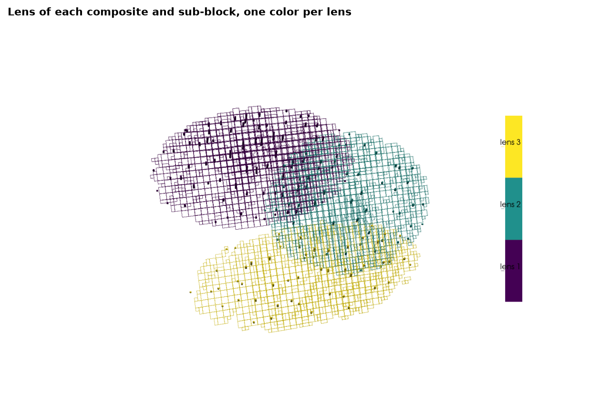
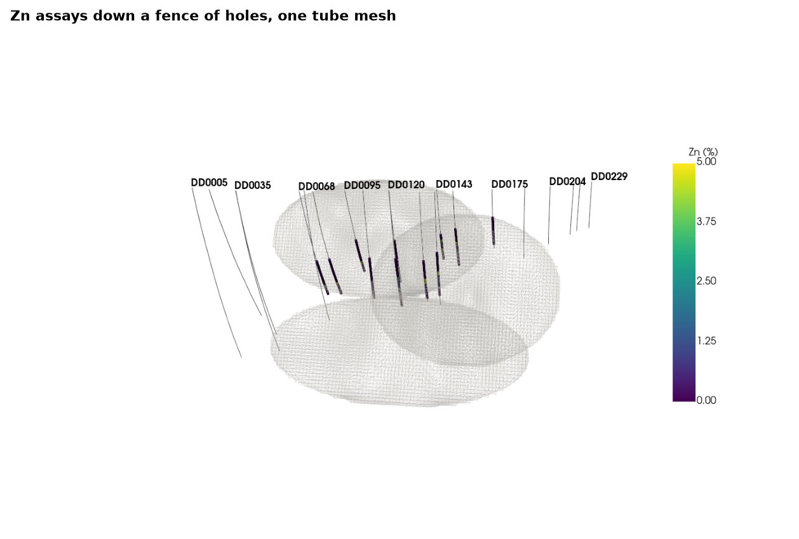
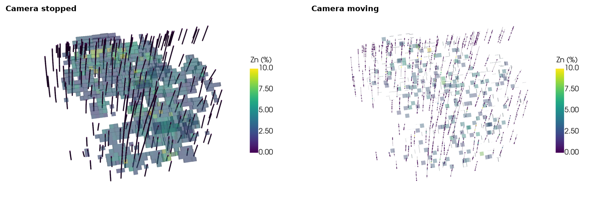

# live scene

`bt.plot3d.Scene` stacks layers in one 3D view. layers colored by the same variable share its color map and range,
so a composite and the blocks around it show one grade in one color, and null values never draw, in any style.
`show()` opens the scene: trame in Jupyter, a native window from a script, and an interactive page with
`show(browser=True)`. `screenshot` writes the current view to a PNG at any multiple of the window's resolution,
with an optional transparent background; here each scene renders off-screen at twice its window size.

<details><summary>Python</summary>

```python
import tempfile

import boitata as bt
import matplotlib.pyplot as plt
import numpy as np
import pyvista as pv
from common import LIGHT, save

pv.OFF_SCREEN = True
BAR = {"vertical": True, "height": 0.5, "position_x": 0.85, "position_y": 0.25}


def image(scene, title, view=(0.8, -0.6, 0.6)):
    """Renders a scene into a matplotlib figure."""
    scene.view_vector(view)
    path = scene.screenshot(Path(tempfile.mkdtemp()) / "scene.png", scale=2)
    scene.close()
    fig, ax = plt.subplots(figsize=(8, 5.2), layout="constrained")
    ax.imshow(plt.imread(path))
    ax.set_axis_off()
    ax.set_title(title)
    return fig
```

</details>

zinc composites of the stacked sulphide lenses inform a grid rotated with them, by inverse distance within 60 m.
both layers carry `ZN_PCT`, so they share one color bar. without `clim` its range would run from the lowest to the
highest value of any layer; here the first layer fixes it at 0 to 10 % and the later ones follow. `slices`, a
shortcut that adds three cuts through the model to the scene, leaves holes at the blocks with no composite in
reach, which are null.

<details><summary>Python</summary>

```python
data = bt.datasets.stacked_sulphide_lenses()
holes = bt.Drillholes(data["collars"], data["surveys"], data["assays"])
lenses = [data[f"lens_{i}"] for i in (1, 2, 3)]
composites = holes.composite(2.0, ["ZN_PCT"])
grid = bt.BlockModel.from_extents(*lenses, size=(20, 20, 10), buffer=20, rotation=(22.5, 0.0, 55.0))
search = bt.Search(radius=60, min_samples=1, max_samples=12)
idw = bt.InverseDistance(search, power=2).fit(composites.coords, composites["ZN_PCT"])
grid = grid.with_column("ZN_PCT", idw.predict(grid))
near = np.all(
    (composites.coords > grid.centroids.min(axis=0)) & (composites.coords < grid.centroids.max(axis=0)),
    axis=1,
)

scene = bt.plot3d.Scene(window_size=(700, 450))
scene.add(
    composites.filter(near), "ZN_PCT", point_size=4, clim=(0, 10), scalar_bar_args={"title": "Zn (%)", **BAR}
)
bt.plot3d.slices(grid, "ZN_PCT", plotter=scene)
for lens in lenses:
    scene.add(lens, style="wireframe", color=LIGHT, opacity=0.15)
print(f"{np.isnan(grid['ZN_PCT']).mean():.0%} of {len(grid):,} blocks null")
print(f"Zn range of every layer: {scene.colors['ZN_PCT'].scalar_range} %")
save(image(scene, "Zn composites and three cuts through the grid, on one scale"), "grade")
```

</details>

```text
18% of 25,004 blocks null
Zn range of every layer: (0.0, 10.0) %
```



text columns share a category list the same way. each composite inside a lens takes its name, the others stay null
and do not draw; the sub-blocks of the lenses carry the same names in `domain`, here renamed `lens` so both layers
color by one variable and every lens keeps its color across them.

<details><summary>Python</summary>

```python
inside = [lens.contains(composites.coords) for lens in lenses]
names = np.select(inside, [f"lens {i}" for i in (1, 2, 3)], "")
composites = composites.with_column("lens", [n or None for n in names])
blocks = bt.BlockModel.from_meshes(
    grid.origin,
    grid.size,
    grid.count,
    [(lens, "inside", f"lens {i}") for i, lens in enumerate(lenses, 1)],
    subgrid=2,
    fill="host",
    rotation=tuple(grid.rotation),
)
blocks = blocks.mask(np.asarray(blocks["domain"], dtype=object) != "host")
blocks = blocks.with_column("lens", blocks["domain"])

scene = bt.plot3d.Scene(window_size=(700, 450))
scene.add(blocks, "lens", style="wireframe", opacity=0.3, scalar_bar_args={"title": "", **BAR})
scene.add(composites, "lens", point_size=5)
print(f"{len(blocks):,} sub-blocks, {(names != '').sum():,} of {len(composites):,} composites in a lens")
print(f"categories: {list(scene.colors['lens'].annotations.values())}")
save(image(scene, "Lens of each composite and sub-block, one color per lens"), "lenses")
```

</details>

```text
3,233 sub-blocks, 1,135 of 13,312 composites in a lens
categories: ['lens 1', 'lens 2', 'lens 3']
```



drill holes draw as one tube mesh, a tube per assay interval carrying the interval columns; unassayed ground has
no interval and leaves a gap, as would a null `ZN_PCT`. holes without intervals draw their traces instead.
`radius` sets the tube radius in meters and `labels=True` names each hole at its collar. here the holes collared
within 30 m of a north-south line through the middle: thin traces with their names, thick assays on top.

<details><summary>Python</summary>

```python
x = np.asarray(data["collars"]["X"])
fence = data["collars"].filter(np.abs(x - np.median(x)) < 30)
fence_holes = bt.Drillholes(fence, data["surveys"], data["assays"])
scene = bt.plot3d.Scene(window_size=(1400, 900))
scene.add(bt.Drillholes(fence, data["surveys"]), radius=1, labels=True, color=LIGHT)
scene.add(fence_holes, "ZN_PCT", radius=4, clim=(0, 5), scalar_bar_args={"title": "Zn (%)", **BAR})
for lens in lenses:
    scene.add(lens, style="wireframe", color=LIGHT, opacity=0.1)
print(f"{len(fence_holes.holes)} of {len(holes.holes)} holes, {len(fence_holes.samples()):,} intervals")
save(image(scene, "Zn assays down a fence of holes, one tube mesh", view=(1, -0.2, 0.3)), "holes")
```

</details>

```text
21 of 289 holes, 1,000 intervals
```



while the camera moves, `motion_quality` swaps each layer for a cheaper copy and draws it in full again once the
camera stops. `"auto"`, the default, only does so above a million cells or points; a number asks for about that
fraction of every layer's geometry. here a tenth: the outer faces of the blocks above 2 % Zn thin to a fixed random
tenth, the composites likewise as flat points, the assay tubes become lines. off-screen, a render at the interactive
update rate stands in for a drag. the swap needs the camera events of the native window or of trame's server
rendering; trame's client rendering (vtk.js) and `show(browser=True)` always draw the full layers.

<details><summary>Python</summary>

```python
scene = bt.plot3d.Scene(window_size=(700, 450), motion_quality=0.1)
blocks = grid.mask(np.nan_to_num(grid["ZN_PCT"]) > 2)
scene.add(blocks, "ZN_PCT", clim=(0, 10), opacity=0.4, scalar_bar_args={"title": "Zn (%)", **BAR})
scene.add(composites.filter(near), "ZN_PCT", point_size=4)
scene.add(holes, "ZN_PCT", radius=3)
scene.view_vector((0.8, -0.6, 0.6))
scene.camera.zoom(1.5)
frames = {}
for state, rate in (("stopped", 0.0001), ("moving", 15.0)):
    scene.ren_win.SetDesiredUpdateRate(rate)
    frames[state] = scene.plotter.screenshot(return_img=True, scale=2)
scene.close()
fig, axes = plt.subplots(1, 2, figsize=(11, 3.6), layout="constrained")
for ax, (state, pixels) in zip(axes, frames.items(), strict=True):
    ax.imshow(pixels)
    ax.set_axis_off()
    ax.set_title(f"Camera {state}")
save(fig, "motion")
```

</details>



Full script: [`example_02_21.py`](example_02_21.py)
