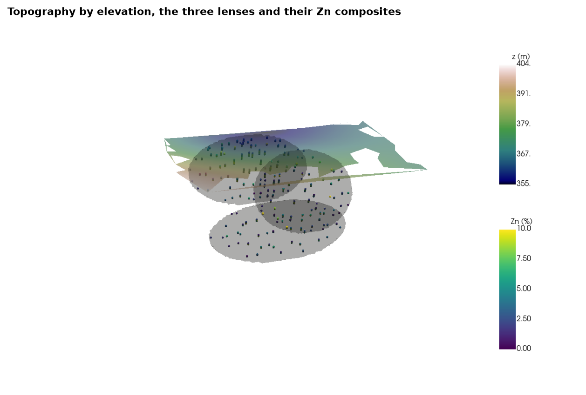

# meshes and points in a scene

a `Mesh` adds to a `bt.plot3d.Scene` as triangles and a `PointSet` as spheres. a mesh is colored by a vertex
attribute, interpolated across each triangle, or by a face attribute, one color per triangle; either way its null
rows never draw. here a topography surface colored by elevation sits above three stacked sulphide lenses and the
zinc composites that cut them, rendered off-screen to an image.

<details><summary>Python</summary>

```python
import boitata as bt
import matplotlib.pyplot as plt
import numpy as np
import pyvista as pv
from common import INK, save

pv.OFF_SCREEN = True
BAR = {"vertical": True, "height": 0.35, "position_x": 0.86}


def image(scene, title, view=(0.8, -0.6, 0.45)):
    """Renders a scene into a matplotlib figure."""
    scene.view_vector(view)
    pixels = scene.plotter.screenshot(return_img=True, window_size=(1400, 900))
    scene.close()
    fig, ax = plt.subplots(figsize=(8, 5.2), layout="constrained")
    ax.imshow(pixels)
    ax.set_axis_off()
    ax.set_title(title)
    return fig
```

</details>

`topography` triangulates the collar elevations ([topography](../19-topography/README.md)) into a mesh; its
elevation goes in as a vertex column. the lenses are closed solids, drawn half transparent. the
composites keep only those inside a lens, colored by zinc on a second color bar.

<details><summary>Python</summary>

```python
data = bt.datasets.stacked_sulphide_lenses()
holes = bt.Drillholes(data["collars"], data["surveys"], data["assays"])
lenses = [data[f"lens_{i}"] for i in (1, 2, 3)]
collars = bt.PointSet.from_table(data["collars"], z="Z")
ground = bt.topography(collars, cell=20.0).mesh
ground = ground.with_vertex_column("elevation", ground.vertices[:, 2])
composites = holes.composite(2.0, ["ZN_PCT"])
ore = composites.filter(np.any([lens.contains(composites.coords) for lens in lenses], axis=0))
print(f"topography: {len(ground.vertices):,} vertices, {len(ground.triangles):,} triangles")
print(f"{len(ore):,} composites inside a lens, {np.isnan(ore['ZN_PCT']).sum()} of them null")

scene = bt.plot3d.Scene(window_size=(1400, 900))
scene.add(
    ground,
    "elevation",
    cmap="gist_earth",
    opacity=0.6,
    scalar_bar_args={"title": "z (m)", "position_y": 0.55, **BAR},
)
for lens in lenses:
    scene.add(lens, color=INK, opacity=0.2)
scene.add(
    ore, "ZN_PCT", point_size=5, clim=(0, 10), scalar_bar_args={"title": "Zn (%)", "position_y": 0.1, **BAR}
)
save(image(scene, "Topography by elevation, the three lenses and their Zn composites"), "scene")
```

</details>

```text
topography: 289 vertices, 534 triangles
1,135 composites inside a lens, 0 of them null
```



Full script: [`example_02_22.py`](example_02_22.py)
