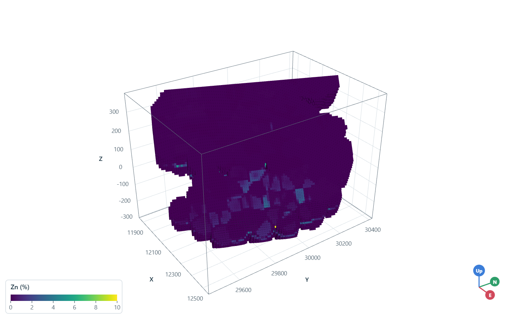
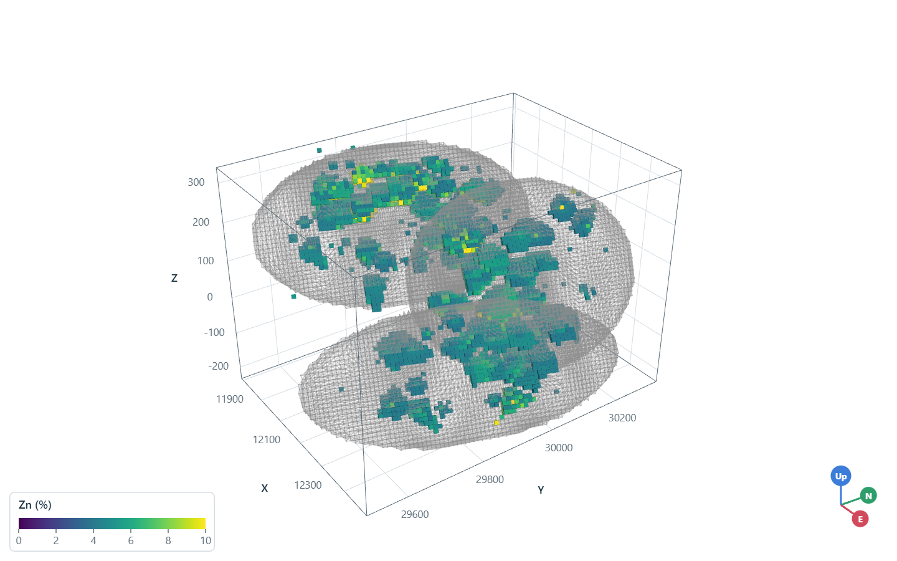
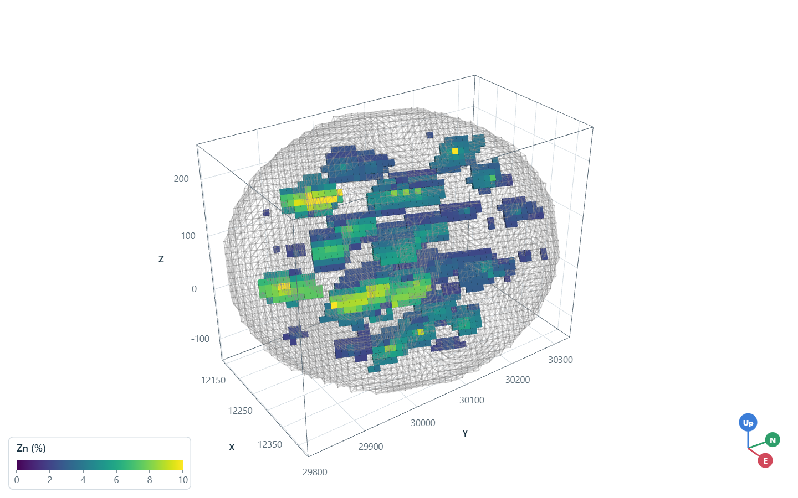

# filtering block models

a block model drawn whole shows its outer shell and hides the grades inside. a layer's `filter` peels it: a
`(low, high)` range on a number column, a list of kept categories on a text column, up to four columns that a block
must all pass. the viewer evaluates the filter on the GPU, so the layer's filter panel edits it while viewing with
histogram sliders and category checkboxes, and `Scene.filters` reads it back or sets it.

<details><summary>Python</summary>

```python
import boitata as bt
import numpy as np
from common import GRAY, show
```

</details>

zinc composites of the stacked sulphide lenses inform a rotated grid by inverse distance within 60 m; blocks with no
composite in reach stay null and never draw. each block also takes the name of the lens holding its center, or
`host`. drawn whole, the grid is a brick of low grades.

<details><summary>Python</summary>

```python
data = bt.datasets.stacked_sulphide_lenses()
holes = bt.Drillholes(data["collars"], data["surveys"], data["assays"])
lenses = [data[f"lens_{i}"] for i in (1, 2, 3)]
composites = holes.composite(2.0, ["ZN_PCT"])
grid = bt.BlockModel.from_extents(*lenses, size=(10, 10, 5), buffer=20, rotation=(22.5, 0.0, 55.0))
search = bt.Search(radius=60, min_samples=1, max_samples=12)
idw = bt.InverseDistance(search, power=2).fit(composites.coords, composites["ZN_PCT"])
inside = [lens.contains(grid.coords) for lens in lenses]
grid = grid.with_columns(
    {
        "ZN_PCT": idw.predict(grid),
        "lens": list(np.select(inside, [f"lens {i}" for i in (1, 2, 3)], "host")),
    }
)
print(f"{len(grid):,} blocks, {np.isnan(grid['ZN_PCT']).mean():.0%} null")

ZN = {"clim": (0, 10), "label": "Zn (%)"}
scene = bt.plot3d.Scene()
scene.add(grid, "ZN_PCT", name="grid", **ZN)
scene.view(azimuth=305, dip=30)
show(scene, "whole", "The whole grid: only its outer shell shows")
```

</details>

```text
192,888 blocks, 18% null
```



a range on `ZN_PCT` keeps the blocks above 4 % and peels the low grades away; the lenses' high-grade cores show
through. an open end is None.

<details><summary>Python</summary>

```python
scene = bt.plot3d.Scene()
scene.add(grid, "ZN_PCT", name="grid", filter={"ZN_PCT": (4, None)}, **ZN)
for i, lens in enumerate(lenses, 1):
    scene.add(lens, name=f"lens {i}", representation="wireframe", color=GRAY, opacity=0.3)
scene.view(azimuth=305, dip=30)
kept = np.nan_to_num(grid["ZN_PCT"]) >= 4
print(f"{kept.sum():,} of {len(grid):,} blocks at 4 % Zn or more")
show(scene, "grade", "Blocks at 4 % Zn or more")
```

</details>

```text
7,563 of 192,888 blocks at 4 % Zn or more
```



a list of categories keeps the blocks of the middle lens; with the grade range too, a block must pass both. here the
filter is set after the layers through `filters`, by layer name, as the panel would.

<details><summary>Python</summary>

```python
scene = bt.plot3d.Scene()
scene.add(grid, "ZN_PCT", name="grid", **ZN)
scene.add(lenses[1], name="lens 2", representation="wireframe", color=GRAY, opacity=0.3)
scene.filters = {"grid": {"lens": ["lens 2"], "ZN_PCT": (2, None)}}
scene.view(azimuth=305, dip=30)
middle = np.asarray(grid["lens"], dtype=object) == "lens 2"
print(f"filters: {scene.filters}")
print(f"{(middle & (np.nan_to_num(grid['ZN_PCT']) >= 2)).sum():,} of {middle.sum():,} blocks of lens 2 shown")
show(scene, "lens", "The blocks of lens 2 at 2 % Zn or more")
```

</details>

```text
filters: {'grid': {'lens': ['lens 2'], 'ZN_PCT': (2.0, None)}}
1,860 of 3,829 blocks of lens 2 shown
```



Full script: [`example_02_23.py`](example_02_23.py)
