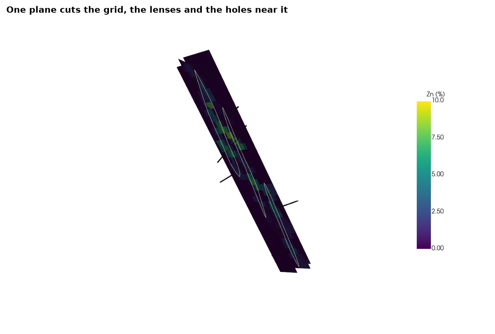
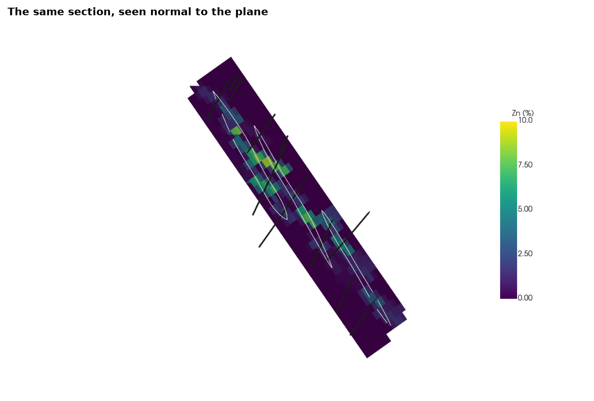
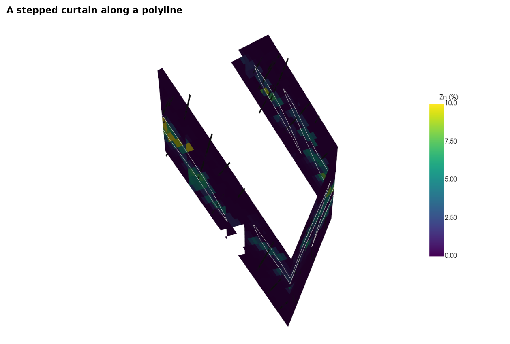
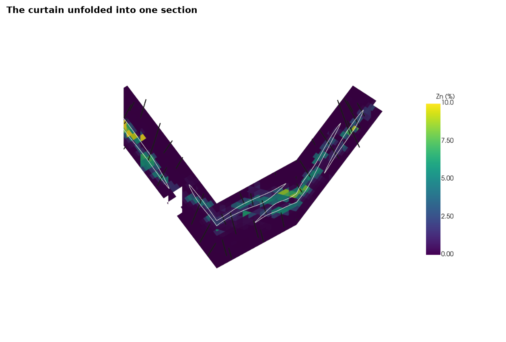

# interactive sections

`Scene.section` cuts every layer of a scene with one plane: blocks and lens surfaces show their intersection,
drill holes within `width` of the plane are clipped to that slab and projected onto it. `section_widget` puts a
plane in the window that recuts the scene each time it moves, and `view_section` turns the camera to look straight
at the plane in parallel projection, as a true-scale section. here each view renders off-screen to an image.

<details><summary>Python</summary>

```python
import boitata as bt
import matplotlib.pyplot as plt
import numpy as np
import pyvista as pv
from common import INK, save

pv.OFF_SCREEN = True
BAR = {"vertical": True, "height": 0.5, "position_x": 0.85, "position_y": 0.25}


def image(scene, title):
    """Renders a scene into a matplotlib figure."""
    pixels = scene.plotter.screenshot(return_img=True, window_size=(1400, 900))
    fig, ax = plt.subplots(figsize=(8, 5.2), layout="constrained")
    ax.imshow(pixels)
    ax.set_axis_off()
    ax.set_title(title)
    return fig
```

</details>

zinc composites of the stacked sulphide lenses inform a grid rotated with them. the scene holds the grid, the drill
holes and the three lens surfaces; one section across the lenses, at azimuth 112.5 and dipping 80, cuts them all.
holes within 15 m of the plane draw on it, the rest drop out.

<details><summary>Python</summary>

```python
data = bt.datasets.stacked_sulphide_lenses()
holes = bt.Drillholes(data["collars"], data["surveys"], data["assays"])
lenses = [data[f"lens_{i}"] for i in (1, 2, 3)]
composites = holes.composite(2.0, ["ZN_PCT"])
grid = bt.BlockModel.from_extents(*lenses, size=(20, 20, 10), buffer=20, rotation=(22.5, 0.0, 55.0))
search = bt.Search(radius=60, min_samples=1, max_samples=12)
idw = bt.InverseDistance(search, power=2).fit(composites.coords, composites["ZN_PCT"])
grid = grid.with_column("ZN_PCT", idw.predict(grid))

scene = bt.plot3d.Scene(window_size=(1400, 900))
scene.add(grid, "ZN_PCT", clim=(0, 10), scalar_bar_args={"title": "Zn (%)", **BAR})
scene.add(holes, color=INK, radius=2)
for lens in lenses:
    scene.add(lens, color="white")
center = grid.centroids.mean(axis=0)
scene.section(center, azimuth=112.5, dip=80, width=30)
print(f"section through {np.round(center).tolist()}")
scene.view_vector((0.1, -0.6, 0.8))
save(image(scene, "One plane cuts the grid, the lenses and the holes near it"), "cut")
```

</details>

```text
section through [12231.0, 29911.0, 48.0]
```



`view_section` looks along the normal of the plane with strike to the right and up dip upward. `section_widget`
would let the plane be dragged and turned in a window; each move calls `section` with the new origin and angles.

<details><summary>Python</summary>

```python
scene.view_section()
save(image(scene, "The same section, seen normal to the plane"), "section")
```

</details>



`points=` cuts along a polyline in plan instead: each segment cuts on the vertical plane through it, between its
ends, so the section steps around the lenses like a curtain. here it runs across the lenses, turns north along
strike, then crosses them again.

<details><summary>Python</summary>

```python
x, y = center[:2]
path = [(x - 250, y - 150), (x + 100, y - 150), (x + 100, y + 150), (x - 250, y + 150)]
scene.section(points=path, width=30)
scene.disable_parallel_projection()
scene.view_vector((0.4, -0.8, 0.6))
scene.reset_camera()
save(image(scene, "A stepped curtain along a polyline"), "curtain")
```

</details>



for a polyline, `view_section` unfolds the curtain: each segment's cut lies along the first segment's plane at its
distance along the polyline, one true-scale section of all three panels. in a window, `section_drawer` draws the
polyline with the mouse (``d`` for a plan view, clicks for vertices, Shift for 45° steps, Enter to cut) and
`layer_toggles` adds a checkbox per layer.

<details><summary>Python</summary>

```python
scene.view_section()
save(image(scene, "The curtain unfolded into one section"), "unfolded")
scene.close()
```

</details>



Full script: [`example_02_24.py`](example_02_24.py)
