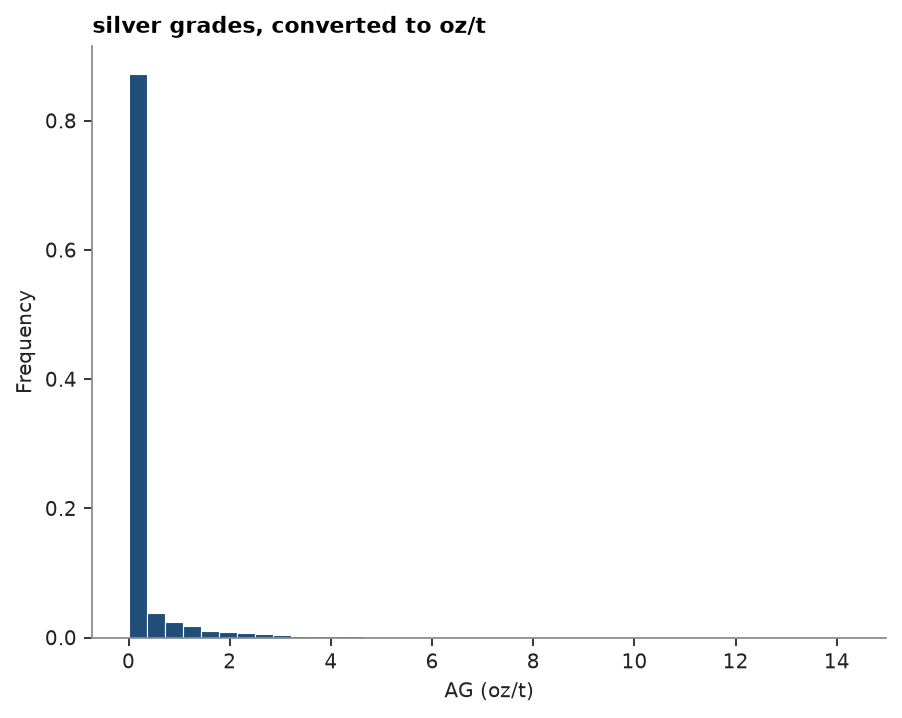

# units

a column can carry a unit, kept in its arrow metadata and through parquet. units combine lengths, masses, grades,
ratios, angles and currencies, so `t/m3`, `USD/m` and `(g/t)^2` are units too. grades are a kind of their own: a
grade never converts to a plain ratio, and ore mass times a grade is metal (`kg metal`), never ore.

<details><summary>Python</summary>

```python
import boitata as bt
import matplotlib.pyplot as plt
import numpy as np
from common import save

assays = bt.datasets.stacked_sulphide_lenses()["assays"]
folder = Path(tempfile.mkdtemp())
bt.write_csv(
    folder / "assays.csv",
    bt.Table({"ZN (%)": assays["ZN_PCT"], "AG [g/t]": assays["AG_GPT"], "DENSITY": assays["DENSITY"]}),
    progress=False,
)
```

</details>

## units from the file

`read_csv` splits a header such as `ZN (%)` or `AG [g/t]` into the column name and its unit. a column whose header
says nothing takes its unit from `units=`.

<details><summary>Python</summary>

```python
table = bt.read_csv(folder / "assays.csv", units={"DENSITY": "t/m3"}, progress=False)
print(table.column_names)
print(table.units)
```

</details>

```text
['ZN', 'AG', 'DENSITY']
{'ZN': '%', 'AG': 'g/t', 'DENSITY': 't/m3'}
```

a project that always names its columns the same way declares the units once with `set_units`; readers and
constructors then give those columns their unit whenever the file leaves it out. `with bt.units(...)` does the same
for one block.

<details><summary>Python</summary>

```python
with bt.units(columns={"DENSITY": "t/m3"}):
    print(bt.read_csv(folder / "assays.csv", progress=False).units)
```

</details>

```text
{'ZN': '%', 'AG': 'g/t', 'DENSITY': 't/m3'}
```

## converting

`convert_units` rescales a column to another unit of the same kind. `oz/t` is troy ounces per short ton, as North
American reports write it.

<details><summary>Python</summary>

```python
silver = table.convert_units("AG", to="oz/t")
print(f"{table['AG'][:3]} g/t is {silver['AG'][:3]} oz/t")
density = table.convert_units("DENSITY", to="kg/m3")["DENSITY"]
print(f"mean density {np.nanmean(table['DENSITY']):.2f} t/m3 = {np.nanmean(density):.0f} kg/m3")
```

</details>

```text
[1.  1.5 0.8] g/t is [0.02916667 0.04375    0.02333333] oz/t
mean density 3.26 t/m3 = 3264 kg/m3
```

a conversion across kinds raises `InvalidInput`: a zinc grade in percent is not a ratio in percent.

<details><summary>Python</summary>

```python
try:
    table.convert_units("ZN", to="ratio%")
except bt.InvalidInput as error:
    print(error)
```

</details>

```text
cannot convert grade (%) to ratio (ratio%)
```

plots label their axes with the unit of the column.

<details><summary>Python</summary>

```python
fig, ax = bt.plot.histogram("AG", data=silver)
ax.set_title("silver grades, converted to oz/t")
save(fig, "histogram")
plt.show()
```

</details>



Full script: [`example_02_25.py`](example_02_25.py)
