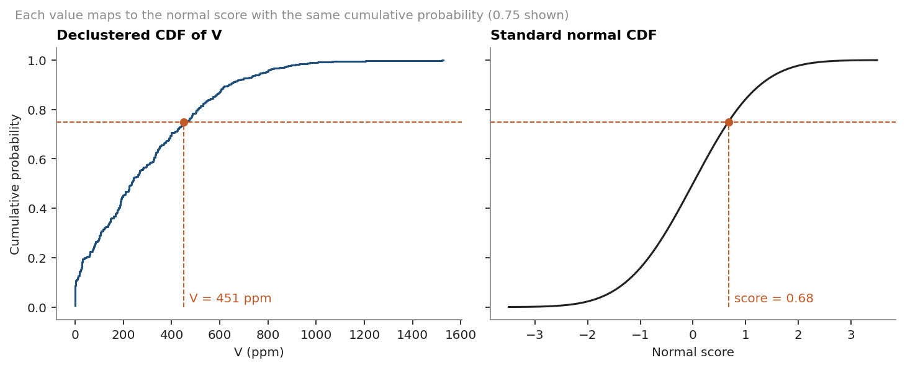
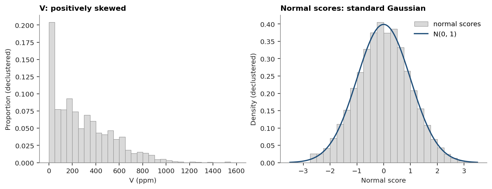

# 2. Normal-score transform

Gaussian methods (simple kriging of scores, SGS) need a standard normal variable.
The normal-score transform matches each value to the Gaussian score with the same cumulative probability, using the declustering weights from [chapter 1](../01-data/README.md).





Checks: weighted mean of the scores 0.001, standard deviation 0.998, and the back-transform returns every sample exactly.

```rust
let ns = nscore_transform(&v, Some(&weights))?;
let value = ns.table.back(score);
```

Source: [`02_normal_score.rs`](../src/bin/02_normal_score.rs), [`02_normal_score.py`](../plot/02_normal_score.py).
