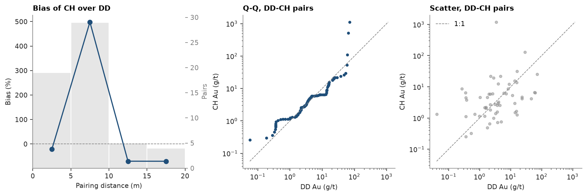

# paired data

four gold veins drilled from surface by diamond holes (DD) and sampled underground by horizontal channels (CH). do the
two sample the same grades? pair samples of each type that lie close to one another and compare their grades.

<details><summary>Python</summary>

```python
import boitata as bt
import matplotlib.pyplot as plt
import numpy as np
from common import ACCENT, GRAY, save

data = bt.datasets.vein_gold_grade_control()
collars = data["collars"]
intervals = bt.merge_intervals(data["assays"], data["lithology"])
holes = bt.Drillholes(collars, data["surveys"], intervals)
```

</details>

channel samples are shorter than core samples, so each type is composited to one composite per vein intercept
(`composite(None, ..., domain="LITH")`), keeping only the quartz vein (QV) intercepts. both types then measure the
grade across the vein.

<details><summary>Python</summary>

```python
intercepts = holes.composite(None, ["AU_GPT"], domain="LITH")
kind = dict(zip(collars["HOLE_ID"], collars["TYPE"], strict=True))
drilling = np.array([kind[h] for h in intercepts["HOLE_ID"]])
vein = (intercepts["LITH"] == "QV") & ~np.isnan(intercepts["AU_GPT"])
dd = intercepts.filter(vein & (drilling == "DD"))
ch = intercepts.filter(vein & (drilling == "CH"))
print(f"{len(dd)} DD and {len(ch)} CH vein intercepts")
```

</details>

```text
206 DD and 2456 CH vein intercepts
```

`pairs` finds, for each DD intercept, the nearest CH intercept within 20 m, with each intercept in at most one pair
and the closest pairs first. `paired_bias` compares the paired means per bin of pairing distance. a bias at short
distances comes from sampling, since the grade has no room to change over space.

<details><summary>Python</summary>

```python
paired = bt.pairs(dd, ch, 20.0, values="AU_GPT")
a, b = paired["value_a"], paired["value_b"]
print(f"{len(paired)} pairs, mean Au DD {a.mean():.2f} g/t, CH {b.mean():.2f} g/t")
print(f"median Au DD {np.median(a):.2f} g/t, CH {np.median(b):.2f} g/t")
worst = np.argsort(-np.abs(b - a))[:3]
for k in worst:
    print(f"  {paired['distance'][k]:4.1f} m apart: DD {a[k]:6.1f}, CH {b[k]:7.1f} g/t")
rest = np.arange(len(paired)) != worst[0]
print(f"without the first: mean Au DD {a[rest].mean():.2f} g/t, CH {b[rest].mean():.2f} g/t")
bias = bt.paired_bias(paired, np.arange(0.0, 21.0, 5.0))
for lo, hi, n, rel in zip(bias["from"], bias["to"], bias["n"], bias["bias"], strict=True):
    print(f"{lo:4.0f}-{hi:2.0f} m: {n:3.0f} pairs, bias of CH over DD {100 * rel:+5.0f} %")
```

</details>

```text
57 pairs, mean Au DD 9.51 g/t, CH 28.84 g/t
median Au DD 3.46 g/t, CH 3.81 g/t
   6.6 m apart: DD    3.5, CH  1192.1 g/t
   6.1 m apart: DD   29.1, CH   129.8 g/t
   8.0 m apart: DD   61.2, CH     6.4 g/t
without the first: mean Au DD 9.61 g/t, CH 8.07 g/t
   0- 5 m:  19 pairs, bias of CH over DD   -22 %
   5-10 m:  29 pairs, bias of CH over DD  +498 %
  10-15 m:   5 pairs, bias of CH over DD   -70 %
  15-20 m:   4 pairs, bias of CH over DD   -70 %
```

one channel at 1192 g/t, paired with a DD intercept of 3.5 g/t, triples the CH mean on its own. without it the paired
means differ by less than 2 g/t, and the medians by less than 0.4 g/t. the bias swings from bin to bin with the few
pairs in each, so the two sampling methods show no systematic difference. the pairs carry a warning instead: the Q-Q
plot follows the 1:1 line except for its last few quantiles, and a mean of gold grades that rests on a few extreme
values needs a top cut ([top cuts](../../03-exploratory-analysis/05-top-cuts/README.md)).

<details><summary>Python</summary>

```python
fig, axes = plt.subplots(1, 3, figsize=(11, 3.6), layout="constrained")
bt.plot.paired_bias(bias, ax=axes[0], color=ACCENT)
axes[0].set(title="Bias of CH over DD", xlabel="Pairing distance (m)", ylabel="Bias (%)")
bt.plot.qq(a, b, log=True, ax=axes[1], color=ACCENT)
axes[1].set(title="Q-Q, DD-CH pairs", xlabel="DD Au (g/t)", ylabel="CH Au (g/t)")
bt.plot.scatter(a, b, line=False, ax=axes[2], color=GRAY, s=12)
axes[2].set(
    title="Scatter, DD-CH pairs", xscale="log", yscale="log", xlabel="DD Au (g/t)", ylabel="CH Au (g/t)"
)
axes[2].legend(loc="upper left")
save(fig, "paired")
```

</details>



Full script: [`example_03_01.py`](example_03_01.py)
