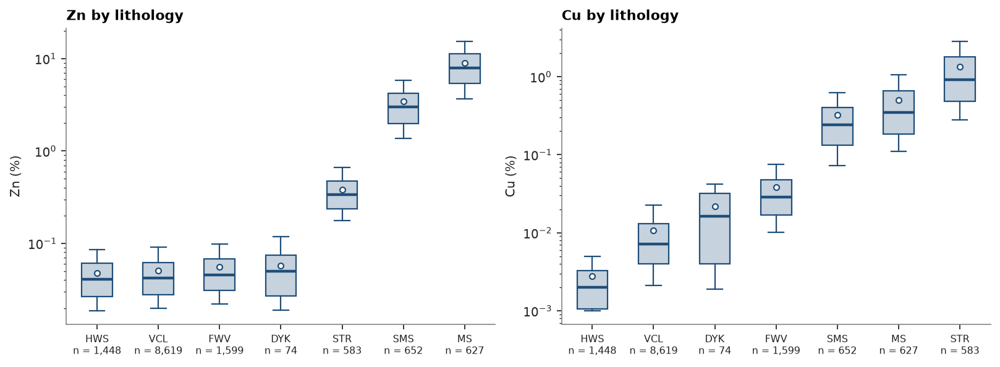
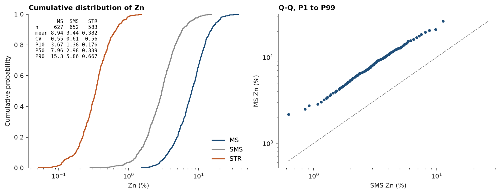

# Statistics by domain

Three stacked sulphide lenses, logged as massive (MS), semi-massive (SMS) and stringer (STR) sulphides in volcanic and
sedimentary host rocks. Are the lithologies different enough to be estimated apart? Statistics, box plots, cumulative
distributions and Q-Q plots per lithology on 2 m composites.

<details><summary>Python</summary>

```python
import ceres as cs
import matplotlib.pyplot as plt
import numpy as np
from common import save

data = cs.datasets.stacked_sulphide_lenses()
intervals = cs.merge_intervals(data["assays"], data["lithology"])
holes = cs.Drillholes(data["collars"], data["surveys"], intervals)
composites = holes.composite(2.0, ["ZN_PCT", "CU_PCT"], domain="LITH")
print(f"{len(composites)} composites")
```

</details>

```text
13602 composites
```

`describe_by` gives the count, moments and quantiles of a column per category, then over all values on the last
row. It skips missing grades; `weights=` takes declustering weights ([declustering](../../03-exploratory-analysis/03-declustering/README.md)).

<details><summary>Python</summary>

```python
stats = cs.describe_by("ZN_PCT", "LITH", quantiles=[0.1, 0.5, 0.9], data=composites)
print(f"{'LITH':<6}{'n':>7}{'mean':>8}{'CV':>6}{'P10':>8}{'P50':>8}{'P90':>8}{'max':>8}")
for row in zip(*(stats[c] for c in ["category", "n", "mean", "cv", "P10", "P50", "P90", "max"]), strict=True):
    print(f"{row[0]:<6}{row[1]:>7.0f}{row[2]:>8.2f}{row[3]:>6.2f}" + "".join(f"{v:>8.2f}" for v in row[4:]))
```

</details>

```text
LITH        n    mean    CV     P10     P50     P90     max
DYK        74    0.06  0.66    0.02    0.05    0.12    0.20
FWV      1599    0.06  0.68    0.02    0.05    0.10    0.49
HWS      1448    0.05  0.66    0.02    0.04    0.09    0.36
MS        627    8.94  0.55    3.67    7.96   15.25   37.06
SMS       652    3.44  0.61    1.38    2.98    5.86   15.36
STR       583    0.38  0.56    0.18    0.34    0.67    1.52
VCL      8619    0.05  0.67    0.02    0.04    0.09    0.35
all     13602    0.64  3.57    0.02    0.05    0.56   37.06
```

Mean Zn falls from 8.94 % in MS to 3.44 % in SMS and 0.38 % in STR; the host rocks and the dyke hold 0.05 to 0.06 %.
Each lithology has a CV between 0.55 and 0.68, all of them pooled 3.57: that spread comes from mixing populations,
not from the spread within one.

Box plots show the same quantiles side by side, sorted by median: the box spans P25 to P75, the whiskers P10 to P90,
the dot is the mean. Cu tells a different story from Zn: it is richest in the stringer zone below the lenses.

<details><summary>Python</summary>

```python
lith = composites["LITH"]
fig, axes = plt.subplots(1, 2, figsize=(10, 3.6), layout="constrained")
for ax, grade in zip(axes, ["ZN_PCT", "CU_PCT"], strict=True):
    cs.plot.boxplot(grade, lith, sort=True, log=True, data=composites, ax=ax)
    ax.set(title=f"{grade.split('_')[0].title()} by lithology", ylabel=f"{grade.split('_')[0].title()} (%)")
    ax.tick_params(axis="x", labelsize=7)
save(fig, "boxplot")
```

</details>



Cumulative distributions compare whole distributions; `stats=True` lists the count, mean, CV and deciles of each
curve in the corner. The Q-Q plot pairs the quantiles of two lithologies: points along the 1:1 line would mean the
same distribution. MS against SMS falls on a line parallel to it on log axes, a constant ratio: MS is SMS scaled up
about 2.7 times, the same shape at a different grade.

<details><summary>Python</summary>

```python
zn = composites["ZN_PCT"]
sulphides = ["MS", "SMS", "STR"]
fig, (a, b) = plt.subplots(1, 2, figsize=(10, 3.8), layout="constrained")
cs.plot.cdf([zn[lith == k] for k in sulphides], labels=sulphides, log=True, stats=True, ax=a)
a.set(title="Cumulative distribution of Zn", xlabel="Zn (%)")
cs.plot.qq(zn[lith == "SMS"], zn[lith == "MS"], log=True, ax=b)
b.set(title="Q-Q, P1 to P99", xlabel="SMS Zn (%)", ylabel="MS Zn (%)")
save(fig, "distributions")
ratio = np.percentile(zn[lith == "MS"], [10, 50, 90]) / np.percentile(zn[lith == "SMS"], [10, 50, 90])
print("MS over SMS at P10, P50, P90:", ", ".join(f"{r:.1f}" for r in ratio))
```

</details>

```text
MS over SMS at P10, P50, P90: 2.7, 2.7, 2.6
```



Full script: [`example_02.py`](example_02.py)
