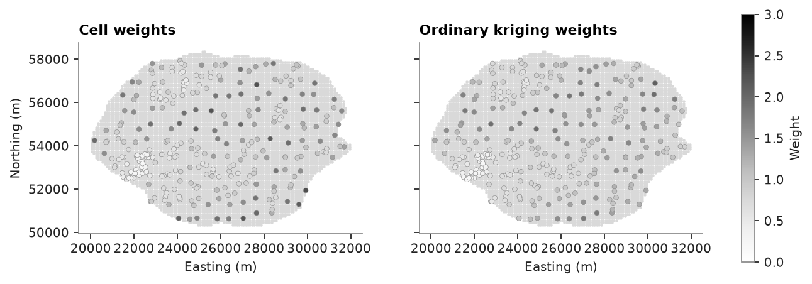
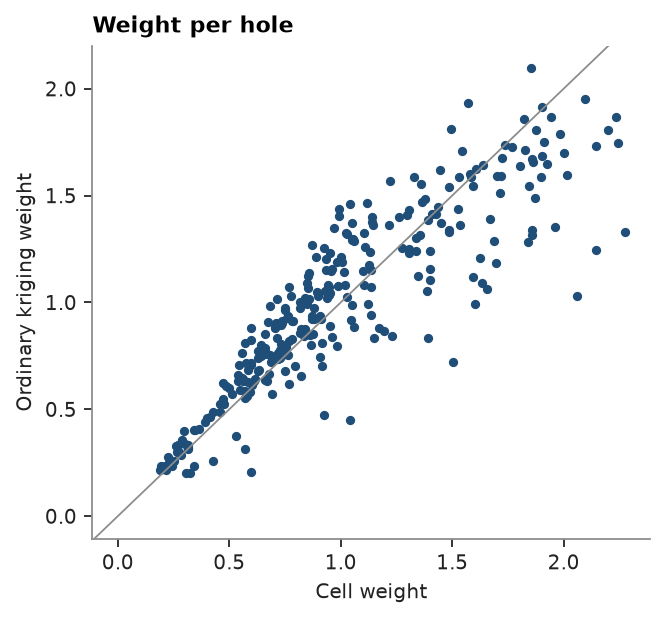
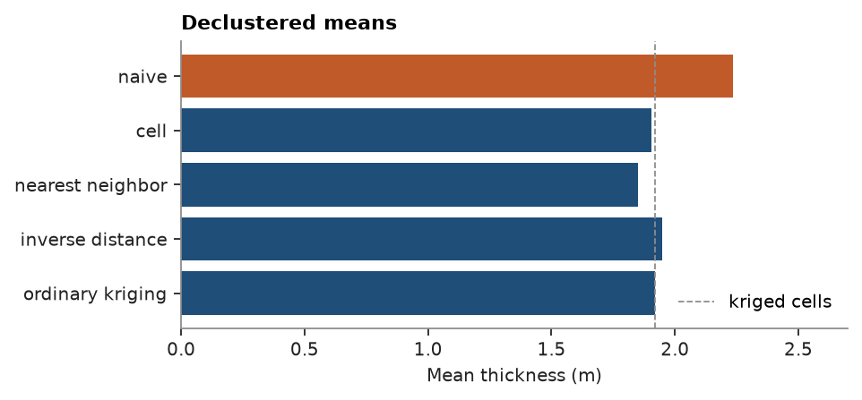

# weight declustering

declustering weights from estimation weights: each hole weighs what it contributes to estimating the whole lease,
compared here with cell declustering on a coal seam infilled where it is thick.

<details><summary>Python</summary>

```python
import boitata as bt
import matplotlib.pyplot as plt
import numpy as np
from common import ACCENT, GRAY, HIGHLIGHT, LIGHT, map_axes, save
```

</details>

a coal seam drilled on a loose grid, then infilled where the seam is thick. the naive mean of the boreholes leans
toward the infill. the targets are the 100 m cells inside the lease.

<details><summary>Python</summary>

```python
lease = bt.datasets.coal_seam_thickness()
holes, grid = lease["boreholes"], lease["grid"]
thickness = holes["THICKNESS_M"]
xy = holes.coords[:, :2]
cells = grid.coords[grid["INSIDE"] == 1]
print(f"{len(holes)} holes, {len(cells)} cells, naive mean {thickness.mean():.2f} m")
```

</details>

```text
295 holes, 7162 cells, naive mean 2.23 m
```

## cell declustering

the reference, as in [declustering](../../03-exploratory-analysis/03-declustering/README.md): scan cell sizes and keep
the one with the lowest declustered mean, since the infill targets thick seam.

<details><summary>Python</summary>

```python
cell = bt.cell_declustering(holes, "THICKNESS_M")
print(f"cell {cell.cell_size:.0f} m: mean {cell.mean:.2f} m")
```

</details>

```text
cell 768 m: mean 1.91 m
```

## weights from estimation

`weight_declustering` estimates every cell and adds up the weight each hole receives. a hole alone in a sparse area
informs many cells, while holes in the infill share the cells around them. the weights sum to the number of holes, as
in `cell_declustering`. inverse distance needs only a search; kriging also needs a variogram, fitted here on the
holes.

<details><summary>Python</summary>

```python
experimental = bt.experimental_variogram(holes, "THICKNESS_M", 300.0, 4000.0)
model = experimental.fit("spherical")
search = bt.Search(radius=5000, max_samples=16)
methods = {
    "nearest neighbor": bt.NearestNeighbor(search),
    "inverse distance": bt.InverseDistance(search, power=2),
    "ordinary kriging": bt.OrdinaryKriging(model, search),
}
weights = {
    name: bt.weight_declustering(holes, "THICKNESS_M", cells, estimator=m) for name, m in methods.items()
}
for name, w in weights.items():
    print(f"{name}: mean {w.mean:.2f} m, weights {w.weights.min():.2f} to {w.weights.max():.2f}")
```

</details>

```text
nearest neighbor: mean 1.85 m, weights 0.00 to 3.13
inverse distance: mean 1.95 m, weights 0.16 to 1.89
ordinary kriging: mean 1.92 m, weights 0.20 to 2.10
```

nearest neighbor gives each hole the cells closest to it: polygon declustering at the resolution of the grid. inverse
distance and kriging spread each cell over several holes and even out the weights. kriging also lets a hole screen
those behind it, so its weights follow the spacing more closely.

<details><summary>Python</summary>

```python
fig, axes = plt.subplots(1, 2, figsize=(10, 4), sharey=True)
for ax, (title, w) in zip(
    axes, [("Cell", cell.weights), ("Ordinary kriging", weights["ordinary kriging"].weights)]
):
    ax.scatter(cells[:, 0], cells[:, 1], s=1, color=LIGHT)
    points = ax.scatter(
        xy[:, 0], xy[:, 1], c=w, s=12, cmap="Greys", vmin=0, vmax=3, edgecolors=GRAY, linewidths=0.3
    )
    map_axes(ax, f"{title} weights")
axes[1].set_ylabel("")
fig.colorbar(points, ax=axes, label="Weight", shrink=0.8)
save(fig, "weights")
```

</details>



the two agree on which holes matter. cell weights are flat within a cell, and kriging weights vary smoothly with the
spacing.

<details><summary>Python</summary>

```python
fig, ax = plt.subplots(figsize=(4.5, 4))
ax.scatter(cell.weights, weights["ordinary kriging"].weights, s=10, color=ACCENT)
ax.axline((0, 0), slope=1, color=GRAY, lw=0.8)
ax.set_xlabel("Cell weight")
ax.set_ylabel("Ordinary kriging weight")
ax.set_title("Weight per hole")
save(fig, "compare")
```

</details>



## declustered means

all the declustered means sit well below the naive one. the ordinary kriging weights of each cell sum to 1, so their
declustered mean equals the mean of the kriged cells (the dashed line).

<details><summary>Python</summary>

```python
kriged = methods["ordinary kriging"].fit(holes, "THICKNESS_M").predict(cells)
means = {"naive": thickness.mean(), "cell": cell.mean} | {name: w.mean for name, w in weights.items()}
fig, ax = plt.subplots(figsize=(6, 2.6))
ax.barh(list(means), list(means.values()), color=[HIGHLIGHT] + [ACCENT] * (len(means) - 1))
ax.axvline(np.nanmean(kriged), color=GRAY, ls="--", lw=0.8, label="kriged cells")
ax.invert_yaxis()
ax.set_xlim(0, 2.7)
ax.set_xlabel("Mean thickness (m)")
ax.set_title("Declustered means")
ax.legend(loc="lower right")
save(fig, "means")
```

</details>



Full script: [`example_03_04.py`](example_03_04.py)
