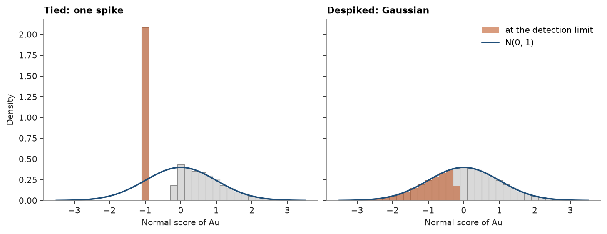
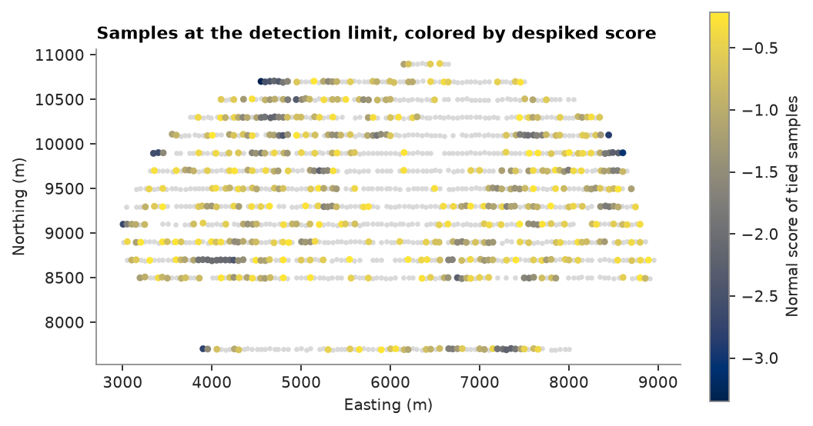

# despiking

soil gold assays below the detection limit are all reported at 2 ppb, so four in ten samples share one value. a
[normal-score transform](../../04-transforms/01-normal-score/README.md) cannot split that spike, since the tied
samples all get the same score. `bt.despike` breaks the ties by ranking each tied sample on the average rank of its
neighbors within growing radii, with a seeded random draw as the last resort. values move by tiny offsets, so every
untied sample keeps its rank.

<details><summary>Python</summary>

```python
import boitata as bt
import matplotlib.pyplot as plt
import numpy as np
from common import ACCENT, GRAY, HIGHLIGHT, LIGHT, map_axes, save

samples = bt.datasets.soil_geochemistry_survey()["samples"]
au = samples["AU_PPB"]
limit = au.min()
tied = au == limit
print(f"{tied.sum()} of {len(au)} samples at the detection limit ({limit:g} ppb)")

untied = bt.despike(samples, "AU_PPB", seed=0)
print(f"distinct values: {len(np.unique(au))} before, {len(np.unique(untied))} after")
print(f"largest change: {np.abs(untied - au).max():.1e} ppb")

ns = bt.NormalScore().fit(au)
spiked = ns.transform(au)
scores = bt.NormalScore().fit_transform(untied)
```

</details>

```text
511 of 1227 samples at the detection limit (2 ppb)
distinct values: 174 before, 1227 after
largest change: 6.5e-05 ppb
```

without despiking, every sample at the limit takes the mean score of the tie. after despiking, the tied samples spread
over the lower tail in the order of their neighborhoods:

<details><summary>Python</summary>

```python
z = np.linspace(-3.5, 3.5, 400)
bins = np.linspace(-3.5, 3.5, 36)
density = np.exp(-(z**2) / 2) / np.sqrt(2 * np.pi)
fig, axes = plt.subplots(1, 2, figsize=(9, 3.4), sharey=True, layout="constrained")
for ax, y, title in ((axes[0], spiked, "Tied: one spike"), (axes[1], scores, "Despiked: Gaussian")):
    ax.hist(y, bins, density=True, color=LIGHT, edgecolor=GRAY, lw=0.5)
    ax.hist(
        y[tied],
        bins,
        density=False,
        weights=np.full(tied.sum(), 1 / len(y) / np.diff(bins)[0]),
        color=HIGHLIGHT,
        alpha=0.6,
        label="at the detection limit",
    )
    ax.plot(z, density, color=ACCENT, lw=1.6, label="N(0, 1)")
    ax.set(title=title, xlabel="Normal score of Au")
axes[0].set_ylabel("Density")
axes[1].legend()
save(fig, "histograms")
```

</details>



the ranking follows the neighborhoods: samples at the limit near high gold get the higher scores of the tie.

<details><summary>Python</summary>

```python
xyz = samples.coords
fig, ax = plt.subplots(figsize=(6.5, 4.6), layout="constrained")
ax.scatter(*xyz[~tied, :2].T, s=4, color=LIGHT)
points = ax.scatter(*xyz[tied, :2].T, c=scores[tied], s=9, cmap="cividis")
fig.colorbar(points, ax=ax, label="Normal score of tied samples", shrink=0.7)
map_axes(ax, "Samples at the detection limit, colored by despiked score")
save(fig, "map")
```

</details>



`bt.despike(samples, ["AU_PPB", "AS_PPM"])` despikes several variables together, such as gold and arsenic, and orders
samples tied in both the same way in each.

Full script: [`example_03_06.py`](example_03_06.py)
