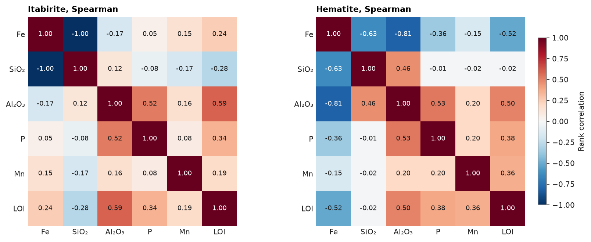
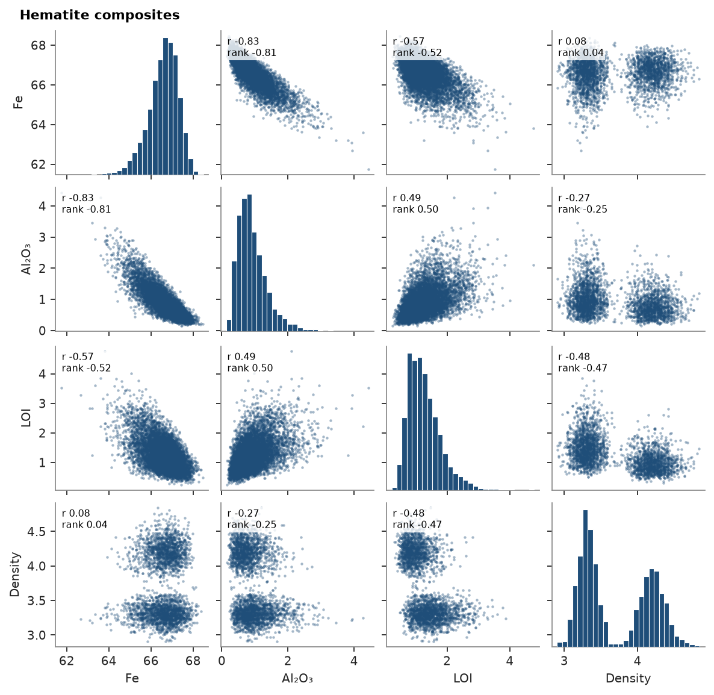
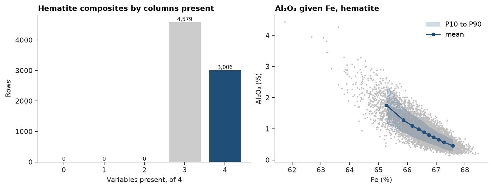
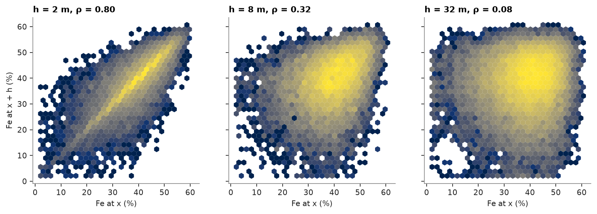

# Correlations

An iron formation drilled by 187 diamond holes: hematite ore, compact (HC) and friable (HF), in itabirite, compact (IC)
and friable (IF), with canga (CG), laterite (LAT) and mafic intrusions (MAF). Every composite carries six oxides that
share one whole, so they cannot vary independently: the correlations between them, and how they fade with distance,
decide whether to estimate them together.

<details><summary>Python</summary>

```python
import ceres as cs
import matplotlib.pyplot as plt
import numpy as np
from common import save

data = cs.datasets.iron_formation_plateau()
intervals = cs.merge_intervals(data["assays"], data["lithology"])
holes = cs.Drillholes(data["collars"], data["surveys"], intervals)
OXIDES = ["FE_PCT", "SIO2_PCT", "AL2O3_PCT", "P_PCT", "MN_PCT", "LOI_PCT"]
composites = holes.composite(2.0, [*OXIDES, "DENSITY"], domain="LITH")
lith = composites["LITH"]
hematite = composites.filter(np.isin(lith, ["HC", "HF"]))
itabirite = composites.filter(np.isin(lith, ["IC", "IF"]))
print(f"{len(composites)} composites of 2 m: {len(hematite)} hematite, {len(itabirite)} itabirite")
```

</details>

```text
24875 composites of 2 m: 7585 hematite, 13403 itabirite
```

## Correlation matrices

`correlation` returns the Pearson or rank (Spearman) correlation matrix of some columns, each pair over the rows
where both are present, optionally weighted; `plot.correlation` draws it with every cell written out. The rank
correlation is the safer one on skewed grades.

<details><summary>Python</summary>

```python
labels = ["Fe", "SiO₂", "Al₂O₃", "P", "Mn", "LOI"]
fig, axes = plt.subplots(1, 2, figsize=(10, 4), layout="constrained")
for ax, rock, name in zip(axes, [itabirite, hematite], ["Itabirite", "Hematite"], strict=True):
    r = cs.correlation(rock, columns=OXIDES, method="spearman")
    print(
        f"{name}, Fe against", "  ".join(f"{c} {v:+.2f}" for c, v in zip(labels[1:], r[0, 1:], strict=True))
    )
    cs.plot.correlation(rock, columns=OXIDES, labels=labels, method="spearman", colorbar=ax is axes[1], ax=ax)
    ax.set_title(f"{name}, Spearman")
save(fig, "correlation")
```

</details>

```text
Itabirite, Fe against SiO₂ -1.00  Al₂O₃ -0.17  P +0.05  Mn +0.15  LOI +0.24
Hematite, Fe against SiO₂ -0.63  Al₂O₃ -0.81  P -0.36  Mn -0.15  LOI -0.52
```



In itabirite, a banded rock of hematite and quartz, Fe and SiO₂ are opposed at -1.00: one oxide replaces the other,
and SiO₂ tells nothing that Fe does not. In the hematite ore the silica is mostly gone, and Fe falls instead with
Al₂O₃ (-0.81) and LOI (-0.52), the clay and goethite that dilute it. The same six oxides relate differently in each
rock, one more reason to estimate the two apart.

## Scatter-plot matrix

`plot.scatter_matrix` shows the pairs behind the numbers: scatters off the diagonal, histograms on it, and in each
panel the Pearson (r) and rank correlation of the pair. `columns=` picks and orders the columns. Density is measured
on only part of the composites, and each panel uses those where both of its values are present.

<details><summary>Python</summary>

```python
columns = ["FE_PCT", "AL2O3_PCT", "LOI_PCT", "DENSITY"]
print(f"density measured on {np.mean(~np.isnan(hematite['DENSITY'])):.0%} of the hematite composites")
fig, axes = cs.plot.scatter_matrix(hematite, columns=columns, labels=["Fe", "Al₂O₃", "LOI", "Density"])
fig.suptitle("Hematite composites", x=0.02, ha="left", fontweight="bold", fontsize=10)
save(fig, "scatter_matrix")
```

</details>

```text
density measured on 40% of the hematite composites
```



Density splits into two groups that Fe does not separate: friable and compact hematite, alike in grade but not in
density. Density follows the rock type, not the grade, and a regression of density on Fe would miss it.

`plot.completeness` counts the composites by how many of the columns they hold, the complete ones in color, and
`plot.conditional` draws the mean of one column and its P10 to P90 in bins of the other, each holding a tenth of
the composites: the relation a dense scatter hides. Al₂O₃ falls steadily as Fe rises, and its spread narrows in the
richest ore.

<details><summary>Python</summary>

```python
fig, (a, b) = plt.subplots(1, 2, figsize=(9, 3.4), layout="constrained")
cs.plot.completeness(hematite, columns=columns, ax=a)
a.set_title("Hematite composites by columns present")
cs.plot.conditional("FE_PCT", "AL2O3_PCT", data=hematite, ax=b)
b.set(title="Al₂O₃ given Fe, hematite", xlabel="Fe (%)", ylabel="Al₂O₃ (%)")
b.legend(loc="upper right")
save(fig, "completeness")
```

</details>



## h-scatterplots

The correlation of a grade with itself, a lag apart: `h_scatter` pairs the composites separated by `lag` within
`tolerance`, in any direction unless an `azimuth` is given, and returns the values at both ends with their
correlation. As the lag grows the cloud widens and the correlation drops, the mirror image of the variogram rising.

<details><summary>Python</summary>

```python
fig, axes = plt.subplots(1, 3, figsize=(10, 3.4), layout="constrained", sharey=True)
for ax, lag in zip(axes, [2.0, 8.0, 32.0], strict=True):
    head, tail, r = cs.h_scatter(itabirite, "FE_PCT", lag, 0.1 * lag)
    print(f"h = {lag:>3.0f} m: {len(head):>6} pairs, correlation {r:.2f}")
    ax.hexbin(tail, head, gridsize=30, bins="log", linewidths=0)
    ax.set(title=f"h = {lag:g} m, ρ = {r:.2f}", xlabel="Fe at x (%)", aspect="equal")
axes[0].set_ylabel("Fe at x + h (%)")
save(fig, "h_scatter")
```

</details>

```text
h =   2 m:  18924 pairs, correlation 0.80
h =   8 m:  21880 pairs, correlation 0.32
h =  32 m:  66886 pairs, correlation 0.08
```



Fe in itabirite correlates at 0.80 between neighboring composites, 0.32 at 8 m and 0.08 at 32 m: the bands that make
the grade are thin, and beyond a few tens of meters a composite says little about its neighbor's Fe. The variogram
([experimental variograms](../../05-spatial-continuity/01-experimental-variograms/README.md)) measures the same loss of correlation lag by lag.

Full script: [`example_11.py`](example_11.py)
