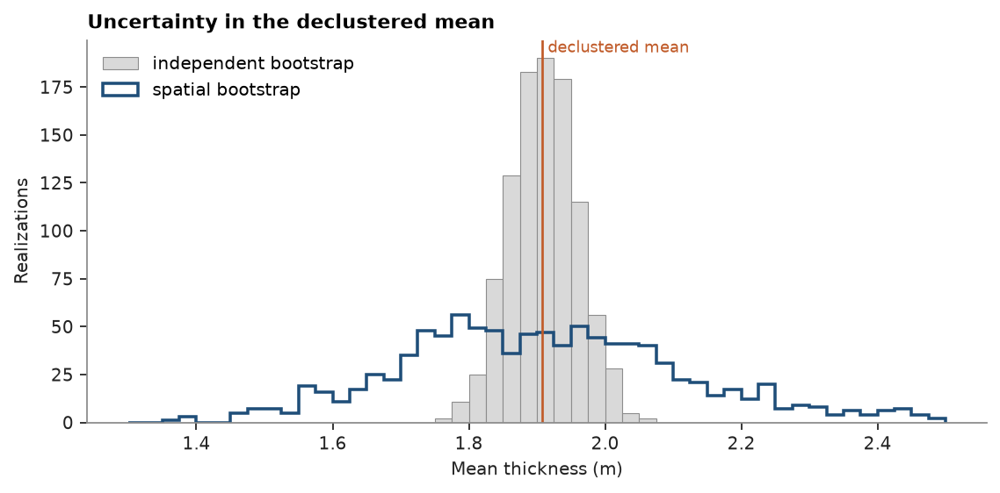
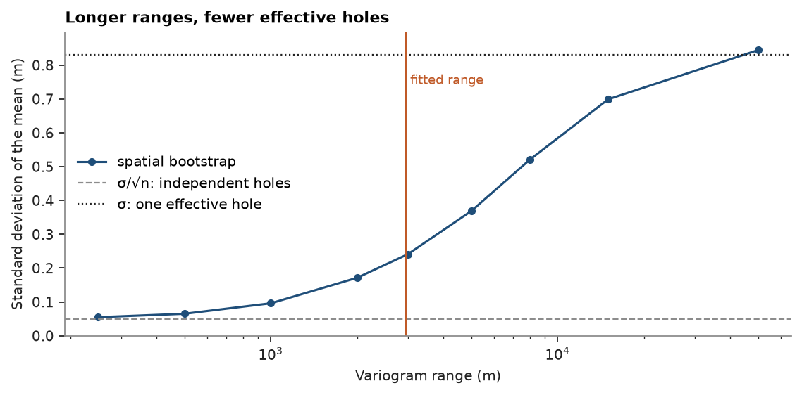

# Spatial bootstrap

A declustered mean is one number from a few hundred holes. How far off could it be? The classical bootstrap
resamples the holes independently and answers σ/√n, but neighboring holes carry much the same information, so the
true uncertainty is larger. `cs.spatial_bootstrap` resamples with the spatial correlation: each realization draws
unconditional Gaussian values at the holes with the normal-score variogram, turns them into ranks, and reads the ranks
through the declustered distribution of the data. Nearby holes then get similar draws and the resampled mean spreads
as far as the correlation allows.

<details><summary>Python</summary>

```python
import ceres as cs
import matplotlib.pyplot as plt
import numpy as np
from common import ACCENT, GRAY, HIGHLIGHT, INK, LIGHT, save

data = cs.datasets.coal_seam_thickness()
holes, grid = data["boreholes"], data["grid"]
thickness = holes["THICKNESS_M"]
xy = holes.coords[:, :2]
weights = cs.cell_declustering(holes, "THICKNESS_M", sizes=np.arange(100.0, 3100.0, 100.0)).weights
mean = np.average(thickness, weights=weights)
sd = np.sqrt(np.average((thickness - mean) ** 2, weights=weights))
print(f"{len(holes)} holes, declustered mean {mean:.2f} m, standard deviation {sd:.2f} m")
```

</details>

```text
295 holes, declustered mean 1.91 m, standard deviation 0.83 m
```

The variogram that drives the resampling is the one of the normal scores. Thicknesses are logged to the centimeter
and many repeat, so `cs.despike` breaks the ties first; the fitted variogram is then rescaled to a unit sill.

<details><summary>Python</summary>

```python
untied = cs.despike(holes, "THICKNESS_M", seed=0)
scores = cs.NormalScore().fit_transform(untied, weights=weights)
fitted = cs.Variogram.fit(cs.experimental_variogram(xy, scores, 250.0, 6000.0), "spherical")
structure = fitted.structures[0]
variogram = cs.Variogram(
    [("spherical", structure.sill / fitted.sill, structure.range)], nugget=fitted.nugget / fitted.sill
)
print(variogram)

nugget = cs.Variogram([], nugget=1.0)
independent = cs.spatial_bootstrap(holes, "THICKNESS_M", nugget, weights=weights, n=1000)
spatial = cs.spatial_bootstrap(holes, "THICKNESS_M", variogram, weights=weights, n=1000)
for name, table in (("independent", independent), ("spatial", spatial)):
    print(f"{name:>11}: standard deviation of the mean {np.std(table['mean']):.3f} m")
print(f"        σ/√n: {sd / np.sqrt(len(holes)):.3f} m")
```

</details>

```text
Variogram(nugget=0.1952192065899283, structures=[Structure("spherical", sill=0.8047807934100717, range=2960.08750426967)], rotation=(0.0, 0.0, 0.0), ratios=(1.0, 1.0))
independent: standard deviation of the mean 0.048 m
    spatial: standard deviation of the mean 0.206 m
        σ/√n: 0.048 m
```

A pure-nugget variogram makes every draw independent, which is the classical bootstrap: its spread matches σ/√n.
With the fitted variogram, whose range is about 3 km over an 11 × 7 km lease, the spread is four times wider:

<details><summary>Python</summary>

```python
bins = np.linspace(1.3, 2.5, 49)
fig, ax = plt.subplots(figsize=(7, 3.4), layout="constrained")
ax.hist(independent["mean"], bins, color=LIGHT, edgecolor=GRAY, lw=0.5, label="independent bootstrap")
ax.hist(spatial["mean"], bins, histtype="step", color=ACCENT, lw=1.6, label="spatial bootstrap")
ax.axvline(mean, color=HIGHLIGHT, lw=1.2)
ax.text(mean, ax.get_ylim()[1], " declustered mean", color=HIGHLIGHT, va="top", fontsize=8)
ax.set(xlabel="Mean thickness (m)", ylabel="Realizations", title="Uncertainty in the declustered mean")
ax.legend(loc="upper left")
save(fig, "means")
```

</details>



## Range and effective number of holes

The spread grows with the range. Written as an effective number of independent holes, (σ / spread)², the 295
holes count as about a dozen at the fitted range of 3 km, and as one once the range spans the whole lease.

<details><summary>Python</summary>

```python
ranges = np.array([250.0, 500.0, 1000.0, 2000.0, 3000.0, 5000.0, 8000.0, 15000.0, 50000.0])
spreads = np.array(
    [
        np.std(
            cs.spatial_bootstrap(
                holes, "THICKNESS_M", cs.Variogram([("spherical", 1.0, r)]), weights=weights, n=400
            )["mean"]
        )
        for r in ranges
    ]
)
for r, s in zip(ranges, spreads):
    print(f"range {r:>7.0f} m: spread {s:.3f} m, effective holes {(sd / s) ** 2:.0f}")

fig, ax = plt.subplots(figsize=(7, 3.4), layout="constrained")
ax.semilogx(ranges, spreads, "o-", color=ACCENT, lw=1.4, ms=4, label="spatial bootstrap")
ax.axhline(sd / np.sqrt(len(holes)), color=GRAY, ls="--", lw=1, label="σ/√n: independent holes")
ax.axhline(sd, color=INK, ls=":", lw=1, label="σ: one effective hole")
ax.axvline(structure.range, color=HIGHLIGHT, lw=1)
ax.text(structure.range, sd * 0.93, " fitted range", color=HIGHLIGHT, va="top", fontsize=8)
ax.set(
    xlabel="Variogram range (m)",
    ylabel="Standard deviation of the mean (m)",
    title="Longer ranges, fewer effective holes",
    ylim=(0, sd * 1.08),
)
ax.legend(loc="center left")
save(fig, "ranges")
```

</details>

```text
range     250 m: spread 0.055 m, effective holes 228
range     500 m: spread 0.065 m, effective holes 163
range    1000 m: spread 0.096 m, effective holes 75
range    2000 m: spread 0.172 m, effective holes 23
range    3000 m: spread 0.241 m, effective holes 12
range    5000 m: spread 0.369 m, effective holes 5
range    8000 m: spread 0.521 m, effective holes 3
range   15000 m: spread 0.699 m, effective holes 1
range   50000 m: spread 0.844 m, effective holes 1
```



## Tonnage uncertainty

The lease covers the cells flagged `INSIDE`; at 1.4 t/m³ each realization of the mean thickness gives a tonnage.
The table also returns quantiles and proportions above cutoffs per realization, here the share of the seam thicker
than 2 m, the minimum mining height.

<details><summary>Python</summary>

```python
area = np.sum(grid["INSIDE"] == 1) * 100.0 * 100.0
density = 1.4
for name, v in (("independent", nugget), ("spatial", variogram)):
    table = cs.spatial_bootstrap(holes, "THICKNESS_M", v, weights=weights, n=1000, cutoffs=[2.0])
    tonnes = np.asarray(table["mean"]) * area * density / 1e6
    p10, p50, p90 = np.quantile(tonnes, [0.1, 0.5, 0.9])
    above = np.quantile(table["above 2"], [0.1, 0.9])
    print(
        f"{name:>11}: P10 {p10:.0f} Mt, P50 {p50:.0f} Mt, P90 {p90:.0f} Mt;"
        f" thicker than 2 m {above[0]:.0%} to {above[1]:.0%}"
    )
```

</details>

```text
independent: P10 185 Mt, P50 191 Mt, P90 198 Mt; thicker than 2 m 34% to 41%
    spatial: P10 167 Mt, P50 190 Mt, P90 219 Mt; thicker than 2 m 25% to 50%
```

Independent resampling promises the tonnage within a few percent; with the spatial correlation the P10–P90 range
is four times wider. That is the uncertainty in the global mean from the holes alone, before any estimate or
simulation: a lower bound on what a resource can claim, and a guide to whether more holes pay.

Full script: [`example_12.py`](example_12.py)
