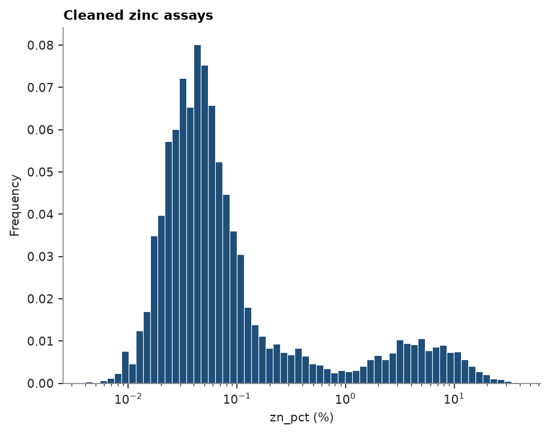

# cleaning steps

assay tables arrive with upper-case names, sentinels such as -99 and "NS" (not sampled), detection-limit text such as
"<0.01" and grades stored as text. each cleaning step fixes one of these and returns a new container, and a `Pipeline`
chains them so the same cleaning runs on the next batch of assays. here the raw assays of the stacked sulphide lenses
go from text to numeric grades ready for statistics.

<details><summary>Python</summary>

```python
import boitata as bt
import numpy as np
from common import ACCENT, save

raw = bt.datasets.stacked_sulphide_lenses(raw=True)["assays"]
print(raw.column_names)
print({c: sorted({s for s in raw[c] if s is not None and not s[0].isdigit()}) for c in raw.column_names[3:8]})
```

</details>

```text
['HOLE_ID', 'FROM', 'TO', 'ZN_PCT', 'PB_PCT', 'CU_PCT', 'AG_GPT', 'AU_GPT', 'DENSITY']
{'ZN_PCT': ['-999', 'NS'], 'PB_PCT': ['-99', 'NS'], 'CU_PCT': ['-999', '<0.01', 'NS'], 'AG_GPT': ['-99', 'NS'], 'AU_GPT': ['-999', '<0.01', 'NS']}
```

`RenameColumns` snake-cases the names. `ToNull` turns the sentinels into nulls; the grades are text, so the text forms
of -99 and -999 count too. `Replace` sets grades below detection to half the 0.01 limit, then `ToNumber` parses the
grade columns and raises if any text is left. `DropNull` keeps the intervals with a zinc assay.

<details><summary>Python</summary>

```python
grades = ["zn_pct", "pb_pct", "cu_pct", "ag_gpt", "au_gpt"]
clean = bt.Pipeline(
    [
        ("names", bt.RenameColumns(case="snake")),
        ("sentinels", bt.ToNull(["NS", "-99", "-999", -99, -999])),
        ("detection", bt.Replace({"<0.01": "0.005"}, columns=grades)),
        ("numbers", bt.ToNumber(grades)),
        ("zinc", bt.DropNull(columns="zn_pct")),
    ]
)
assays = clean.fit_transform(raw)
print(f"{len(raw)} intervals in, {len(assays)} with zinc")
for g in grades:
    v = assays[g]
    print(f"{g:7} {np.isnan(v).sum():5} null, mean {np.nanmean(v):.3f}")
```

</details>

```text
16907 intervals in, 16905 with zinc
zn_pct      0 null, mean 0.902
pb_pct      1 null, mean 0.343
cu_pct      1 null, mean 0.152
ag_gpt      1 null, mean 8.184
au_gpt   4386 null, mean 0.221
```

units live in the column metadata and survive Parquet. `convert_units` rescales a column and relabels its unit; here
gold goes from g/t to ppb. plots label their axes with the unit.

<details><summary>Python</summary>

```python
assays = assays.with_units({"zn_pct": "%", "pb_pct": "%", "cu_pct": "%", "ag_gpt": "g/t", "au_gpt": "g/t"})
assays = assays.convert_units("au_gpt", to="ppb")
print(assays.units)
print(f"mean gold {np.nanmean(assays['au_gpt']):.0f} ppb")
```

</details>

```text
{'zn_pct': '%', 'pb_pct': '%', 'cu_pct': '%', 'ag_gpt': 'g/t', 'au_gpt': 'ppb'}
mean gold 221 ppb
```

the zinc grades span three orders of magnitude; on a log axis their two populations separate.

<details><summary>Python</summary>

```python
fig, ax = bt.plot.histogram("zn_pct", data=assays, log=True, bins=60, color=ACCENT)
ax.set_title("Cleaned zinc assays")
save(fig, "zinc")
```

</details>



`clean.to_json()` saves the chain; `bt.Pipeline.from_json` reloads it for the next batch, and a batch missing a column
a step reads raises `MissingColumn` naming that step.

Full script: [`example_03_14.py`](example_03_14.py)
