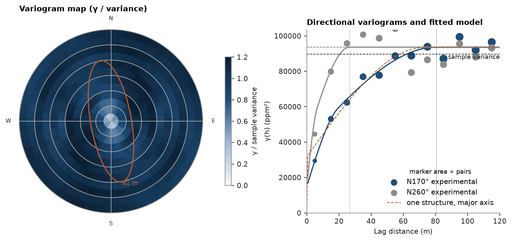

# 3. Variography

Anisotropic spherical model of `V`: the variogram map finds the direction of greatest continuity, then directional
experimental variograms along and across it are fitted.

<details><summary>Python</summary>

```python
import ceres as cs
import matplotlib.pyplot as plt
import numpy as np
from common import ACCENT, GREY, HIGHLIGHT, INK, save

samples = cs.datasets.walker_lake()
xy, v = samples.coords, samples["V"]
lag, max_lag = 10.0, 120.0
```

</details>

The variogram map gives γ in every horizontal direction; the direction whose fitted range is longest is the major axis.

<details><summary>Python</summary>

```python
vmap = cs.variogram_map(xy, v, lag, max_lag)
angle = vmap.angles[np.nanargmax(vmap.ranges)]
azimuth = (90 - np.degrees(angle)) % 180
```

</details>

Fit a spherical structure along and across the major axis. The major direction sets nugget, sill and major range;
the minor direction contributes only its range. `rotation` is azimuth, dip, rake in degrees; `ratios` are semi-major/major
and minor/major ranges. The model is saved for later chapters.

<details><summary>Python</summary>

```python
major = cs.experimental_variogram(xy, v, lag, max_lag, azimuth=azimuth)
minor = cs.experimental_variogram(xy, v, lag, max_lag, azimuth=azimuth + 90)
along, across = major.fit("spherical"), minor.fit("spherical")
a_major = along.structures[0].range
ratio = min(across.structures[0].range / a_major, 1.0)
model = cs.Variogram(
    [("spherical", along.structures[0].sill, a_major)],
    nugget=along.nugget,
    rotation=(azimuth, 0, 0),
    ratios=(ratio, 1.0),
)
(HERE / "model.json").write_text(model.to_json())
print(model)
```

</details>

```text
Variogram(nugget=32974.91362140061, structures=[Structure("spherical", sill=60404.48424557247, range=75.41661873855779)], rotation=(170.0, 0.0, 0.0), ratios=(0.3216494539612399, 1.0))
```

The ellipse on the map is the model range in each direction:

<details><summary>Python</summary>

```python
variance = v.var()
fig = plt.figure(figsize=(9.2, 4.2), layout="constrained")
a = fig.add_subplot(1, 2, 1, projection="polar")
gamma = np.where(vmap.counts >= 30, vmap.gammas, np.nan)
step = vmap.angles[1] - vmap.angles[0]
theta = np.r_[vmap.angles, vmap.angles + np.pi, 2 * np.pi] - step / 2
radius = np.r_[vmap.lags - lag / 2, vmap.lags[-1] + lag / 2]
mesh = a.pcolormesh(theta, radius, np.vstack([gamma, gamma]).T / variance, vmin=0, vmax=1.2, shading="flat")
t = np.linspace(0, 2 * np.pi, 361)
direction = np.radians(90 - azimuth)
a_minor = a_major * ratio
ellipse = a_major * a_minor / np.hypot(a_minor * np.cos(t - direction), a_major * np.sin(t - direction))
a.plot(t, ellipse, color=HIGHLIGHT, lw=1.4)
a.text(direction, a_major * 1.05, f"{a_major:.0f} m", color=HIGHLIGHT, fontsize=8)
a.set_rlim(0, radius[-1])
a.set_xticks(np.radians([0, 90, 180, 270]), ["E", "N", "W", "S"])
a.set_rlabel_position(200)
a.tick_params(labelsize=7)
a.set_title("Variogram map (γ / variance)")
fig.colorbar(mesh, ax=a, shrink=0.7, label="γ / sample variance")

b = fig.add_subplot(1, 2, 2)
h = np.linspace(0, max_lag, 200)
for exp, color, az, rng in ((major, ACCENT, azimuth, a_major), (minor, GREY, azimuth + 90, a_minor)):
    keep = exp.counts > 0
    b.scatter(
        exp.lags[keep],
        exp.gammas[keep],
        s=np.sqrt(exp.counts[keep]) * 2,
        color=color,
        label=f"N{az % 360:.0f}° experimental",
    )
    b.plot(
        h,
        model.nugget + model.structures[0].sill * cs.Variogram([("spherical", 1, rng)]).gamma(h),
        color=color,
    )
    b.axvline(rng, color=color, lw=0.8, ls=":")
b.axhline(variance, color=INK, lw=0.8, ls="--")
b.text(max_lag, variance, "sample variance", va="top", ha="right", color=INK, fontsize=8)
b.set_xlim(0, max_lag)
b.set_ylim(bottom=0)
b.set_title("Directional variograms and fitted model")
b.set_xlabel("Lag distance (m)")
b.set_ylabel("γ(h) (ppm²)")
b.legend(loc="lower right", title="marker area ∝ pairs", title_fontsize=8)
save(fig, "variogram")
```

</details>



Full script: [`example.py`](example.py)
