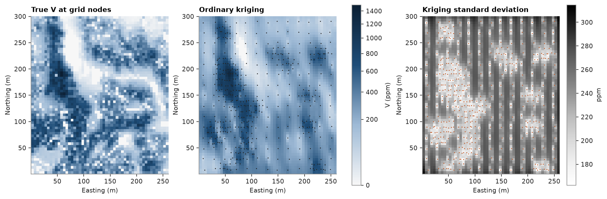
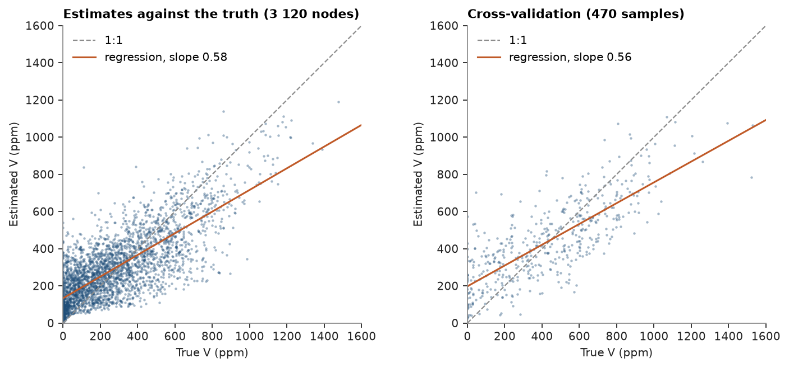

# 4. Ordinary kriging

Ordinary kriging of `V` on a 5 m grid with the model from [chapter 3](../03-variography/README.md), checked against
the exhaustive values and by cross-validation.

<details><summary>Python</summary>

```python
import ceres as cs
import matplotlib.pyplot as plt
import numpy as np
from common import ACCENT, HIGHLIGHT, INK, map_axes, save
from matplotlib.colors import PowerNorm

samples = cs.datasets.walker_lake()
truth = cs.datasets.walker_lake_exhaustive()["V"].reshape(300, 260)
model = cs.Variogram.from_json((HERE.parent / "03-variography" / "model.json").read_text())
```

</details>

Up to 24 samples within 100 m along the major axis. `predict` accepts a `BlockModel`, a `PointSet` or an array of
coordinates; `with_column` stores the results on the model.

<details><summary>Python</summary>

```python
grid = cs.BlockModel(origin=(0.5, 0.5), size=(5, 5), count=(52, 60))
search = cs.Search(radius=100, max_samples=24, min_samples=4)
ok = cs.OrdinaryKriging(model, search).fit(samples.coords, samples["V"])
estimate, variance = ok.predict(grid, return_variance=True)
grid = grid.with_column("estimate", estimate).with_column("variance", variance)
```

</details>

Compare with the true values at the grid nodes, and re-estimate every sample with itself left out:

<details><summary>Python</summary>

```python
nodes = grid.centroids.astype(int)
true_at_nodes = truth[nodes[:, 1] - 1, nodes[:, 0] - 1]
cv = ok.cross_validate()
print(grid)
print(f"grid: mean estimate {estimate.mean():.1f}, true {true_at_nodes.mean():.1f}")
print(f"variance of estimates {estimate.var():.0f} vs true {true_at_nodes.var():.0f}")
print(
    f"cross-validation: ME {cv.mean_error:.1f}  RMSE {cv.rmse:.1f}  r {cv.correlation:.2f}  "
    f"SSE {cv.standardized_squared_error:.2f}"
)
```

</details>

```text
BlockModel(regular, 3120 of 3120 cells, count [52, 60, 1], size [5.0, 5.0, 1.0], rotation [0.0, 0.0, 0.0])
  estimate: Float64
  variance: Float64
grid: mean estimate 294.3, true 276.2
variance of estimates 35595 vs true 62312
cross-validation: ME 5.6  RMSE 189.6  r 0.78  SSE 0.65
```

The kriging standard deviation depends only on the data layout and the model: low near samples, high in gaps.

<details><summary>Python</summary>

```python
shape = (60, 52)
extent = (0.5, 260.5, 0.5, 300.5)
norm = PowerNorm(0.5, vmin=0, vmax=1500)
fig, axes = plt.subplots(1, 3, figsize=(12, 4.6), layout="constrained")
for ax, image, title in (
    (axes[0], true_at_nodes, "True V at grid nodes"),
    (axes[1], estimate, "Ordinary kriging"),
):
    im = ax.imshow(image.reshape(shape), origin="lower", extent=extent, norm=norm)
    map_axes(ax, title)
axes[1].scatter(samples.coords[:, 0], samples.coords[:, 1], s=2, color=INK, linewidths=0)
fig.colorbar(im, ax=axes[:2], shrink=0.8, label="V (ppm)")
sd = axes[2].imshow(np.sqrt(variance).reshape(shape), origin="lower", extent=extent, cmap="Greys")
map_axes(axes[2], "Kriging standard deviation")
axes[2].scatter(samples.coords[:, 0], samples.coords[:, 1], s=2, color=HIGHLIGHT, linewidths=0)
fig.colorbar(sd, ax=axes[2], shrink=0.8, label="ppm")
save(fig, "maps")
```

</details>



Kriging is smooth: estimates vary less than the truth, so the regression of estimates on true values has a slope
below 1. A mean error² / variance of 0.65 means the model's variance is somewhat pessimistic here.

<details><summary>Python</summary>

```python
fig, (a, b) = plt.subplots(1, 2, figsize=(9, 4), layout="constrained")
for ax, x, y, title in (
    (a, true_at_nodes, estimate, "Estimates against the truth (3 120 nodes)"),
    (b, cv.actual, cv.estimate, "Cross-validation (470 samples)"),
):
    cs.plot.scatter(x, y, ax=ax, s=4, color=ACCENT, alpha=0.4)
    ax.set(xlim=(0, 1600), ylim=(0, 1600), xlabel="True V (ppm)", ylabel="Estimated V (ppm)")
    ax.set_aspect("equal")
    ax.set_title(title)
    ax.legend(loc="upper left")
save(fig, "validation")
```

</details>



[Chapter 12](../12-estimation-methods/README.md) compares other estimators and refines the search.

Full script: [`example_04.py`](example_04.py)
