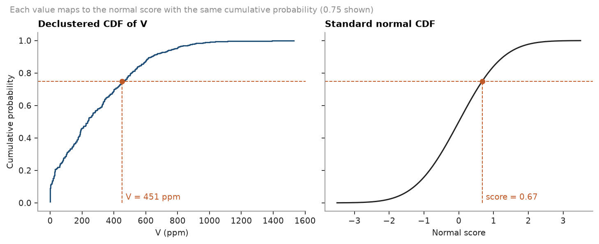
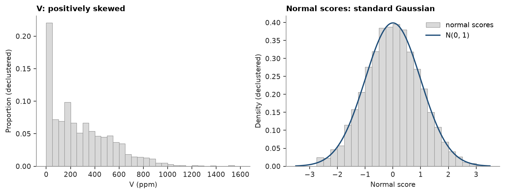
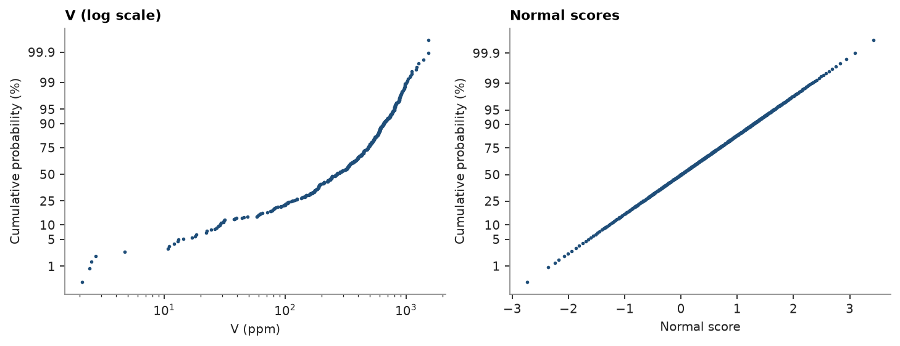

# normal-score transform

gaussian methods need a standard normal variable. the normal-score transform maps each value to the gaussian score
with the same cumulative probability, weighting samples by cell-declustering weights
([declustering](../../03-exploratory-analysis/03-declustering/README.md)).

<details><summary>Python</summary>

```python
import boitata as bt
import matplotlib.pyplot as plt
import numpy as np
from common import ACCENT, GRAY, HIGHLIGHT, INK, LIGHT, save

samples = bt.datasets.walker_lake()
v = samples["V"]
w = bt.cell_declustering(samples, "V", sizes=np.arange(2.5, 102.5, 2.5)).weights

ns = bt.NormalScore()
y = ns.fit_transform(v, weights=w)
mean = np.average(y, weights=w)
sd = np.sqrt(np.average((y - mean) ** 2, weights=w))
print(f"scores: weighted mean {mean:.3f}, sd {sd:.3f}")
print(f"back-transform max error {np.abs(ns.inverse_transform(y) - v).max():.1e}")
```

</details>

```text
scores: weighted mean 0.001, sd 0.998
back-transform max error 0.0e+00
```

each value takes the score with the same cumulative probability:

<details><summary>Python</summary>

```python
order = np.argsort(v)
cdf = np.cumsum(w[order]) / w.sum()
z = np.linspace(-3.5, 3.5, 400)
p = 0.75
vp, yp = v[order][np.searchsorted(cdf, p)], y[order][np.searchsorted(cdf, p)]

fig, (a, b) = plt.subplots(1, 2, figsize=(9, 3.6), sharey=True, layout="constrained")
a.step(v[order], cdf, where="post", color=ACCENT, lw=1.4)
a.set_title("Declustered CDF of V")
a.set_xlabel("V (ppm)")
a.set_ylabel("Cumulative probability")
b.plot(z, bt.normal_cdf(z), color=INK, lw=1.4)
b.set_title("Standard normal CDF")
b.set_xlabel("Normal score")
for ax, x in ((a, vp), (b, yp)):
    ax.axhline(p, color=HIGHLIGHT, lw=0.9, ls="--")
    ax.vlines(x, 0, p, color=HIGHLIGHT, lw=0.9, ls="--")
    ax.plot(x, p, "o", color=HIGHLIGHT, ms=5)
a.annotate(f"V = {vp:.0f} ppm", (vp, 0.02), xytext=(4, 0), textcoords="offset points", color=HIGHLIGHT)
b.annotate(f"score = {yp:.2f}", (yp, 0.02), xytext=(4, 0), textcoords="offset points", color=HIGHLIGHT)
fig.suptitle(
    f"Each value maps to the normal score with the same cumulative probability ({p:.2f} shown)",
    x=0.01,
    ha="left",
    fontsize=9,
    color=GRAY,
)
save(fig, "quantile-mapping")
```

</details>



the skewed histogram of `V` becomes a standard gaussian:

<details><summary>Python</summary>

```python
fig, (a, b) = plt.subplots(1, 2, figsize=(9, 3.4), layout="constrained")
a.hist(v, np.linspace(0, 1600, 33), weights=w / w.sum(), color=LIGHT, edgecolor=GRAY, lw=0.5)
a.set_title("V: positively skewed")
a.set_xlabel("V (ppm)")
a.set_ylabel("Proportion (declustered)")
bins = np.linspace(-3.5, 3.5, 29)
b.hist(
    y,
    bins,
    weights=w / w.sum() / np.diff(bins)[0],
    color=LIGHT,
    edgecolor=GRAY,
    lw=0.5,
    label="normal scores",
)
b.plot(z, np.exp(-(z**2) / 2) / np.sqrt(2 * np.pi), color=ACCENT, lw=1.6, label="N(0, 1)")
b.set_title("Normal scores: standard Gaussian")
b.set_xlabel("Normal score")
b.set_ylabel("Density (declustered)")
b.legend()
save(fig, "histograms")
```

</details>



on a probability scale a gaussian plots as a straight line. `bt.plot.probability` shows that V is not lognormal
either, while its scores are gaussian by construction:

<details><summary>Python</summary>

```python
fig, (a, b) = plt.subplots(1, 2, figsize=(9, 3.4), layout="constrained")
bt.plot.probability(v[v > 0], weights=w[v > 0], log=True, ax=a, color=ACCENT, ms=3)
a.set(title="V (log scale)", xlabel="V (ppm)")
bt.plot.probability(y, weights=w, ax=b, color=ACCENT, ms=3)
b.set(title="Normal scores", xlabel="Normal score")
save(fig, "probability")
```

</details>



the weighted scores have mean 0 and standard deviation 1, and the back-transform returns every sample exactly.

only the samples at 0 ppm tie. `fit_transform` scores each sample by its rank, so tied samples spread in file order;
`transform` maps the tied value to one score:

<details><summary>Python</summary>

```python
zero = v == 0
print(f"{zero.sum()} of {len(v)} samples at 0 ppm")
print(f"fit_transform: scores {y[zero].min():.2f} to {y[zero].max():.2f}")
print(f"transform: {np.unique(ns.transform(v[zero]))[0]:.2f} for all")
```

</details>

```text
22 of 470 samples at 0 ppm
fit_transform: scores -2.73 to -1.34
transform: -1.76 for all
```

neither order means anything. for a large spike, such as assays at a detection limit,
[despiking](../../03-exploratory-analysis/06-despiking/README.md) breaks the ties by the neighborhood of each sample
before the transform.

Full script: [`example_04_01.py`](example_04_01.py)
