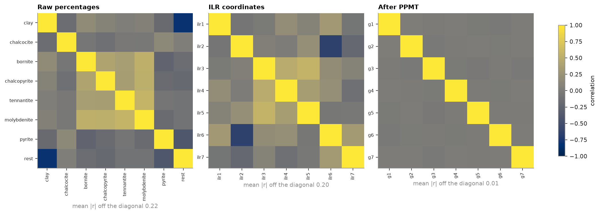
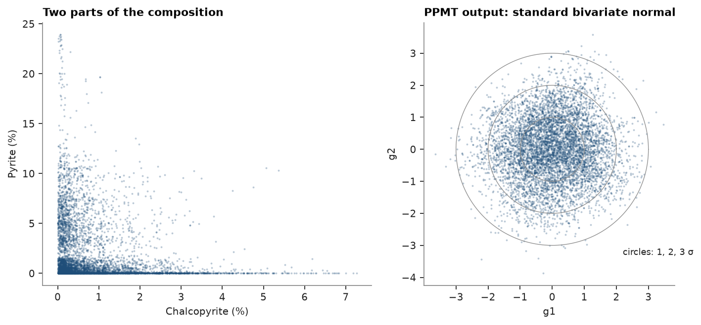

# Compositional data

Porphyry 1 geometallurgical samples: seven minerals in % plus the remainder, a composition summing to 100.
Raising one part lowers the others, so raw correlations mix geology with the constant-sum constraint, and
estimating parts independently can break the total.

<details><summary>Python</summary>

```python
import boitata as bt
import matplotlib.pyplot as plt
import numpy as np
from common import ACCENT, GRAY, INK, save

data = bt.datasets.porphyry_geometallurgy(deposit=1)["synthetic_drillholes"]
minerals = ["arcilla", "calcosina", "bornita", "calcopirita", "tenantita", "molibdenita", "pirita"]
names = ["clay", "chalcocite", "bornite", "chalcopyrite", "tennantite", "molybdenite", "pyrite", "rest"]
parts = np.column_stack([data[m] for m in minerals])
parts = np.column_stack([parts, 100 - parts.sum(axis=1)])

assert (parts > 0).all(), "log-ratios need positive parts"
composition = bt.closure(parts, total=100)
```

</details>

The isometric log-ratio (ILR) maps each composition to 7 unconstrained coordinates; the projection-pursuit
multivariate transform (PPMT) turns those into independent standard Gaussians, ready for independent simulation.
The way back must return every composition.

<details><summary>Python</summary>

```python
coords = bt.ilr(composition)
ppmt = bt.PPMT(iterations=40, seed=7)
gauss = ppmt.fit_transform(coords)
back = bt.ilr_inverse(ppmt.inverse_transform(gauss)) * 100
print(f"round trip max error {np.abs(back - composition).max():.2e} %")
```

</details>

```text
round trip max error 1.88e-12 %
```

Correlations at each stage:

<details><summary>Python</summary>

```python
cmap = "cividis"
fig, axes = plt.subplots(1, 3, figsize=(13, 4.4), layout="constrained")
panels = [
    (np.corrcoef(composition.T), names, "Raw percentages"),
    (np.corrcoef(coords.T), [f"ilr{i + 1}" for i in range(coords.shape[1])], "ILR coordinates"),
    (np.corrcoef(gauss.T), [f"g{i + 1}" for i in range(gauss.shape[1])], "After PPMT"),
]
for ax, (corr, labels, title) in zip(axes, panels):
    image = ax.imshow(corr, cmap=cmap, vmin=-1, vmax=1)
    ax.set_xticks(range(len(labels)), labels, rotation=90, fontsize=7)
    ax.set_yticks(range(len(labels)), labels, fontsize=7)
    ax.set_title(title)
    off = np.abs(corr[~np.eye(len(corr), dtype=bool)])
    ax.set_xlabel(f"mean |r| off the diagonal {off.mean():.2f}", color=GRAY)
fig.colorbar(image, ax=axes, shrink=0.8, label="correlation")
save(fig, "correlations")
```

</details>



Two parts before, two Gaussian coordinates after:

<details><summary>Python</summary>

```python
fig, (a, b) = plt.subplots(1, 2, figsize=(9, 4), layout="constrained")
a.scatter(composition[:, 3], composition[:, 6], s=3, color=ACCENT, alpha=0.3, linewidths=0)
a.set(xlabel="Chalcopyrite (%)", ylabel="Pyrite (%)", title="Two parts of the composition")
b.scatter(gauss[:, 0], gauss[:, 1], s=3, color=ACCENT, alpha=0.3, linewidths=0)
t = np.linspace(0, 2 * np.pi, 200)
for radius in (1, 2, 3):
    b.plot(radius * np.cos(t), radius * np.sin(t), color=GRAY, lw=0.6)
b.set_aspect("equal")
b.set(xlabel="g1", ylabel="g2", title="PPMT output: standard bivariate normal")
b.text(2.2, -3.3, "circles: 1, 2, 3 σ", color=INK, fontsize=8)
save(fig, "scatter")
```

</details>



Full script: [`example_04_04.py`](example_04_04.py)
