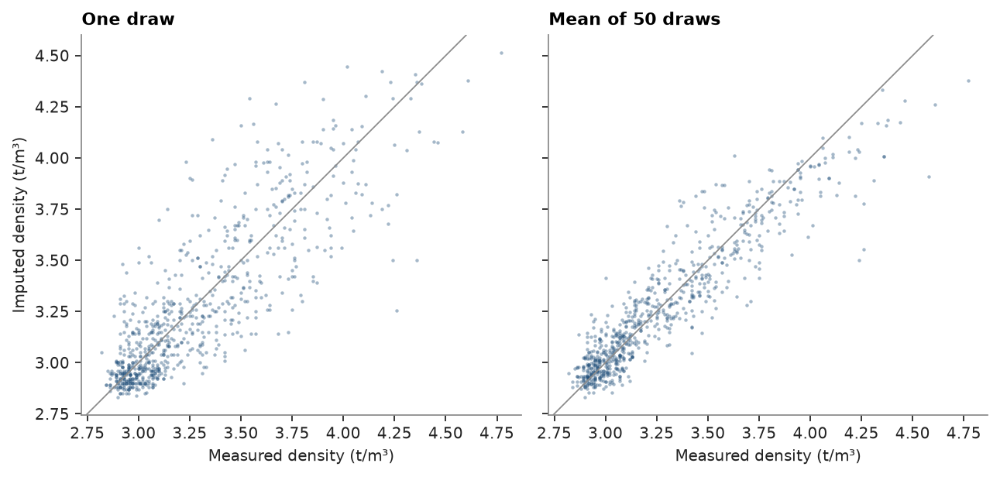
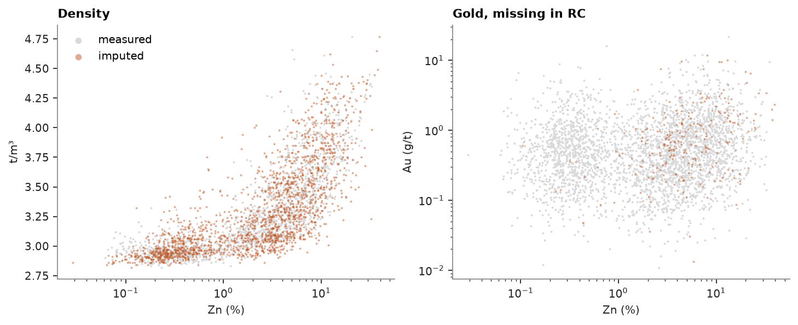

# imputation

not every sample is assayed for every variable. in the stacked sulphide lenses, density was measured on about half of
the diamond core from the sulphide units and never on RC chips, and the RC holes have no gold assays. the grades Zn,
Pb, Cu and Ag are complete. `GaussianImputer` fills the gaps: it normal-scores each variable on its own values, fits
the correlation of the scores to all rows, and draws each missing score given the scores present in its row.

<details><summary>Python</summary>

```python
import boitata as bt
import matplotlib.pyplot as plt
import numpy as np
from common import ACCENT, GRAY, HIGHLIGHT, LIGHT, save

lenses = bt.datasets.stacked_sulphide_lenses()
samples = bt.merge_intervals(lenses["assays"], lenses["lithology"])
sulphide = samples.filter(np.isin(samples["LITH"], ["MS", "SMS", "STR"])).drop_null("ZN_PCT")
columns = ["ZN_PCT", "PB_PCT", "CU_PCT", "AG_GPT", "AU_GPT", "DENSITY"]
labels = ["Zn", "Pb", "Cu", "Ag", "Au", "density"]
data = np.column_stack([sulphide[c] for c in columns])
missing = np.isnan(data)
print(
    f"{len(data)} sulphide samples, missing: "
    + ", ".join(f"{n} {m.sum()}" for n, m in zip(labels, missing.T))
)
```

</details>

```text
3358 sulphide samples, missing: Zn 0, Pb 0, Cu 0, Ag 0, Au 237, density 1823
```

the scores of density follow Zn, Pb and Ag closely. gold is weakly tied to the others, so its drawn values carry more
of their own randomness.

<details><summary>Python</summary>

```python
imputer = bt.GaussianImputer(seed=0).fit(data)
print("score correlation")
print(" " * 8 + "".join(f"{n:>8}" for n in labels))
for name, row in zip(labels, imputer.correlation_):
    print(f"{name:8}" + "".join(f"{r:8.2f}" for r in row))
```

</details>

```text
score correlation
              Zn      Pb      Cu      Ag      Au density
Zn          1.00    0.95   -0.38    0.80    0.15    0.81
Pb          0.95    1.00   -0.37    0.90    0.13    0.80
Cu         -0.38   -0.37    1.00   -0.26    0.32   -0.17
Ag          0.80    0.90   -0.26    1.00    0.12    0.82
Au          0.15    0.13    0.32    0.12    1.00    0.18
density     0.81    0.80   -0.17    0.82    0.18    1.00
```

to check the method, hide the measured density of every other hole, impute it, and compare with the truth: one draw,
and the mean of 50 draws with different seeds, close to the conditional mean.

<details><summary>Python</summary>

```python
holes = sulphide["HOLE_ID"]
test = ~missing[:, 5] & np.isin(holes, np.unique(holes)[::2])
holed = data.copy()
holed[test, 5] = np.nan
draws = np.array([bt.GaussianImputer(seed=s).fit(holed).transform(holed)[test, 5] for s in range(50)])
truth = data[test, 5]
qs = [0.1, 0.5, 0.9]
print(f"{test.sum()} densities hidden")
for name, x in {"truth": truth, "one draw": draws[0], "mean of 50": draws.mean(axis=0)}.items():
    q = ", ".join(f"{v:.2f}" for v in np.quantile(x, qs))
    rmse = bt.compare(x, truth)["rmse"]
    print(f"{name:11} q10, q50, q90: {q}   sd {x.std():.2f}" + (f"   rmse {rmse:.2f}" if rmse else ""))

fig, axes = plt.subplots(1, 2, figsize=(8, 3.6), layout="constrained", sharex=True, sharey=True)
for ax, (x, title) in zip(axes, [(draws[0], "One draw"), (draws.mean(axis=0), "Mean of 50 draws")]):
    ax.scatter(truth, x, s=4, color=ACCENT, alpha=0.4, linewidths=0)
    ax.axline((3, 3), slope=1, color=GRAY, lw=0.8)
    ax.set(xlabel="Measured density (t/m³)", title=title, aspect="equal")
axes[0].set_ylabel("Imputed density (t/m³)")
save(fig, "check")
```

</details>

```text
758 densities hidden
truth       q10, q50, q90: 2.93, 3.14, 3.80   sd 0.36
one draw    q10, q50, q90: 2.91, 3.16, 3.86   sd 0.37   rmse 0.21
mean of 50  q10, q50, q90: 2.93, 3.19, 3.79   sd 0.32   rmse 0.13
```



one draw keeps the spread of the hidden densities (sd 0.37 against 0.36), with a root-mean-square error of 0.21 t/m³.
the mean of 50 draws cuts the error to 0.13 but narrows the spread to 0.32, like any prediction. draws suit simulation
and tonnage uncertainty; the mean suits a single best value per sample.

one draw fills every gap below. the imputed densities follow the trend of the measured ones against zinc, with the
same scatter.

<details><summary>Python</summary>

```python
filled = imputer.transform(data)
fig, axes = plt.subplots(1, 2, figsize=(9, 3.6), layout="constrained")
for ax, j, title, label in ((axes[0], 5, "Density", "t/m³"), (axes[1], 4, "Gold, missing in RC", "Au (g/t)")):
    gap = missing[:, j]
    ax.scatter(data[~gap, 0], data[~gap, j], s=3, color=LIGHT, linewidths=0, label="measured")
    ax.scatter(filled[gap, 0], filled[gap, j], s=3, color=HIGHLIGHT, alpha=0.5, linewidths=0, label="imputed")
    ax.set(xlabel="Zn (%)", ylabel=label, xscale="log", title=title)
axes[1].set_yscale("log")
axes[0].legend(markerscale=3)
save(fig, "filled")
print(f"density mean {np.nanmean(data[:, 5]):.3f} measured, {filled[:, 5].mean():.3f} after imputation")
```

</details>

```text
density mean 3.264 measured, 3.279 after imputation
```



the imputer assumes that missing values behave like measured ones with the same grades. that holds for density here,
measured on part of the same core; gold in RC chips borrows its relation to the base metals from the diamond holes.
`MultivariateSimulation.fit(..., impute=True)` redraws the gaps in every realization
([multivariate simulation](../../08-stochastic-simulation/06-multivariate-simulation/README.md)).

Full script: [`example_04_06.py`](example_04_06.py)
