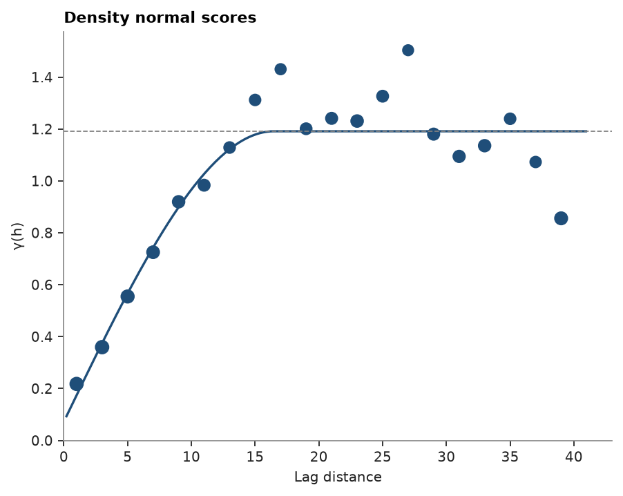
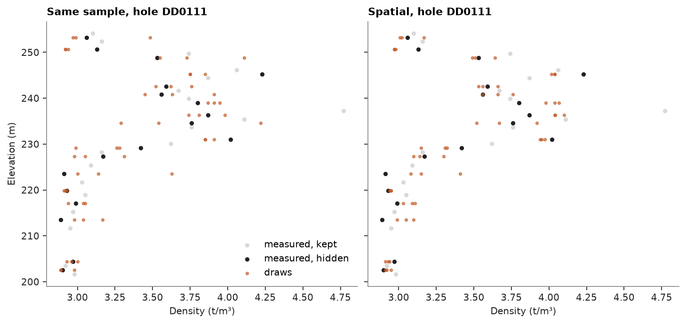

# Spatial imputation

`GaussianImputer` ([imputation](../../04-transforms/06-imputation/README.md)) draws a missing value from the other variables of the same sample. With `spatial=`, it
also draws from nearby samples: the normal scores follow an intrinsic model, in which every variable and every pair
of variables share one correlogram scaled by the score covariance, and the samples are visited along a random path,
each missing score drawn by simple cokriging from its own row and from the nearest samples, those already imputed
included. Here density in the stacked sulphide lenses, missing in 91% of all samples and in about half of the
sulphide ones.

<details><summary>Python</summary>

```python
import boitata as bt
import matplotlib.pyplot as plt
import numpy as np
from common import HIGHLIGHT, INK, LIGHT, save

lenses = bt.datasets.stacked_sulphide_lenses()
intervals = bt.merge_intervals(lenses["assays"], lenses["lithology"])
samples = bt.Drillholes(lenses["collars"], lenses["surveys"], intervals).samples()
density = np.asarray(samples["DENSITY"], float)
sulphide = np.isin(np.asarray(samples["LITH"]), ["MS", "SMS", "STR"]) & ~np.isnan(samples["ZN_PCT"])
columns = ["ZN_PCT", "PB_PCT", "CU_PCT", "AG_GPT", "AU_GPT", "DENSITY"]
data = np.column_stack([samples[c][sulphide] for c in columns])
xyz, holes = samples.coords[sulphide], np.asarray(samples["HOLE_ID"])[sulphide]
seen = ~np.isnan(data[:, 5])
print(f"density missing in {np.isnan(density).mean():.0%} of {len(density)} samples")
print(f"{len(data)} sulphide samples, density measured in {seen.sum()}")
```

</details>

```text
density missing in 91% of 17848 samples
3358 sulphide samples, density measured in 1535
```

The spatial model is the variogram of the density normal scores, on 2 m lags: a small nugget and a range of about
16 m, shorter than the spacing between holes, so the information comes mostly from the samples above and below in
the same hole. The imputer rescales its sill to one.

<details><summary>Python</summary>

```python
scores = bt.NormalScore().fit_transform(data[seen, 5])
experimental = bt.experimental_variogram(xyz[seen], scores, 2.0, 40.0)
model = experimental.fit("spherical")
nugget, (structure,) = model.nugget, model.structures
print(f"nugget {nugget:.2f}, spherical sill {structure.sill:.2f}, range {structure.range:.1f} m")
fig, ax = bt.plot.variogram(experimental, variogram=model)
ax.set(title="Density normal scores")
save(fig, "variogram")
```

</details>

```text
nugget 0.07, spherical sill 1.12, range 16.5 m
```



Two checks hide measured densities and score the imputed ones against the truth: every other hole, as in [imputation](../../04-transforms/06-imputation/README.md),
and every other measured sample, which leaves the neighbors in the same hole. Each imputer runs with 10 seeds; the
error of one draw and of the mean of the draws are root-mean-square.

<details><summary>Python</summary>

```python
order = np.flatnonzero(seen)
tests = {
    "every other hole": seen & np.isin(holes, np.unique(holes[seen])[::2]),
    "every other sample": np.isin(np.arange(len(data)), order[::2]),
}
imputers = {
    "same sample": lambda seed, holed: bt.GaussianImputer(seed=seed).fit(holed),
    "spatial": lambda seed, holed: bt.GaussianImputer(seed=seed, spatial=model).fit(holed, coords=xyz),
}
draws = {}
print(f"{'hidden':20}{'imputer':13}{'one draw':>9}{'mean':>7}{'sd':>6}")
for test, hidden in tests.items():
    holed = data.copy()
    holed[hidden, 5] = np.nan
    truth = data[hidden, 5]
    for name, make in imputers.items():
        d = np.array([make(seed, holed).transform(holed)[hidden, 5] for seed in range(10)])
        draws[test, name] = d
        one, mean = (np.sqrt(np.mean((x - truth) ** 2)) for x in (d[0], d.mean(axis=0)))
        print(f"{test:20}{name:13}{one:9.3f}{mean:7.3f}{d[0].std():6.2f}")
    print(f"{test:20}{'truth':13}{'':16}{truth.std():6.2f}")
```

</details>

```text
hidden              imputer       one draw   mean    sd
every other hole    same sample      0.210  0.135  0.35
every other hole    spatial          0.216  0.138  0.35
every other hole    truth                          0.35
every other sample  same sample      0.220  0.135  0.36
every other sample  spatial          0.156  0.121  0.37
every other sample  truth                          0.36
```

Across holes, the neighbors add almost nothing: the hidden holes lie beyond the range of the variogram. Within
holes, one spatial draw errs by 0.16 t/m³ against 0.22 from the same sample alone, and both keep the spread of the
truth. Along one hole, the spatial draws follow the level of the measured densities around them.

<details><summary>Python</summary>

```python
hidden = tests["every other sample"]
counts = {h: (hidden & (holes == h)).sum() for h in np.unique(holes)}
hole = max(counts, key=counts.get)
rows = np.flatnonzero(holes == hole)
at = np.flatnonzero(hidden)
fig, axes = plt.subplots(1, 2, figsize=(9, 4.2), layout="constrained", sharey=True)
for ax, name in zip(axes, imputers):
    d = draws["every other sample", name]
    pick = np.isin(at, rows)
    kept = rows[~hidden[rows] & seen[rows]]
    ax.scatter(data[kept, 5], xyz[kept, 2], s=10, color=LIGHT, label="measured, kept")
    ax.scatter(data[at[pick], 5], xyz[at[pick], 2], s=10, color=INK, label="measured, hidden")
    for k in range(3):
        ax.scatter(
            d[k, pick], xyz[at[pick], 2], s=6, color=HIGHLIGHT, alpha=0.6, label="draws" if k == 0 else None
        )
    ax.set(xlabel="Density (t/m³)", title=f"{name.capitalize()}, hole {hole}")
axes[0].set_ylabel("Elevation (m)")
axes[0].legend(loc="lower right")
save(fig, "downhole")
```

</details>



The draws also keep the correlations. The normal-score correlation of density with Zn, Pb and Ag over the hidden
samples, averaged over the draws, against the correlation fitted to the data:

<details><summary>Python</summary>

```python
hidden = tests["every other sample"]
holed = data.copy()
holed[hidden, 5] = np.nan
target = bt.GaussianImputer().fit(holed).correlation_[5]
ns = [bt.NormalScore().fit(data[:, j]) for j in (0, 1, 3)]
for name in imputers:
    d = draws["every other sample", name]
    z = [bt.NormalScore().fit(data[seen, 5]).transform(x) for x in d]
    r = [
        np.mean([np.corrcoef(n.transform(data[hidden, j]), zk)[0, 1] for zk in z])
        for n, j in zip(ns, (0, 1, 3))
    ]
    print(f"{name:12}" + "".join(f"{v:7.2f}" for v in r))
print(f"{'fitted':12}" + "".join(f"{target[j]:7.2f}" for j in (0, 1, 3)))
```

</details>

```text
same sample    0.80   0.79   0.81
spatial        0.83   0.81   0.84
fitted         0.80   0.79   0.81
```

Both stay within 0.03 of the fitted correlations. Only the missing entries change; measured values are returned as they are. `transform` takes `coords=` for new
samples and otherwise reuses those given to `fit`. A pure-nugget variogram gives exactly the draws of the
non-spatial imputer, and `MultivariateSimulation.fit(..., impute=bt.GaussianImputer(spatial=model))` redraws the
gaps this way in every realization ([multivariate simulation](../../08-stochastic-simulation/06-multivariate-simulation/README.md)).

The intrinsic model is the simplest spatial model with the fitted correlations: one correlogram for all variables.
Here it comes from density, the variable being imputed; grades with a different continuity borrow it too.

Full script: [`example_04_07.py`](example_04_07.py)
