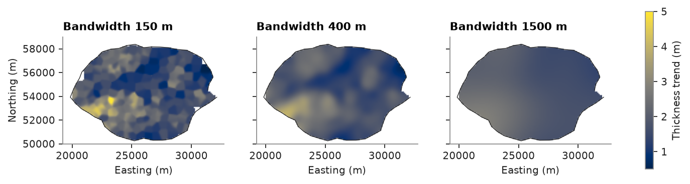
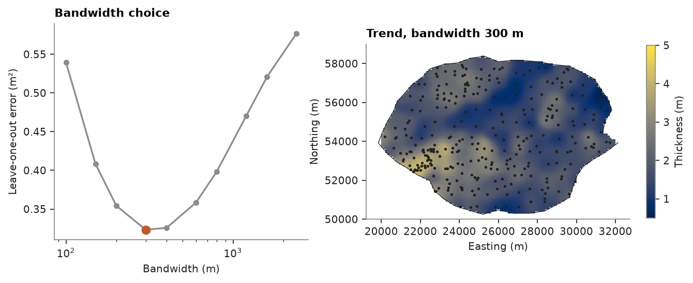
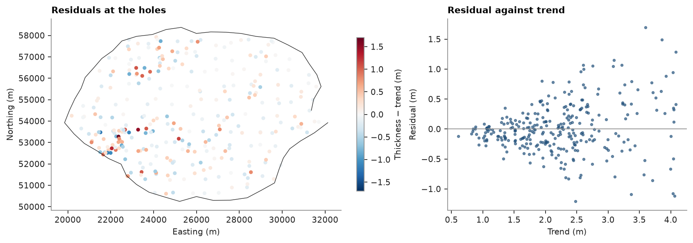
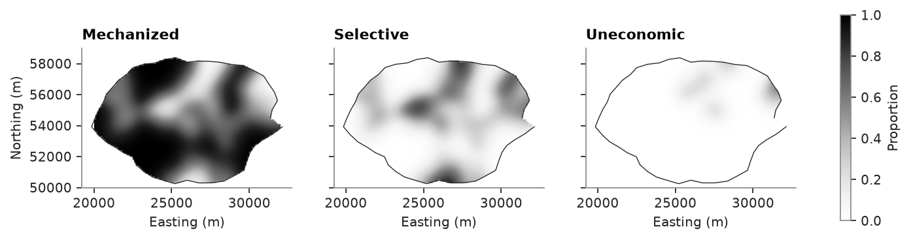

# smooth trend

a moving-window trend: at each location, the declustered average of the boreholes under a gaussian kernel. maps of
seam thickness for several bandwidths, the bandwidth chosen by leave-one-out error, the residuals, and the local
proportions of the mining categories.

<details><summary>Python</summary>

```python
import boitata as bt
import matplotlib.pyplot as plt
import numpy as np
from common import ACCENT, GRAY, HIGHLIGHT, INK, map_axes, save
```

</details>

the coal seam was drilled on a regular mesh, then infilled where it is thick, so the boreholes over-represent thick
coal. cell declustering weights correct that, and the trend averages the holes with these weights.

<details><summary>Python</summary>

```python
data = bt.datasets.coal_seam_thickness()
holes, grid, lease = data["boreholes"], data["grid"], data["boundary"]
weights = bt.cell_declustering(holes, "THICKNESS_M", cell_size=500.0).weights
thickness = holes["THICKNESS_M"]
print(
    f"{len(holes)} holes, mean {thickness.mean():.2f} m, declustered {np.average(thickness, weights=weights):.2f} m"
)

nx, ny, _ = grid.count
dx, dy, _ = grid.size
x0, y0, _ = grid.origin
extent = (x0, x0 + nx * dx, y0, y0 + ny * dy)
outside = np.asarray(grid["INSIDE"]) == 0


def image(ax, values, **kwargs):
    values = np.where(outside, np.nan, np.asarray(values, dtype=float)).reshape(ny, nx)
    shown = ax.imshow(values, origin="lower", extent=extent, **kwargs)
    ax.plot(*lease.coords[:, :2].T, color=INK, lw=0.6)
    return shown
```

</details>

```text
295 holes, mean 2.23 m, declustered 1.98 m
```

## bandwidth

`detrend` with a `bandwidth` fits a smooth trend instead of a polynomial. the bandwidth is the standard deviation of
the kernel: a small one follows every hole, a large one keeps only the regional shape. `rotation` and `ratios`, as for
a variogram, make the kernel anisotropic.

<details><summary>Python</summary>

```python
fig, axes = plt.subplots(1, 3, figsize=(11, 3.2), sharey=True)
norm = plt.Normalize(0.5, 5.0)
for ax, bandwidth in zip(axes, (150.0, 400.0, 1500.0)):
    trend, _ = bt.detrend(holes, "THICKNESS_M", bandwidth=bandwidth, weights=weights)
    shown = image(ax, trend.predict(grid), norm=norm)
    map_axes(ax, f"Bandwidth {bandwidth:.0f} m")
for ax in axes[1:]:
    ax.set_ylabel("")
fig.colorbar(shown, ax=axes, label="Thickness trend (m)", shrink=0.8)
save(fig, "bandwidths")
```

</details>



## automatic choice

given several bandwidths, `detrend` keeps the one with the least leave-one-out error: it compares each hole with the
trend of the other holes and averages the squared differences with the declustering weights. too small a bandwidth
chases noise, and too large a one misses the shape. noisier data get a larger bandwidth.

<details><summary>Python</summary>

```python
candidates = [100, 150, 200, 300, 400, 600, 800, 1200, 1600, 2400]
trend, residuals = bt.detrend(holes, "THICKNESS_M", bandwidth=candidates, weights=weights)
print(f"chosen bandwidth {trend.bandwidth:.0f} m")

fig, (left, right) = plt.subplots(1, 2, figsize=(10, 3.4), gridspec_kw={"width_ratios": [1, 1.3]})
left.plot(trend.bandwidths, trend.scores, "o-", color=GRAY, ms=4)
best = trend.scores.argmin()
left.plot(trend.bandwidths[best], trend.scores[best], "o", color=HIGHLIGHT, ms=7)
left.set_xscale("log")
left.set_xlabel("Bandwidth (m)")
left.set_ylabel("Leave-one-out error (m²)")
left.set_title("Bandwidth choice")
shown = image(right, trend.predict(grid), norm=norm)
right.scatter(*holes.coords[:, :2].T, s=2, color=INK)
map_axes(right, f"Trend, bandwidth {trend.bandwidth:.0f} m")
fig.colorbar(shown, ax=right, label="Thickness (m)", shrink=0.8)
save(fig, "automatic")
```

</details>

```text
chosen bandwidth 300 m
```



## residuals

the residuals, thickness minus trend at the holes, keep the short-scale variation. they center on zero and correlate
weakly with the trend, but their spread grows with it: thick coal varies more, a proportional effect. normal-scoring
within classes of the trend, as `SGS` does with a trend, removes both.

<details><summary>Python</summary>

```python
at_holes = trend.predict(holes)
print(f"residual mean {np.average(residuals, weights=weights):+.3f} m, sd {residuals.std():.2f} m")
print(f"correlation with the trend {np.corrcoef(at_holes, residuals)[0, 1]:+.2f}")

fig, (left, right) = plt.subplots(
    1, 2, figsize=(10.5, 3.6), gridspec_kw={"width_ratios": [1.3, 1]}, layout="constrained"
)
left.plot(*lease.coords[:, :2].T, color=INK, lw=0.6)
limit = np.abs(residuals).max()
dots = left.scatter(*holes.coords[:, :2].T, c=residuals, s=10, cmap="RdBu_r", vmin=-limit, vmax=limit)
map_axes(left, "Residuals at the holes")
fig.colorbar(dots, ax=left, label="Thickness − trend (m)", shrink=0.8)
right.scatter(at_holes, residuals, s=6, color=ACCENT, alpha=0.6)
right.axhline(0, color=GRAY, lw=0.8)
right.set_xlabel("Trend (m)")
right.set_ylabel("Residual (m)")
right.set_title("Residual against trend")
save(fig, "residuals")
```

</details>

```text
residual mean -0.011 m, sd 0.42 m
correlation with the trend +0.20
```



the trend at the holes and at the cells can feed a simulation
([SGS](../../08-stochastic-simulation/01-sgs/README.md)): `SGS.fit(holes, "THICKNESS_M", trend=trend.predict(holes))`
then `simulate(grid, trend=trend.predict(grid))` simulates the thickness conditioned on the local trend. cells beyond
four bandwidths of every hole have no trend (NaN), so drop them first.

## category proportions

with `categorical=True`, `detrend` smooths the indicator of each category instead. the trend is then a table of local
proportions, one column per category, each in [0, 1] and summing to 1 at every cell.

<details><summary>Python</summary>

```python
categories, _ = bt.detrend(holes, "CATEGORY", bandwidth=candidates, weights=weights, categorical=True)
proportions = categories.predict(grid)
total = sum(np.asarray(proportions[name]) for name in categories.categories)
print(
    f"bandwidth {categories.bandwidth:.0f} m; proportions sum to 1: {np.allclose(total[~np.isnan(total)], 1.0)}"
)

fig, axes = plt.subplots(1, 3, figsize=(11, 3.2), sharey=True)
for ax, name in zip(axes, categories.categories):
    shown = image(ax, proportions[name], vmin=0.0, vmax=1.0, cmap="Greys")
    map_axes(ax, name.capitalize())
for ax in axes[1:]:
    ax.set_ylabel("")
fig.colorbar(shown, ax=axes, label="Proportion", shrink=0.8)
save(fig, "proportions")
```

</details>

```text
bandwidth 600 m; proportions sum to 1: True
```



Full script: [`example_04_08.py`](example_04_08.py)
