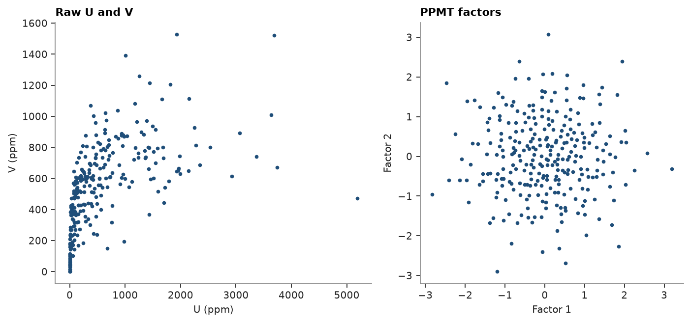

# pipeline

a gaussian cosimulation of two grades takes several transforms in a fixed order: cap, normal-score each grade, then
PPMT. the back-transform runs the same chain in reverse with the same fitted parameters. `Pipeline` holds that chain:
each step names a transform and the columns it replaces, `fit` fits the steps in turn on a container,
`inverse_transform` undoes them, and `to_json` saves the fitted chain for new data.

<details><summary>Python</summary>

```python
import boitata as bt
import matplotlib.pyplot as plt
import numpy as np
from common import ACCENT, save

samples = bt.datasets.walker_lake()
samples = samples.drop_null("U")
w = bt.cell_declustering(samples, "V", sizes=np.arange(2.5, 102.5, 2.5)).weights
samples = samples.with_column("w", w)

pipe = bt.Pipeline(
    [
        ("cap", bt.Capping(quantile=0.99), "V"),
        ("ns_u", bt.NormalScore(), "U"),
        ("ns_v", bt.NormalScore(), "V"),
        ("ppmt", bt.PPMT(seed=7), ["U", "V"]),
    ]
)
factors = pipe.fit_transform(samples, weights="w")
print(pipe)
print(f"factor correlation {np.corrcoef(factors['U'], factors['V'])[0, 1]:.3f}")
```

</details>

```text
Pipeline([('cap', 'Capping', 'V'), ('ns_u', 'NormalScore', 'U'), ('ns_v', 'NormalScore', 'V'), ('ppmt', 'PPMT', ['U', 'V'])])
factor correlation -0.001
```

the steps replace `U` and `V` in place, so the output keeps the columns of the input and the next step reads the
previous one's result. the weights reach the steps whose `fit` takes them: capping, the normal scores and PPMT.

<details><summary>Python</summary>

```python
fig, (a, b) = plt.subplots(1, 2, figsize=(9, 4), layout="constrained")
a.scatter(samples["U"], samples["V"], s=6, color=ACCENT)
a.set(title="Raw U and V", xlabel="U (ppm)", ylabel="V (ppm)")
b.scatter(factors["U"], factors["V"], s=6, color=ACCENT)
b.set(title="PPMT factors", xlabel="Factor 1", ylabel="Factor 2", aspect="equal")
save(fig, "factors")
```

</details>



a saved pipeline reloads with `from_json` and back-transforms factors, here independent gaussian draws standing in
for simulated values. capping has no inverse, so `inverse_transform` skips it and the back-transformed `V` stays
below the cap. `transform` and `inverse_transform` raise `MissingColumn` when the data lack a fitted column.

<details><summary>Python</summary>

```python
saved = bt.Pipeline.from_json(pipe.to_json())
draws = np.random.default_rng(1).standard_normal((2000, 2))
grades = saved.inverse_transform({"U": draws[:, 0], "V": draws[:, 1]})
print(f"V cap {pipe.named_steps['cap'].caps_:.0f} ppm, back-transformed V max {grades['V'].max():.0f} ppm")
print(
    f"U-V correlation: data {np.corrcoef(samples['U'], samples['V'])[0, 1]:.2f}, "
    f"back-transformed {np.corrcoef(grades['U'], grades['V'])[0, 1]:.2f}"
)
```

</details>

```text
V cap 1111 ppm, back-transformed V max 1111 ppm
U-V correlation: data 0.55, back-transformed 0.53
```

Full script: [`example_04_11.py`](example_04_11.py)
