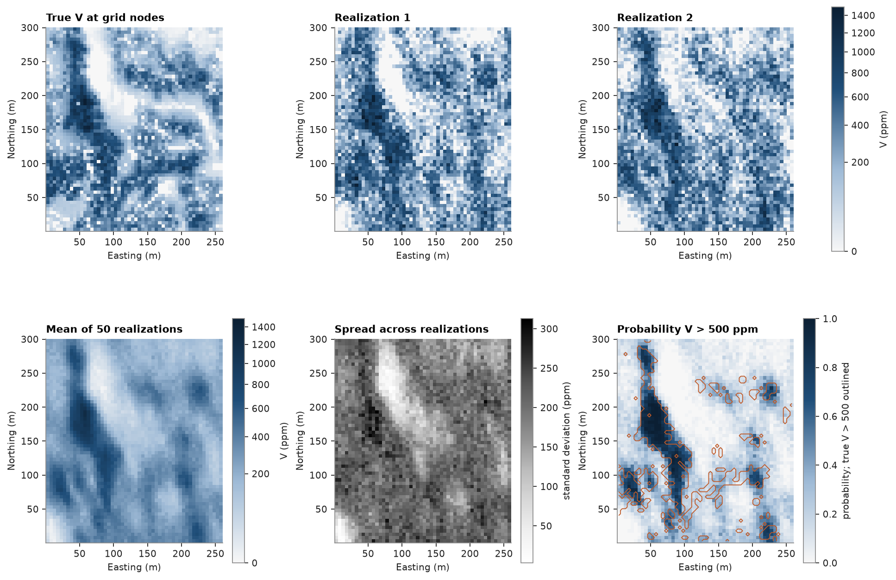
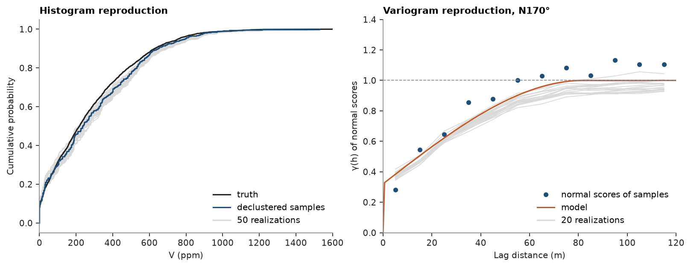

# 5. Sequential Gaussian simulation

Kriging gives one smooth map. Simulation draws many maps that each honour the samples, the declustered histogram and the variogram; together they measure uncertainty.



The normal-score variogram is fitted along N170° and N260° and scaled to a unit sill: nugget 0.32, spherical 0.68, ranges 82 m and 35 m.
SGS normal-scores the data with the declustering weights, simulates on the 5 m grid and back-transforms, with tails bounded to 0 and the largest sample.



Each realization's histogram follows the declustered samples, and its variogram follows the model.
The mean of the realizations is smooth like kriging; the probability map outlines the true V > 500 ppm zones.

```python
y = cs.NormalScore(tails=(0, v.max())).fit_transform(v, weights=weights)
gaussian = cs.Variogram([("spherical", 0.68, 82)], nugget=0.32, rotation=(170, 0, 0), ratios=(0.43, 1))
sgs = cs.SGS(gaussian, cs.Search(radius=100, max_samples=24)).fit(xy, v, weights=weights)
reals = sgs.simulate(grid, n=50, seed=42)  # (50, 3120), same result on any number of threads
p500 = cs.probability_above(reals, 500.0)
```

[`example.py`](example.py)
