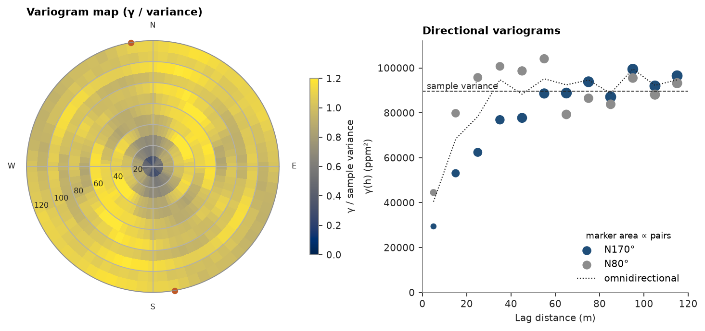
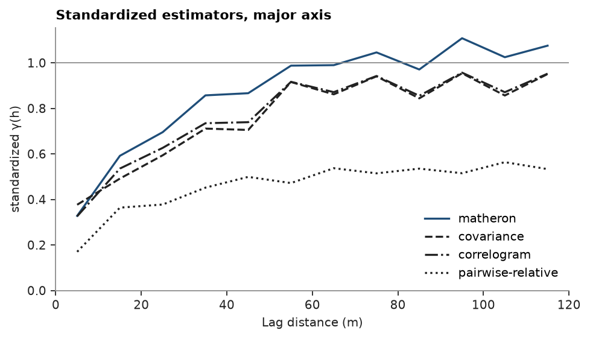

# Experimental variograms

The experimental variogram γ(h) is half the mean squared difference of `V` between samples a lag h apart. The
variogram map computes it in every horizontal direction and finds the direction of greatest continuity; directional
variograms along and across it, and other estimators, follow.

<details><summary>Python</summary>

```python
import ceres as cs
import matplotlib.pyplot as plt
import numpy as np
from common import ACCENT, GRAY, HIGHLIGHT, INK, save

samples = cs.datasets.walker_lake()
xy, v = samples.coords, samples["V"]
lag, max_lag = 10.0, 120.0
```

</details>

The variogram map bins pairs by lag and direction, 36 sectors over 180°, and fits a range in each; the direction
with the longest range is the major axis.

<details><summary>Python</summary>

```python
vmap = cs.variogram_map(xy, v, lag, max_lag)
angle = vmap.angles[np.nanargmax(vmap.ranges)]
azimuth = (90 - np.degrees(angle)) % 180
print(
    f"major axis N{azimuth:.0f}°, range {np.nanmax(vmap.ranges):.0f} m; shortest {np.nanmin(vmap.ranges):.0f} m"
)
```

</details>

```text
major axis N170°, range 80 m; shortest 24 m
```

Directional variograms keep pairs within `tolerance` (22.5° by default) of an azimuth. Each lag reports its mean
distance, γ and pair count.

<details><summary>Python</summary>

```python
major = cs.experimental_variogram(xy, v, lag, max_lag, azimuth=azimuth)
minor = cs.experimental_variogram(xy, v, lag, max_lag, azimuth=azimuth + 90)
omni = cs.experimental_variogram(xy, v, lag, max_lag)
print(" lag   major   minor    omni  pairs(major)")
for i in range(0, len(major.lags), 2):
    print(
        f"{major.lags[i]:4.0f} {major.gammas[i]:7.0f} {minor.gammas[i]:7.0f} {omni.gammas[i]:7.0f} {major.counts[i]:7.0f}"
    )
variance = v.var()
print(f"sample variance {variance:.0f}")
```

</details>

```text
 lag   major   minor    omni  pairs(major)
   5   29411   44505   40404     119
  25   62401   95745   78353     751
  45   77753   98673   88300    1218
  65   88812   79293   92469    1693
  85   87105   83801   88662    1851
 105   91948   88107   92228    1871
sample variance 89738
```

Across the major axis γ passes the sample variance by 25 m. Along it γ is seven tenths of the variance at 25 m and
reaches it only by 65 m. The omnidirectional variogram averages the two and hides the anisotropy. The first lag
holds few pairs, and every fit near the origin leans on it.

<details><summary>Python</summary>

```python
fig = plt.figure(figsize=(9.2, 4.2), layout="constrained")
a = fig.add_subplot(1, 2, 1, projection="polar")
gamma = np.where(vmap.counts >= 30, vmap.gammas, np.nan)
step = vmap.angles[1] - vmap.angles[0]
theta = np.r_[vmap.angles, vmap.angles + np.pi, 2 * np.pi] - step / 2
radius = np.r_[vmap.lags - lag / 2, vmap.lags[-1] + lag / 2]
mesh = a.pcolormesh(theta, radius, np.vstack([gamma, gamma]).T / variance, vmin=0, vmax=1.2, shading="flat")
a.plot([angle, angle + np.pi], [radius[-1], radius[-1]], "o", color=HIGHLIGHT, ms=5, clip_on=False)
a.set_rlim(0, radius[-1])
a.set_xticks(np.radians([0, 90, 180, 270]), ["E", "N", "W", "S"])
a.set_rlabel_position(200)
a.tick_params(labelsize=7)
a.set_title("Variogram map (γ / variance)")
fig.colorbar(mesh, ax=a, shrink=0.7, label="γ / sample variance")

b = fig.add_subplot(1, 2, 2)
for exp, color, name in ((major, ACCENT, f"N{azimuth:.0f}°"), (minor, GRAY, f"N{(azimuth + 90) % 180:.0f}°")):
    cs.plot.variogram(exp, ax=b, color=color, label=name)
b.plot(omni.lags, omni.gammas, ":", color=INK, lw=1, label="omnidirectional")
b.axhline(variance, color=INK, lw=0.8, ls="--")
b.text(2, variance, "sample variance", va="bottom", color=INK, fontsize=8)
b.set_xlim(0, max_lag)
b.set_ylim(0, 1.25 * variance)
b.set_title("Directional variograms")
b.set_xlabel("Lag distance (m)")
b.set_ylabel("γ(h) (ppm²)")
b.legend(loc="lower right", title="marker area ∝ pairs", title_fontsize=8)
save(fig, "variogram")
```

</details>



Other estimators along the major axis. `standardize=True` divides the classical and covariance estimates by the
sample variance, the correlogram's scale. Covariance and correlogram use each lag's own head and tail means and
level off below 1 here. The pairwise-relative variogram scales every squared difference by the pair mean: it
ignores the grade level and keeps its own scale.

<details><summary>Python</summary>

```python
fig, ax = plt.subplots(figsize=(6, 3.4), layout="constrained")
styles = {"matheron": "-", "covariance": "--", "correlogram": "-.", "pairwise-relative": ":"}
for name, style in styles.items():
    exp = cs.experimental_variogram(xy, v, lag, max_lag, azimuth=azimuth, estimator=name, standardize=True)
    ax.plot(exp.lags, exp.gammas, style, color=ACCENT if name == "matheron" else INK, label=name)
ax.axhline(1, color=GRAY, lw=0.8)
ax.set_xlim(0, max_lag)
ax.set_ylim(bottom=0)
ax.set_title("Standardized estimators, major axis")
ax.set_xlabel("Lag distance (m)")
ax.set_ylabel("standardized γ(h)")
ax.legend(loc="lower right")
save(fig, "estimators")
```

</details>



Full script: [`example_01.py`](example_01.py)
