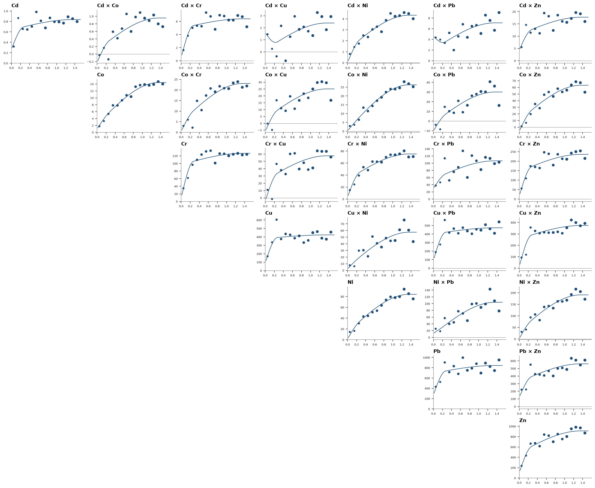
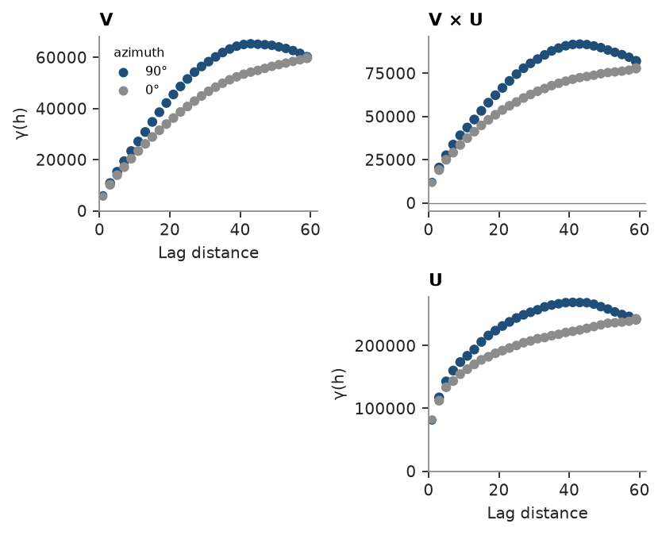

# Variogram sets

`experimental_variograms` computes every direct and cross variogram of several variables in one call. The set it
returns is indexed by variable pair, `Coregionalization.fit` takes it as it is, and `cs.plot.variograms` draws it as a
matrix of panels. On a regular grid the pairs are found by shifting cell indices instead of comparing every two
samples, which makes variograms of exhaustive grids and simulated realizations cheap.

<details><summary>Python</summary>

```python
import ceres as cs
import numpy as np
from common import save

train = cs.datasets.jura()["prediction"]
metals = ["Cd", "Co", "Cr", "Cu", "Ni", "Pb", "Zn"]
```

</details>

Jura has seven metals at 259 soil samples, in km. One call gives the 7 direct and 21 cross variograms; `vs[i, j]`
and `vs[j, i]` are the same cross variogram, and variables can be named by column.

<details><summary>Python</summary>

```python
vs = cs.experimental_variograms(train, metals, 0.1, 1.5)
print(vs)
print(f"Cd × Zn: {len(vs['Cd', 'Zn'].lags)} lags, {int(vs['Cd', 'Zn'].counts.sum()):,} pairs")
```

</details>

```text
VariogramSet(7 variables, omnidirectional)
Cd × Zn: 15 lags, 11,376 pairs
```

The linear model of coregionalization is fitted to all 28 at once. Each structure has a 7 × 7 sill matrix, kept
positive semi-definite, so the model is valid for cokriging any subset of the metals. Its total sill matrix gives
the correlations between the metals, close to those of the samples:

<details><summary>Python</summary>

```python
lmc = cs.Coregionalization.fit(vs, ["spherical", "spherical"])
for name, matrix in [("nugget", lmc.nugget)] + [(f"{m} {a:.2f} km", s) for m, a, s in lmc.structures]:
    print(f"{name:18} smallest eigenvalue {np.linalg.eigvalsh(matrix)[0]:.2g}")
sill = lmc.nugget + sum(s for _, _, s in lmc.structures)
model_corr = sill / np.sqrt(np.outer(np.diag(sill), np.diag(sill)))
sample_corr = np.corrcoef([train[m] for m in metals])
upper = np.triu_indices(len(metals), 1)
print(f"largest |model - sample| correlation: {np.abs(model_corr - sample_corr)[upper].max():.2f}")
```

</details>

```text
nugget             smallest eigenvalue -3.9e-14
spherical 0.27 km  smallest eigenvalue -3.1e-15
spherical 1.36 km  smallest eigenvalue -3.7e-16
largest |model - sample| correlation: 0.10
```

The direct variograms are on the diagonal and the cross variograms above it, each with the fitted model. Co and Ni
rise mostly over the long structure, Cu and Pb mostly over the short one, and each cross variogram mixes the two in
its own proportions.

<details><summary>Python</summary>

```python
fig, axes = cs.plot.variograms(vs, model=lmc)
for ax in axes.flat:
    ax.title.set_fontsize(8)
    ax.tick_params(labelsize=6)
    ax.xaxis.label.set_visible(False)
    ax.yaxis.label.set_visible(False)
save(fig, "jura")
```

</details>



The Walker Lake exhaustive grid holds V and U at all 78 000 cells of a 260 × 300 m grid. Given a `BlockModel`,
the pairs one cell offset apart all share a separation, so each offset is binned once and its pairs are gathered by
index shifts. With a half-degree tolerance only the offsets along the rows and columns are kept: 30 lags per
direction, each one pass over the cells.

<details><summary>Python</summary>

```python
table = cs.datasets.walker_lake_exhaustive()
grid = cs.BlockModel((0.5, 0.5), (1.0, 1.0), (260, 300), attributes={"V": table["V"], "U": table["U"]})
axes_set = cs.experimental_variograms(
    grid, ["V", "U"], 2.0, 60.0, directions=[(90.0, 0.0), (0.0, 0.0)], tolerance=0.5
)
east, north = axes_set["V", "V"]
print(f"V along x: {int(east.counts.sum()):,} pairs; along y: {int(north.counts.sum()):,} pairs")
```

</details>

```text
V along x: 4,131,000 pairs; along y: 4,204,200 pairs
```

The index shifts find the same pairs as the search over the cell centers and the same estimates up to round-off,
checked here on a 60 × 60 m corner, small enough for the search:

<details><summary>Python</summary>

```python
corner = cs.BlockModel((0.5, 0.5), (1.0, 1.0), (60, 60))
rows = (np.arange(60)[:, None] * 260 + np.arange(60)).ravel()
v = table["V"][rows]
by_shift = cs.experimental_variogram(corner, v, 2.0, 30.0)
by_search = cs.experimental_variogram(corner, v, 2.0, 30.0, method="pairs")
print(f"same pair counts: {np.array_equal(by_shift.counts, by_search.counts)}")
print(f"largest relative difference in γ: {np.max(np.abs(by_shift.gammas / by_search.gammas - 1)):.1e}")
```

</details>

```text
same pair counts: True
largest relative difference in γ: 8.9e-16
```

V is more continuous north to south than east to west, and U follows it. The same call on a simulated realization
checks it against the variogram model it was drawn from.

<details><summary>Python</summary>

```python
fig, axes = cs.plot.variograms(axes_set)
save(fig, "walker_lake")
```

</details>



Full script: [`example_05_03.py`](example_05_03.py)
