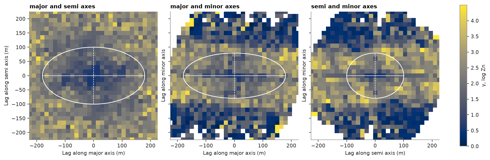
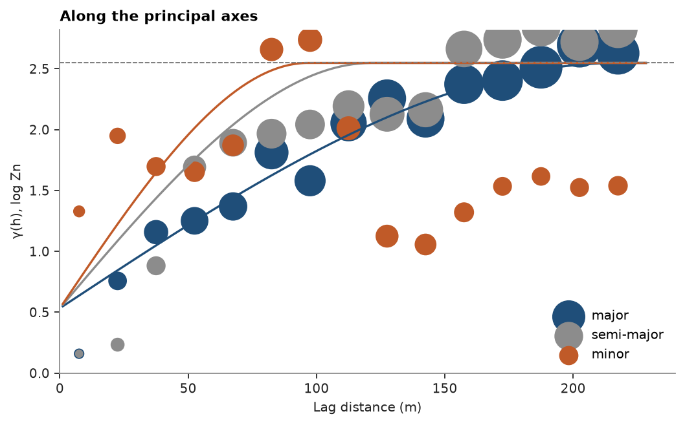

# Variogram volume

A variogram map shows γ on one plane; in 3D the plane of best continuity is itself unknown. `variogram_volume`
bins every pair by its lag vector into a cube of cells, the 3D variogram map, and reads the principal axes of
continuity from a few hundred directions spread over the sphere. In each direction it finds the lag where γ reaches
half the sill; under geometric anisotropy these lags trace an ellipsoid with the axes and ratios of the range
ellipsoid. Its rotation and ratios go straight into `Variogram`. Here the axes are recovered from Zn composites
across three stacked sulphide lenses and compared with the orientation of the lens solids.

<details><summary>Python</summary>

```python
import boitata as bt
import matplotlib.pyplot as plt
import numpy as np
from common import ACCENT, GRAY, HIGHLIGHT, save
```

</details>

## Composites and the lens orientation

Zn is high in the lenses and low in the rock around them, so the lenses are what is continuous. A composite
set inside the lenses alone would say little about their orientation: a lens is a few meters thick, so every
pair across it is a downhole pair. All 2 m composites are kept, and Zn is taken in logarithms to tame its
skew. The orientation of each lens solid is the plane through its vertices, whose pole is the direction of
least spread.

<details><summary>Python</summary>

```python
data = bt.datasets.stacked_sulphide_lenses()
holes = bt.Drillholes(data["collars"], data["surveys"], data["assays"])
composites = holes.composite(2.0, ["ZN_PCT"])
composites = composites.filter(np.isfinite(composites["ZN_PCT"]))
log_zn = np.log(composites["ZN_PCT"])
print(f"{len(composites)} composites")


def unit(azimuth, dip):
    az, dip = np.radians(azimuth), np.radians(dip)
    return np.array([np.cos(dip) * np.sin(az), np.cos(dip) * np.cos(az), -np.sin(dip)])


def plane(pole):
    """Dip and dip direction of the plane with this pole."""
    pole = pole if pole[2] > 0 else -pole
    return np.degrees(np.arccos(pole[2])), np.degrees(np.arctan2(pole[0], pole[1])) % 360


poles = []
for i in (1, 2, 3):
    vertices = data[f"lens_{i}"].vertices
    pole = np.linalg.svd(vertices - vertices.mean(axis=0), full_matrices=False)[2][2]
    poles.append(pole if pole[2] > 0 else -pole)
    print(f"lens {i}: dips {plane(pole)[0]:.0f} degrees towards {plane(pole)[1]:03.0f}")
lens_pole = np.mean(poles, axis=0)
lens_pole /= np.linalg.norm(lens_pole)
```

</details>

```text
13312 composites
lens 1: dips 59 degrees towards 111
lens 2: dips 61 degrees towards 110
lens 3: dips 59 degrees towards 110
```

## The volume and its axes

Lags of 15 m reach 225 m on each axis. Each direction sums the pairs within 15 degrees of it; a wider cone
averages in directions across the lenses and flattens the recovered dip.

<details><summary>Python</summary>

```python
volume = bt.variogram_volume(composites, log_zn, 15.0, 225.0, tolerance=15.0)
print("rotation (azimuth, dip, rake):", np.round(volume.rotation, 1))
print("ranges (major, semi, minor):  ", np.round(volume.ranges, 0))
print("ratios:                       ", np.round(volume.ratios, 2))
for name, (az, dip) in zip(("major", "semi-major", "minor"), volume.axes):
    print(f"{name:>10} axis: azimuth {az:05.1f}, dip {dip:4.1f}")

minor = unit(*volume.axes[2])
angle = np.degrees(np.arccos(abs(minor @ lens_pole)))
dip, direction = plane(minor)
lens_dip, lens_direction = plane(lens_pole)
print(f"plane of the major and semi-major axes: dips {dip:.0f} towards {direction:03.0f}")
print(f"mean lens plane:                        dips {lens_dip:.0f} towards {lens_direction:03.0f}")
print(f"minor axis to lens pole: {angle:.1f} degrees")
```

</details>

```text
rotation (azimuth, dip, rake): [199.3  10.7 123.6]
ranges (major, semi, minor):   [179. 100.  80.]
ratios:                        [0.56 0.44]
     major axis: azimuth 199.3, dip 10.7
semi-major axis: azimuth 093.6, dip 54.9
     minor axis: azimuth 296.3, dip 32.9
plane of the major and semi-major axes: dips 57 towards 116
mean lens plane:                        dips 60 towards 110
minor axis to lens pole: 5.6 degrees
```

The major axis runs along strike, nearly horizontal; the semi-major axis runs down dip; the minor axis is
within a few degrees of the pole of the lenses. The plane of best continuity is the lens plane.

## Slices through the principal planes

`bt.plot.variogram_volume` slices the cube through two principal axes and draws the range ellipse. In the plane
of the lenses γ climbs slowly; across them it climbs fast, then drops where the lag reaches the next lens.

<details><summary>Python</summary>

```python
fig, axes = plt.subplots(1, 3, figsize=(12, 4.2), sharey=True, layout="constrained")
vmax = np.nanpercentile(volume.gammas, 98)
for ax, name in zip(axes, ("major-semi", "major-minor", "semi-minor")):
    bt.plot.variogram_volume(volume, plane=name, ax=ax, vmin=0, vmax=vmax)
    ax.set_title(name.replace("-", " and ") + " axes")
    ax.set_xlabel(ax.get_xlabel() + " (m)")
axes[0].set_ylabel(axes[0].get_ylabel() + " (m)")
fig.colorbar(axes[0].collections[0], ax=axes, label="γ, log Zn", shrink=0.85)
save(fig, "slices")
```

</details>



## From the volume to a model

Experimental variograms along the three axes, with the rotation and ratios held at the volume's values, leave
`Variogram.fit_directional` only the nugget, sill and range to find. Across the lenses γ reaches the sill near
90 m and then falls back, as pairs 130 m apart land in the next lens: a hole effect the single structure
ignores.

<details><summary>Python</summary>

```python
experimentals = [
    bt.experimental_variogram(composites, log_zn, 15.0, 225.0, azimuth=az, dip=dip, tolerance=15.0)
    for az, dip in volume.axes
]
model = bt.Variogram.fit_directional(
    experimentals, volume.axes, "spherical", rotation=volume.rotation, ratios=volume.ratios
)
structure = model.structures[0]
print(f"nugget {model.nugget:.2f}, sill {structure.sill:.2f}, major range {structure.range:.0f} m")

fig, ax = plt.subplots(figsize=(6.5, 4), layout="constrained")
for exp, direction, color, name in zip(
    experimentals, volume.axes, (ACCENT, GRAY, HIGHLIGHT), ("major", "semi-major", "minor")
):
    bt.plot.variogram(exp, variogram=model, direction=direction, ax=ax, color=color, label=name)
ax.legend(loc="lower right")
ax.set(xlabel="Lag distance (m)", ylabel="γ(h), log Zn", title="Along the principal axes")
save(fig, "axes")
```

</details>

```text
nugget 0.53, sill 2.02, major range 218 m
```



Full script: [`example_05_04.py`](example_05_04.py)
