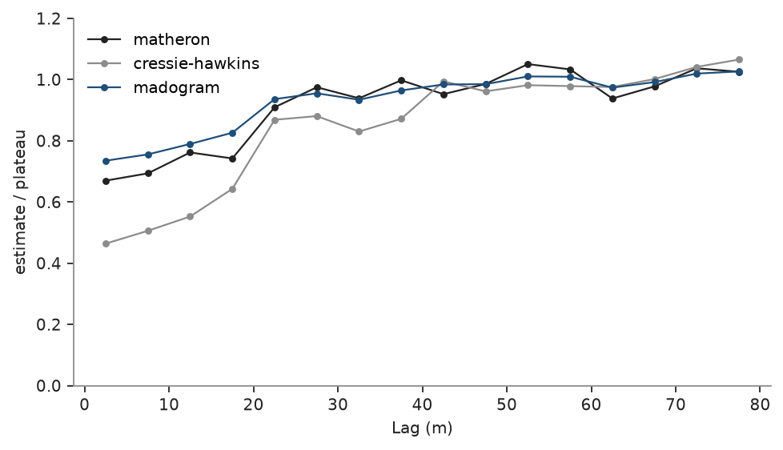
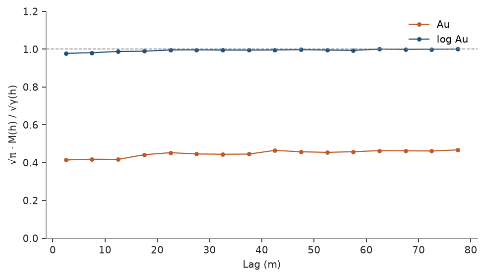

# madogram

the madogram is half the mean absolute difference between values a lag apart, M(h) = Σ |z(x) − z(x + h)| / 2N, where the
variogram averages squared differences. it is in the units of the data, and a single extreme pair moves it far less, so
its shape stays readable on skewed grades whose variogram the outliers make erratic. for gaussian increments
M(h) = √(γ(h)/π). `dissemination` measures the departure from that: √π · M(h) / √γ(h) is 1 for gaussian increments and
drops below 1 when a few large differences carry γ, the signature of high grades scattered in isolated samples.

<details><summary>Python</summary>

```python
import boitata as bt
import matplotlib.pyplot as plt
import numpy as np
from common import ACCENT, GRAY, HIGHLIGHT, INK, save
```

</details>

the 1 m quartz-vein composites of [top cuts](../../03-exploratory-analysis/05-top-cuts/README.md), gold in g/t, in
vein V1:

<details><summary>Python</summary>

```python
data = bt.datasets.vein_gold_grade_control()
intervals = bt.merge_intervals(data["assays"], data["lithology"])
holes = bt.Drillholes(data["collars"], data["surveys"], intervals)
composites = holes.composite(1.0, ["AU_GPT"], domain="LITH", categories=["VEIN"])
vein = composites.filter((composites["LITH"] == "QV") & (composites["VEIN"] == "V1")).drop_null("AU_GPT")
au = vein["AU_GPT"]
print(
    f"{len(au)} composites, mean {au.mean():.2f} g/t, CV {au.std() / au.mean():.2f}, max {au.max():.0f} g/t"
)
```

</details>

```text
3659 composites, mean 9.43 g/t, CV 2.72, max 521 g/t
```

## three estimators

the plot draws the classical variogram, the madogram and the robust `"cressie-hawkins"` estimator, all omnidirectional
with 5 m lags. their units differ, so each is divided by its mean beyond 40 m, its plateau. all three level off near
25 m. beyond, the classical variogram zigzags with the few pairs that hold the highest grades, while the madogram
stays flat. the madogram starts higher because it scales like the square root of γ: for gaussian increments, a
madogram at 0.73 of its plateau matches a variogram at 0.73² = 0.53 of its sill.

<details><summary>Python</summary>

```python
lag, max_lag = 5.0, 80.0
estimators = {"matheron": INK, "cressie-hawkins": GRAY, "madogram": ACCENT}
fig, ax = plt.subplots(figsize=(6, 3.4), layout="constrained")
for e, color in estimators.items():
    curve = bt.experimental_variogram(vein, "AU_GPT", lag, max_lag, estimator=e)
    plateau = curve.gammas[curve.lags > 40].mean()
    ax.plot(curve.lags, curve.gammas / plateau, "o-", color=color, ms=3, lw=1, label=e)
ax.set(xlabel="Lag (m)", ylabel="estimate / plateau", ylim=(0, 1.2))
ax.legend()
save(fig, "estimators")
```

</details>



## outliers

drop the five highest composites, 0.14 % of the data, and recompute. the variogram loses 40 % at every lag, the
madogram 10 %:

<details><summary>Python</summary>

```python
keep = au < np.sort(au)[-5]
trimmed = vein.filter(keep)
for e in ("matheron", "madogram"):
    full = bt.experimental_variogram(vein, "AU_GPT", lag, max_lag, estimator=e)
    cut = bt.experimental_variogram(trimmed, "AU_GPT", lag, max_lag, estimator=e)
    change = cut.gammas / full.gammas - 1
    print(
        f"{e:>9}: change without the top five, median {100 * np.median(change):.0f} %, "
        f"range {100 * change.min():.0f} to {100 * change.max():.0f} %"
    )
```

</details>

```text
 matheron: change without the top five, median -40 %, range -43 to -37 %
 madogram: change without the top five, median -10 %, range -11 to -9 %
```

## dissemination

`dissemination` takes a madogram and a classical variogram computed with the same arguments. on the gold it sits well
below 1 at every lag. the logarithm of the grades, closer to gaussian, brings it near 1:

<details><summary>Python</summary>

```python
fig, ax = plt.subplots(figsize=(6, 3.4), layout="constrained")
both = vein.with_column("log_au", np.log(au))
for name, column, color in [("Au", "AU_GPT", HIGHLIGHT), ("log Au", "log_au", ACCENT)]:
    madogram = bt.experimental_variogram(both, column, lag, max_lag, estimator="madogram")
    variogram = bt.experimental_variogram(both, column, lag, max_lag)
    ax.plot(madogram.lags, bt.dissemination(madogram, variogram), "o-", color=color, ms=3, lw=1, label=name)
ax.axhline(1.0, color=GRAY, lw=0.8, ls="--")
ax.set(xlabel="Lag (m)", ylabel="√π · M(h) / √γ(h)", ylim=(0, 1.2))
ax.legend()
save(fig, "dissemination")
```

</details>



Full script: [`example_05_06.py`](example_05_06.py)
